# Making ARCNAVE Modern

### A plain-English review of everything we discussed

---

## What this document is

This pulls together **everything** from our conversation. We looked at
ARCNAVE's AI, backend (the server), frontend (the screens users see),
database (where data lives), and how it gets released. We read the
actual program code, not the design notes.

Then we compared it against how the best companies (Anthropic, OpenAI
and similar) work in 2026, and marked **where ARCNAVE is behind**.

> **Who this is for:** anyone, technical or not. Jargon gets a plain
> meaning in brackets the first time it appears.

### Map of this document

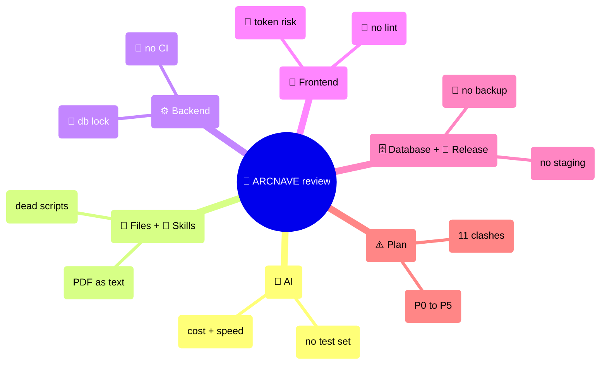

---

## How to read each point

Every issue is shown from three angles:

| **Today** | **2026 standard** | **Should ARCNAVE do it** |
|---|---|---|
| what ARCNAVE does now | what the best teams do | yes/no, why, which stage |

**Priority tags** (how soon):

- **P0** — now
- **P1** — foundation
- **P2** — big AI cost win
- **P3** — structural cleanup
- **P4** — maturity
- **P5** — later / enterprise polish

---

## The core truth: why the best companies win

Their edge is **not** the AI model. It is the **way they build**:

1. **One control room.** Sending requests to the AI, saving repeated
   data, cost limits, and monitoring all live in one place, not
   scattered through the app.
2. **Tests are the spec.** Before changing anything about the AI, they
   score it against a fixed set of test cases. It has to pass before
   real users see it.
3. **The agent is a plain function.** Events go in, the next action
   comes out. You can replay it, test it, debug it. The AI is not a
   black box.
4. **They control what goes into the AI.** If the input gets past ~40%
   full, the AI gets noticeably worse ("dumb zone").
5. **Heavy internal use.** At Anthropic, 1,000+ staff give feedback
   every 10 minutes. Only features people keep using ship to customers.
6. **Mostly ordinary code, AI only at the edges.** The AI handles a
   small, specific job (3-20 steps). Everything around it is normal,
   predictable code.

---

## What ARCNAVE already gets right (keep these)

- **One well-organised app (not split into many services).** Correct
  choice at this size.
- **Strong tenant data isolation** (one college can never see another's
  data) with three separate database logins.
- **Service ownership rules** — no AI tool talks to the database
  directly. Good discipline.
- **Verification safety nets** — the AI's numbers get re-checked; if it
  can't read a whole document it refuses instead of guessing.
- **Prompt safety layer** — a nasty sentence hidden inside an uploaded
  file is treated as text, never as an instruction.
- **Provider-independent design** — Gemini, Claude, OpenAI can be
  swapped.
- **Decision log and checkpoint notes** — good habit.
- **Frontend:** modern data-fetching library, accessible UI building
  blocks, tests that check behaviour not markup.

---

# Part 1 — The AI: how it works

## A single "hi" costs about 4,500 words of input

When a user types just **"hi"**, here is what happens today:

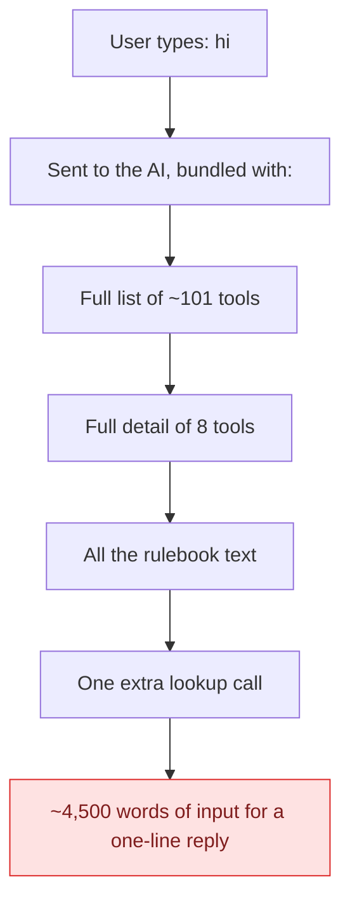

> **Simple picture:** it is like handing someone a huge toolbox they
> did not ask for, just so they can say "hi" back. None of it is
> needed.

**How it should work:**

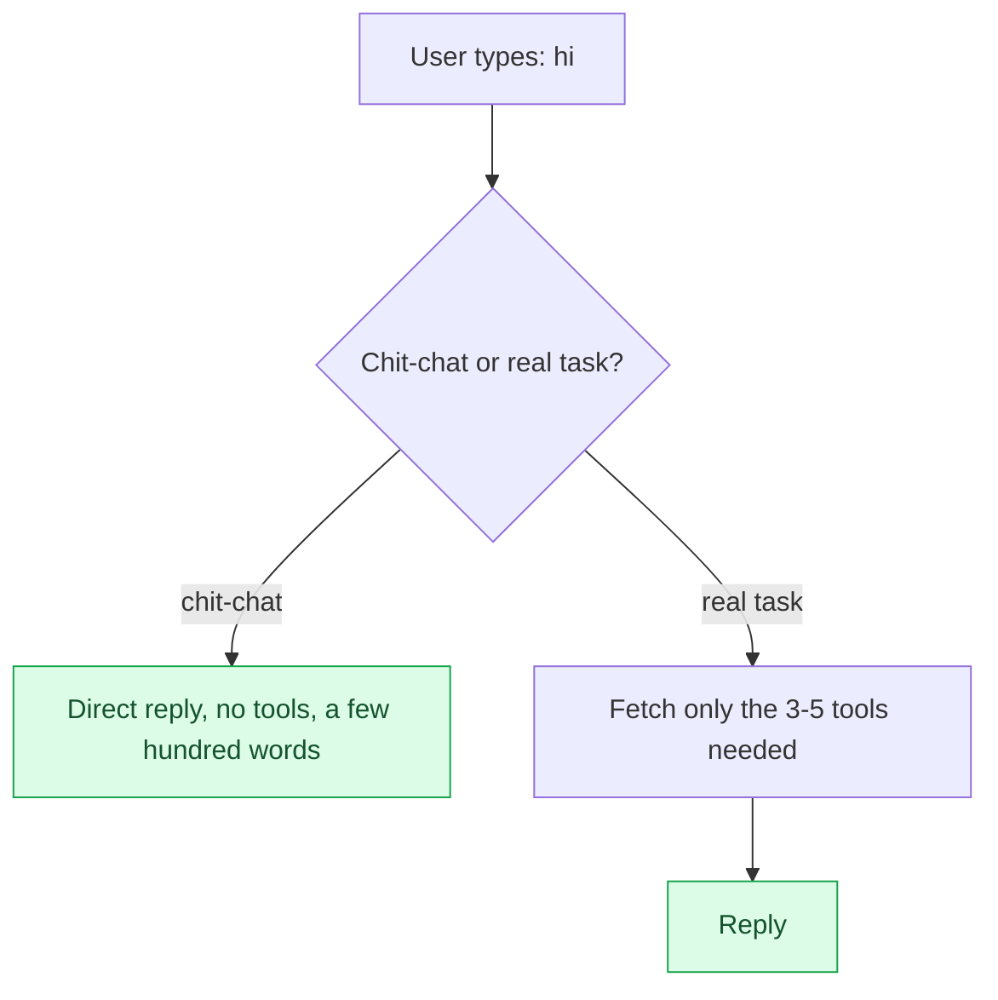

## The AI issue list

| # | Issue | Today | 2026 standard | Priority |
|---|---|---|---|---|
| 1.1 | Full tool list sent every message | ~2,200 words per message | Search and send only what is needed — 85% smaller | P2 |
| 1.2 | Tool picking does not read the question | If a role has 8 or fewer tools, all get sent; the match score is too loose | Meaning-based search + re-ranking + keyword blend | P2 |
| 1.3 | No cheap path for greetings / small talk | "hi" runs the whole pipeline | A small classifier decides first | P2 |
| 1.4 | No saved-input reuse (caching) on the main AI path | Relies only on Google's automatic reuse — measured 0 hits | Explicit caching — 90% cost cut, guaranteed | P2 |
| 1.5 | Prompt order only half-right for reuse | The rulebook chunks change turn to turn | From turn 2 the front part must be identical every time | P2 |
| 1.6 | Whole chat history re-sent every turn | ~25,000 words, as one big blob | Add-only, as separate messages | P2 |
| 1.7 | Normal chat replies do not stream | You wait for the whole reply, then it appears at once | Always stream the reply the user sees | P2 |
| 1.8 | Two AI calls per tool turn, context sent twice | decision + write-up | With caching this stops hurting | P2 |
| 1.9 | Monitoring writes to the database inside the request | 2-4 writes per turn, each waited on | Fire and forget | P1 |
| 1.10 | An extra lookup call every Curriculum turn | even for "hi" | Skip it after the greeting filter | P2 |
| 1.11 | AI settings are fixed in code | "low thinking" for everything | Adjust depth to how hard the question is | P3 |
| 1.12 | Forced-format replies only half-supported | Only two providers enforce it natively | Enforce for every provider | P3 |
| 1.13 | Number-checking is pattern-based, English only | Misses Tamil / mixed-language numbers | A dedicated safety-check layer | P3 |
| 1.14 | Experiment switches left in the live path | 7 experimental flags in the hot path | A proper feature-flag registry | P2 |
| 1.15 | AI monitoring is home-built, off the standard | Can't see a whole turn as one tree | Standard AI tracing + Langfuse | P1 |
| 1.16 | The agent loop is hand-written in a 3,500-line file | one giant function | A clear step-by-step state machine | P3 |
| 1.17 | **No test set for the AI at all** | code itself admits "no eval set yet" | Offline + CI tests, block merges below the bar | P1 |
| 1.18 | Safety guards are pattern-based, single layer | No jailbreak / personal-data filter | A dedicated guardrail pass | P3 |

## Where the AI cost leaks

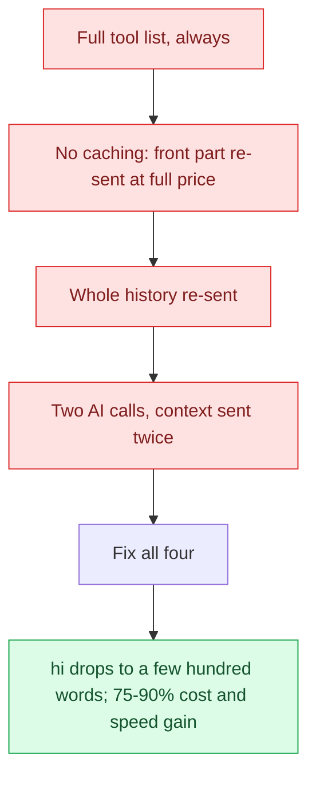

---

# Part 2 — Handling uploaded files

## PDFs, Word and Excel reach the AI as plain text only

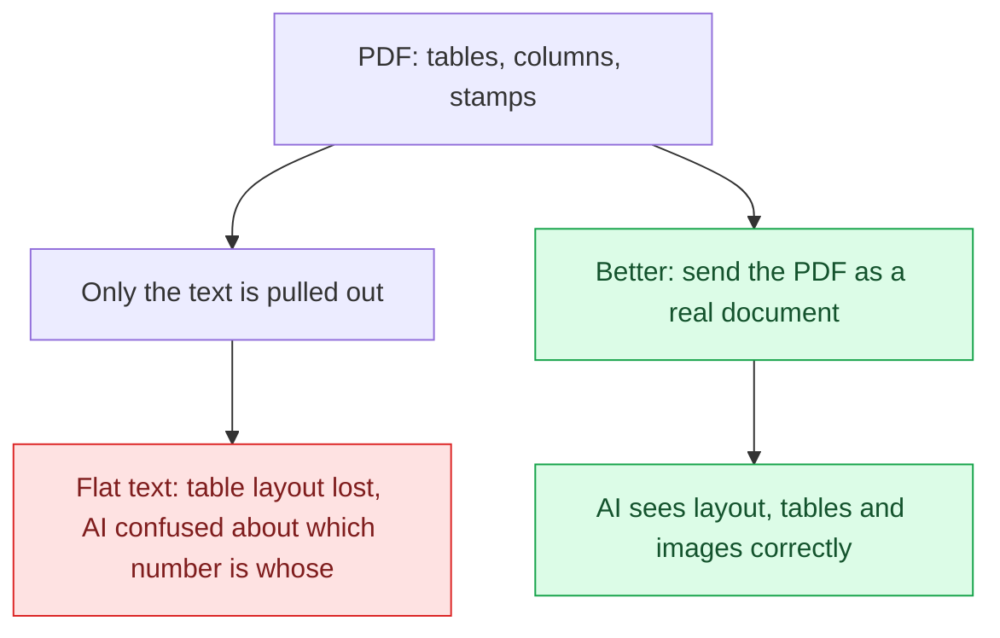

> The whole "which column belongs to which student" fight in the
> checkpoint notes comes from this. This is what "attachments don't
> behave right" means.

| # | Issue | Today | Should do | Priority |
|---|---|---|---|---|
| 2.1 | PDF / Word sent as plain text, not a real document | tables and layout lost | Yes — matches the recent decision to lean on native reading (keep counting on the exact-maths path) | P2 |
| 2.2 | File text sits in the user's message, can't be reused, up to ~250,000 words | no "grab only the relevant part" (RAG) | Yes — the pieces for this already exist | P2 |
| 2.3 | Each new turn re-downloads and re-extracts the file | extracted text is not saved | Yes | P3 |
| 2.4 | Scanned-page reading uses a weak in-app engine, 30-page cap | poor on tables and handwriting | Use a vision model; 2.1 mostly fixes this too | P3 |
| 2.5 | Text-extraction libraries are weak on complex PDFs | | 2.1 makes these a fallback only | P3 |

---

# Part 3 — AI "skills"

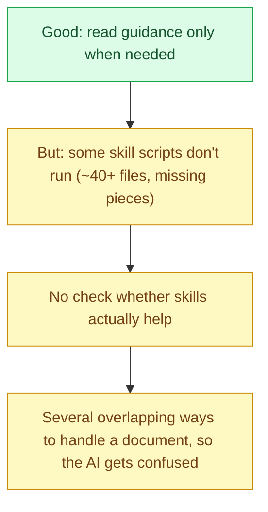

| # | Action | Priority |
|---|---|---|
| 3.1 | Keep the design — do not change it | — |
| 3.2 | Delete the dead scripts, or add the missing pieces | P3 |
| 3.3 | Put skills into the AI test set (1.17) | P2 |
| 3.4 | Merge the document paths into one clear route | P4 |

---

# Part 4 — Backend (the server)

## The big one: a database "parking lot" jam

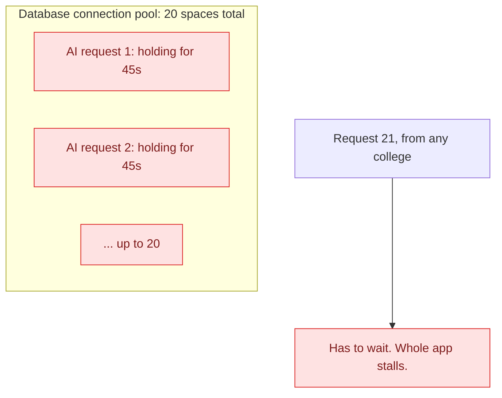

> **Picture:** a car park with 20 spaces. Every AI request parks a car
> and leaves it for **45 seconds** (while it talks to the AI). Twenty
> requests and the car park is full — for every college.
>
> **Fix:** only take a space while actually doing database work; give
> it back while talking to the AI (short transactions).

| # | Issue | Today | 2026 standard | Priority |
|---|---|---|---|---|
| 🚨 4.1 | Database transaction held open for the whole AI call | 30-45s connection lock | Short transactions; outside calls outside the lock | P0 |
| 4.2 | Old framework version, plain JavaScript, no input-checking library | route inputs checked by hand | Newer version + a schema library + auto-generated API doc | P1 |
| 4.3 | No typed code (TypeScript) anywhere | 0 typed files | Standard for this kind of product | P3 |
| 4.4 | Monitoring is just print statements | no request tracing, no metrics | Standard tracing toolkit | P1 |
| 4.5 | No job queue or shared cache | background jobs run inside the request; rate limit is per-process only | A database-backed queue | P2 |
| 4.6 | Huge files | one file is 3,500 lines; another 112,000 | Split into ~300-500 line modules | P3 |
| 🚨 4.7 | **No automated build/test pipeline (CI)** | no pipeline folder at all | Lint + test + build + AI test on every change | P0 |
| 4.8 | No API contract | frontend client written by hand, can drift | Generate the client from the contract | P1 |
| 4.9 | Thin testing pyramid, no failure-injection | no real-database test containers; no circuit breakers | Real containers; timeouts and graceful fallback | P3 |
| 4.10 | No API version / retirement policy | version prefix exists, no sunset plan | A deprecation timeline | P5 |

---

# Part 5 — Frontend (the screens)

## The big one: the login token sits unprotected in the browser

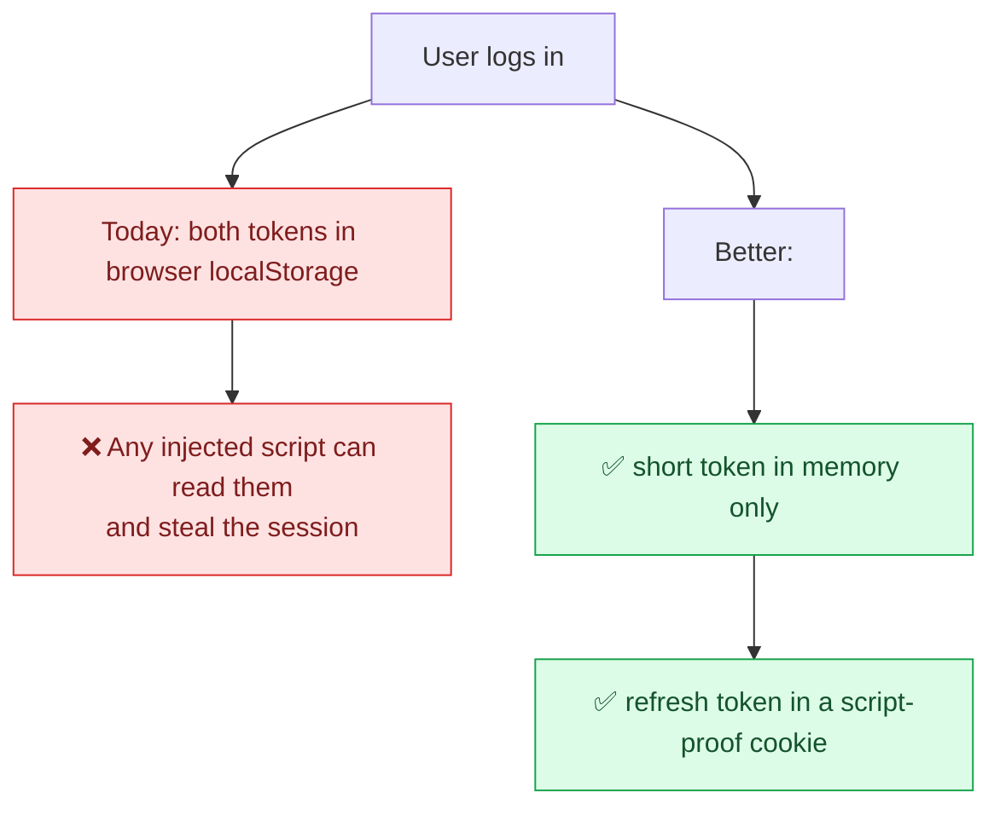

| # | Issue | Today | 2026 standard | Priority |
|---|---|---|---|---|
| 🚨 5.1 | Login tokens in browser storage — theft risk | both tokens | short token in memory + refresh token in a script-proof cookie | P0 |
| 5.2 | No typed code | 0 typed files | typed frontend is standard | P3 |
| 5.3 | Older router library | no type-safe routes | newer type-safe router | P4 |
| 5.4 | No live updates except AI streaming | notifications are polled | one live-events stream | P4 |
| 5.5 | Older build tool and styling versions | hand-kept bundle list | newer versions, automatic splitting | P4 |
| 5.6 | Browser-only app, no server rendering | full client render | fine for an internal dashboard — just split the bundle | P4 |
| 🚨 5.7 | **No linting or formatting config at all** | none in the repo | basic for any project; includes accessibility checks | P0 |
| 5.8 | Files grouped by type, not by feature | components / hooks / store | group by feature area | P3 |
| 5.9 | Shared state kept in React context | context in 10 places | a proper small state library | P3 |
| 5.10 | Accessibility not enforced | building blocks are accessible, but no checks or screen-reader testing | full standard compliance + manual testing | P0 (lint), P4 (full) |
| 5.11 | No design-system document | no shared tokens or component catalogue | tokens + a component catalogue | P4 |
| 5.12 | No layered error boundaries | one broken widget can crash the whole app | small, isolated error areas | P4 |
| 5.13 | No multi-package tooling | plain npm | workspace + build cache tools | P5 |

---

# Database

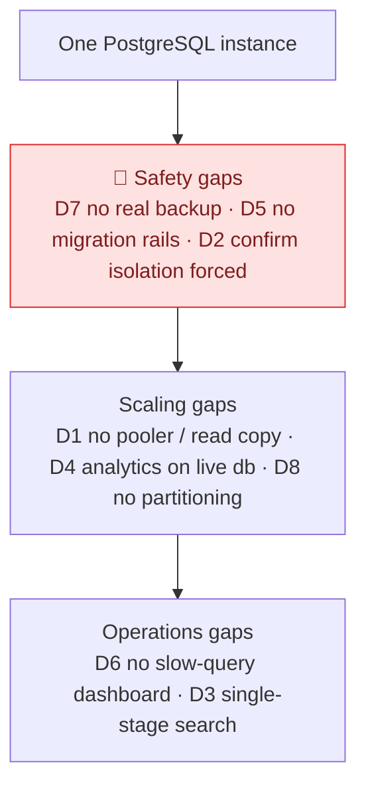

> **D7 matters most.** A copy of the database is not a backup. If
> someone deletes the wrong table, the copy deletes it too. You need
> point-in-time recovery, and you must test the restore regularly.

| # | Today | 2026 standard | Priority |
|---|---|---|---|
| D1 | one instance | connection pooler + read copy | P3 |
| D2 | isolation correct | confirm "forced" on every table; add matching indexes | P1 |
| D3 | meaning-search only | blend with keyword search + re-ranking | P3 |
| D4 | analytics on the live database | a running counter table; heavy reports on a copy | P2 |
| 🚨 D5 | "reversible" rule only | safe-lock timeout as the first line; build indexes without blocking; multi-step column changes | P1 |
| D6 | none | query-stats extension + dashboard | P1 |
| 🚨 D7 | container volume only | proper backup tool + recovery targets + tested restores | P1 |
| D8 | none | partition the biggest growing tables | P5 |

---

# Release, platform and security

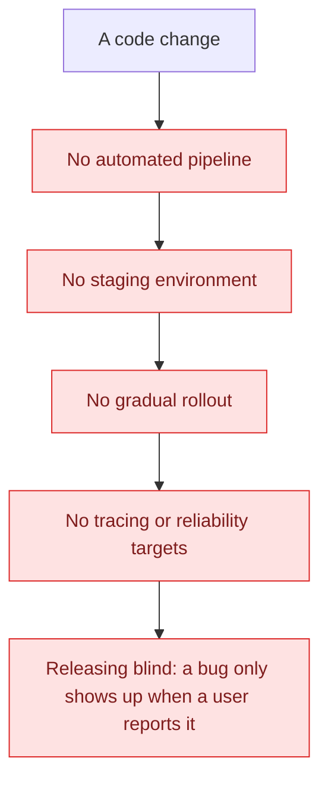

| # | Issue | 2026 standard | Priority |
|---|---|---|---|
| 🚨 O1 | No build/test pipeline | lint + test + security scan + build on every change | P0 |
| O2 | No daily-merge workflow or feature switches | merge to main daily; separate "deployed" from "switched on" | P4 |
| O3 | No staging / gradual rollout / auto rollback | roll out to a slice of users, auto-roll-back on bad signals | P4 |
| O4 | Services not automatically monitored | tracing built in by default | P1 |
| O5 | No software bill of materials / signing | list every dependency + sign build outputs + policy checks | P5 |
| O6 | No secrets manager | move secrets out of plain files | P5 |
| O7 | No infrastructure-as-code | infrastructure defined in version-controlled files | P5 |
| O8 | No reliability targets or error budget | set targets, auto-roll-back on breach | P4 |

---

# How the best teams actually write it

1. **Smaller instruction prompts.** Anthropic cut theirs by 80%. Long
   "don't do X, don't do Y" lists actually make newer models worse.
   ARCNAVE's big rulebook paragraph is exactly this pattern. Measure
   removing parts of it, behind the test set.
2. **No worked examples in the instruction prompt** for newer models.
3. **Test-driven fast loop for prompt tweaks.** Keep your product
   process for scope; for prompt changes, let the tests decide.
4. **Reproducible.** Same input and tools give the same result. Pin
   prompt versions and model versions.
5. **Compact errors.** When a tool fails, feed back a short error note,
   not a full stack trace, so the AI can recover.
6. **Trigger from anywhere.** Separate the agent core from the chat
   route so notifications, workflows and scheduled jobs can reuse it.

---

# Part 6 — Where this plan clashes with existing ARCNAVE decisions

Some recommendations conflict with decisions **already made in
ARCNAVE**. These were checked against the **actual code**, not the
design notes (the notes defer a lot of things to "later" — not
trusted).

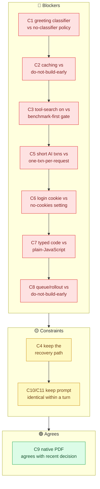

"Blocker" means it needs a decision reversal or real work, not that it
cannot be done.

### C1 — greeting classifier (1.3) vs the "no classifier" policy

The rulebook code says plainly: never look at the *meaning* of a
message to decide the rules, and never use an AI classification step
for it — a missed rule chunk is a silent regression.

**Resolution:** that rule is about *choosing rule chunks*, not
*choosing tools*. Build the greeting check for tool selection only,
and leave rule-chunk selection on today's path. Write this into the
approved spec.

### C2 — explicit caching (1.4) vs "do not build caching early"

A recorded decision says: do not build explicit caching until cost or
speed is a real, proven problem. A controlled experiment (zero reuse
hits) is baked into the code in several places as "closed".

**Resolution:** in this conversation you stated it *is* a proven
problem ("hi costs 4,500 words"). That meets the re-open condition.
Record the new measurement as a formal decision entry and link it to
the original.

### C3 — turn on tool-search (1.1) vs "benchmark must say GO first"

The config says: only switch this on after the benchmark script
reports a GO; the app never flips it itself.

**Resolution:** run the benchmark against the demo college with real
(paid) calls, record the GO/NO-GO numbers, then switch on only if GO.
Independent tests elsewhere show 56-64% retrieval accuracy — a real
risk.

### C4 — tighter tool search (1.2) vs the recovery catalogue

There was a past incident where a wrongly-excluded tool caused a wrong
answer. The "describe tools" catalogue exists so the AI can always
discover a tool it has.

**Resolution:** not a hard conflict, but a rule: tightening search
must not remove that recovery path. Put that incident in the test set.

### C5 — short AI transactions (4.1) vs one-transaction-per-request

The whole app relies on: open a transaction at the start of a request,
commit at the end. AI turns write to the database (monitoring rows,
audit rows, tools like "mark attendance") in that same transaction,
interleaved with AI calls.

**Resolution (real work, real risk):** splitting into short
transactions breaks all-or-nothing safety. The approach: each database
touch inside an AI turn gets its own short transaction; the connection
goes back to the pool while talking to the AI; writing tools run in
their own transaction.

### C6 — login cookie (5.1) vs the "no cookies" setting

The cross-origin setting is deliberately "no credentials" — cookies
are not forwarded. Header-based login is the design.

**Resolution:** moving the refresh token to a cookie needs credentials
turned on, a strict same-site setting, and a cross-site-request token.
The login middleware changes too. Worth it for the security gain.

### C7 — typed code (4.3 / 5.2) vs the "plain JavaScript" decision

Zero typed files, backend and frontend — a deliberate choice.

**Resolution:** re-weigh the reason behind that decision and write a
new decision entry before starting. A gradual migration is possible,
but it is a reversal of stance.

### C8 — queue / feature-switch / gradual-rollout tools vs "do not build early"

Several code comments repeat: not built ahead of real usage volume;
one server process per deployment today.

**Resolution:** adopting these is a deliberate change of philosophy. A
database-backed queue is the least disruptive option (no new
infrastructure). Only add feature-switch and gradual-rollout tools if
the plan moves to multiple server processes.

### C9 — native PDF (2.1) — not a conflict

A recent decision retired the old table tool and chose to rely on the
AI reading documents natively.

**Note:** 2.1 agrees with that. One caveat: native reading was
measured as unreliable at *counting* (2 vs 23, 7 vs 839), so counting
and totals must stay on the exact-maths path. Included here so nothing
is missed.

### C10 / C11 — agent rewrite and smaller prompt vs the "identical prompt" rule

A recorded finding: re-packaging the rule text mid-turn measurably
weakened rule-following (3 out of 3 down to 2 out of 7).

**Resolution:** any rewrite or prompt trimming must keep the rule text
byte-identical across a turn, and each trimmed piece must be checked
against the rule-following tests. Test-gated, so it is safe — but not
"just delete it".

---

# Part 7 — The plan, P0 to P5

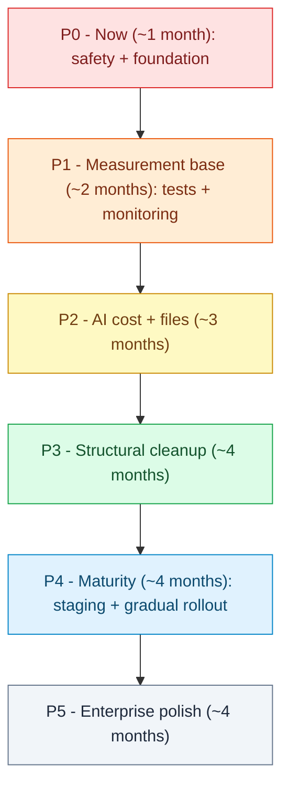

> Each stage depends on the one before it. Do not skip.

## P0 — Now (safety + foundation, ~1 month)

- Build a **CI pipeline** (automated lint, test, migration up/down,
  build); block merges that fail.
- Add **linting + formatting + accessibility rules** to frontend and
  backend.
- Turn on **dependency scanning**; list the outdated ones.
- **Fix the AI database lock** (4.1 / clash C5): do not hold the
  transaction open through the whole AI call. Short transactions, with
  care for all-or-nothing safety.
- **Fix token storage** (5.1 / clash C6): refresh token into a
  script-proof cookie; adjust the cross-origin and login settings.

## P1 — Measurement base (tests + monitoring, ~2 months)

Without this, tuning the AI is guesswork.

- **AI test set** (1.17): 50-150 real cases, run offline and in CI,
  block merges below the bar. Include the "wrongly excluded tool"
  incident (clash C4).
- **AI monitoring** (1.15): standard AI tracing + Langfuse, self-hosted.
  One turn shows as one tree.
- **Backend tracing** (4.4 / O4): standard tracing toolkit; carry a
  trace id into the logs.
- **Database monitoring** (D6): query-stats extension + dashboard.
- **Migration safety rails** (D5): safe-lock timeout first; build
  indexes without blocking; multi-step column changes.
- **Backups** (D7): proper backup tool + a first tested restore.
- **Confirm forced isolation + matching indexes** (D2).
- **Input schemas per route + generated API doc** (4.2 / 4.8); upgrade
  the framework version.
- **Move monitoring writes off the request path** (1.9).

## P2 — AI cost + files (~3 months)

This is where "hi = 4,500 words" gets fixed.

- **Greeting check** (1.3 / clash C1): chit-chat vs task. Tool
  selection only; do not touch rule-chunk selection. Write clash C1
  into the spec.
- **Run the tool-search benchmark, then switch on if GO** (1.1 / clash
  C3). Record the numbers as a decision entry.
- **Explicit caching for the AI** (1.4 / clash C2): fixed regional
  endpoint + explicit cache handle. Record the new measurement (re-open
  the old decision).
- **History as a reusable front block** (1.6): add-only.
- **Send PDFs as real documents** (2.1 / clash C9): read natively;
  counting stays on the exact-maths path.
- **Fix tool search** (1.2 / clash C4): margin-based cutoff, tuned by
  the test set. Keep the recovery path.
- **Stream normal replies** (1.7).
- **Clean up experiment switches** (1.14): 7 flags into a real
  registry.
- **Put skills in the test set** (3.3).
- **Skip the extra lookup call** (1.10) after the greeting filter.
- **Database-backed job queue** (4.5 / clash C8): move file-extraction
  and media work to background jobs.
- **Running counter table for usage limits** (D4).

## P3 — Structural cleanup (~4 months)

- **Rewrite the agent as a step-by-step machine** (1.16 / clash C10):
  route, fetch tools, decide, act, verify, write up. Lock the
  "identical prompt within a turn" rule in the acceptance tests.
- **Split the huge files** (4.6).
- **Reorganise the frontend by feature + a small state library** (5.8 /
  5.9), respecting the locked visual design.
- **Start the typed-code migration** (4.3 / 5.2 / clash C7): new
  decision entry; allow mixed files; new files typed.
- **Connection pooler** (D1).
- **Contract tests** (4.9) on the noisiest routes.
- **Blend keyword + meaning search + re-ranking** (1.5 / D3).
- **Guardrail layer** (1.18); Tamil / mixed-language number checks
  (1.13).
- **Adjust AI thinking depth to difficulty** (1.11); native
  forced-format for every provider (1.12).
- **Cache extracted file text** (2.3); vision model for scans (2.4 /
  2.5).
- **Remove the dead skill scripts** (3.2).

## P4 — Maturity (staging + gradual rollout, ~4 months)

- **Staging environment + smoke tests** (O3).
- **Gradual rollout + feature switches** (O2 / O3 / clash C8): each
  user stays on one version; only once running multiple server
  processes.
- **Reliability targets + error budget + auto rollback** (O8).
- **Internal-use loop** — a staff group, ship only what they keep
  using; summarise feedback with the AI.
- **Score a sample of live traffic + watch for scorer drift.**
- **Live updates for notifications / job progress** (5.4).
- **Design-system document + component catalogue** (5.11); isolated
  error areas (5.12); bundle-size limit in CI (5.5 / 5.6).
- **Full accessibility audit** (5.10).
- **Newer router** (5.3); build-tool and styling upgrades (5.5).
- **Merge the document paths** (3.4).

## P5 — Enterprise polish (~4 months)

- **Dependency bill of materials + signed builds + policy checks** (O5).
- **Secrets manager** (O6).
- **Infrastructure as code** (O7).
- **Partition the biggest tables** (D8).
- **Read copy of the database** for heavy reports (D1).
- **API version / retirement policy** (4.10).
- **Prompt and model version registry + gradual rollout for prompt and
  model changes.**
- **Multi-package workspace tooling** (5.13).

---

## First 60 days

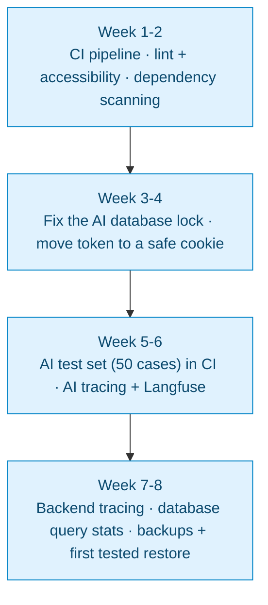

---

# In closing

ARCNAVE's **foundation is good** — one well-organised app, strong
tenant isolation, service ownership rules, verification safety nets,
decision log. Keep all of that.

The gaps fall into three groups:

- **AI cost and speed** — no caching, full tool list every time, no
  greeting shortcut, whole history re-sent. → **P2**
- **No measurement or monitoring** — no AI test set, no AI tracing, no
  database monitoring, no pipeline. Without these, every improvement is
  blind. → **P0 and P1**
- **No enterprise discipline** — no typed code, no API contract, no
  staging, no gradual rollout, no backups, no partitioning. → **P3 to
  P5**

**First 60 days = all of P0, plus the test set and monitoring from
P1.** After that, let the test numbers drive P2 — the bar is "it
passed the tests", not "it was built".

The **11 clashes in Part 6** are not blockers. Each one just needs a
short decision entry, with the reason, before you start.

---

# The target picture — once every issue is fixed

### The whole plan, on one page

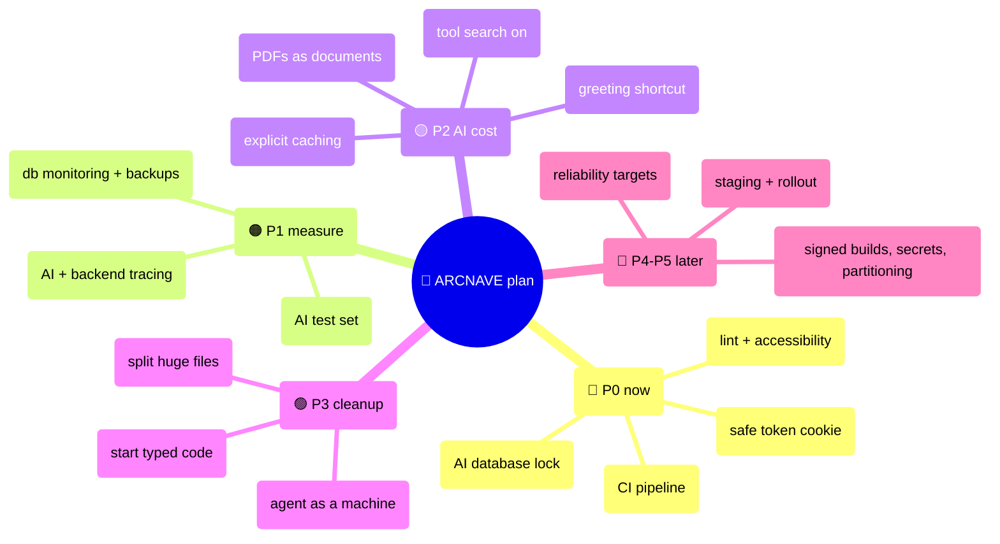

### 🧠 ARCNAVE with every error rectified

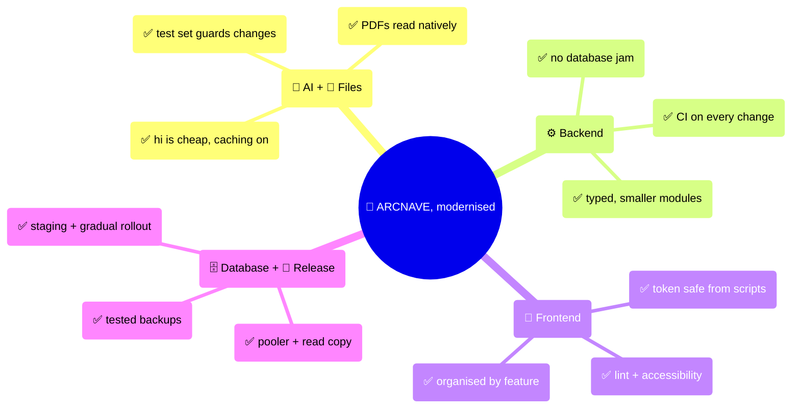
