# ARCNAVE-ஐ நவீனப்படுத்துதல்

### ஒரு எளிய, படிக்க சுவாரஸ்யமான முழு ஆய்வு அறிக்கை

---

## 📖 இந்த ஆவணம் எதைப் பற்றியது

இந்த உரையாடலில் (session) நாம் பேசிய **எல்லாவற்றையும்** ஒரே இடத்தில்.
ARCNAVE-ஓட AI, பின்தளம் (backend), முன்தளம் (frontend), தரவுத்தளம்
(database), மற்றும் வெளியீட்டு முறை (deployment) — எல்லாவற்றையும்
உள்ளே இருக்கும் நிரலை (code) நேரடியாகப் படித்துச் சோதனை செய்தது.

பிறகு 2026-ல் உலகின் சிறந்த நிறுவனங்கள் (Anthropic, OpenAI போன்றவை)
எப்படி வேலை செய்கிறார்கள் என்பதோடு ஒப்பிட்டு, **ARCNAVE எங்கே
பின்தங்கியிருக்கிறது** என்பதைச் சொல்கிறது.

> 🎯 **யாருக்காக:** தொழில்நுட்ப அறிவு இல்லாதவரும் படித்துப்
> புரிந்துகொள்ளும் வகையில். கடினமான வார்த்தைகளுக்குப் பக்கத்தில்
> ஆங்கிலச் சொல் அடைப்புக்குறிக்குள் (brackets) கொடுக்கப்பட்டுள்ளது.

---

## 🗺️ இந்த ஆவணத்தின் வரைபடம்

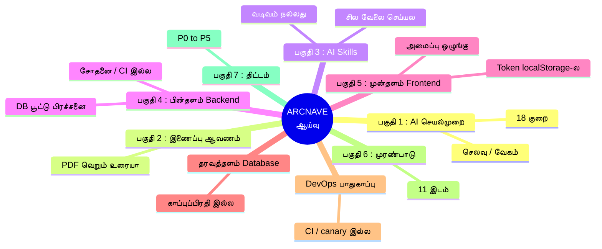

ஒவ்வொரு குறையையும் **மூன்று கோணத்தில்** பார்ப்போம்:

| 🔵 **இப்போ இருக்கறது** | 🟢 **2026 நடைமுறை** | 🎯 **ARCNAVE-ல் செய்யலாமா** |
|---|---|---|
| ARCNAVE-ல் இன்று என்ன நடக்குது | சிறந்த நிறுவனங்கள் என்ன செய்யறாங்க | செய்யணுமா, ஏன், எந்தக் கட்டத்துல |

**அவசர அளவு (priority) குறியீடு:**

🔴 **P0** உடனே · 🟠 **P1** · 🟡 **P2** · 🟢 **P3** · 🔵 **P4** · ⚪ **P5** பிறகு

---

## 💡 அடிப்படை உண்மை — சிறந்த நிறுவனங்கள் ஏன் வெல்கிறார்கள்

அவர்களுடைய பலம் AI model மட்டும் **அல்ல**. அவர்களுடைய *வேலை செய்யும்
முறை (engineering process)*.

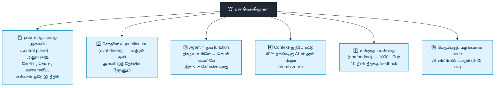

---

## ✅ ARCNAVE-ல் ஏற்கனவே சரியாக இருப்பவை — இவற்றை விடக்கூடாது

புதிதாகக் கட்டும் முன், இவை **நல்ல அடித்தளம்** என்பதைப்
புரிந்துகொள்ளணும்:

- ✅ **தனிமைப்படுத்தப்பட்ட ஒற்றை அமைப்பு (modular monolith)** — ஒரே app,
  தெளிவான உள் எல்லைகள். இது சரியான தேர்வு — சிதறடிக்க (microservices)
  வேண்டாம்.
- ✅ **பல-நிறுவனத் தரவு தனிமை (multi-tenant RLS) + மூன்று தனி DB
  பங்கு (role)** — கவனமாகக் கட்டப்பட்டது.
- ✅ **சேவை உரிமை விதிகள் (service ownership)** — எந்த AI கருவியும்
  நேரடியாக database-ஐ தொடக்கூடாது. இது சரியான ஒழுங்கு.
- ✅ **உறுதிப்படுத்தும் பாதுகாப்பு (verification backstops)** — AI சொன்ன
  எண்ணை மறுபடி கணக்கிட்டுச் சரிபார்ப்பது, முழுசாப் படிக்க முடியாதபோது
  பதில் சொல்லாமல் மறுப்பது.
- ✅ **Prompt பாதுகாப்பு அடுக்கு (safety layer)** — ஆவணத்துக்குள்
  மறைந்திருக்கும் தீங்கான வாக்கியத்தை உத்தரவாக எடுக்காது.
- ✅ **Provider-சுதந்திர இணைப்பான்கள் (adapters)** — Gemini, Claude,
  OpenAI-ஐ மாற்றி மாற்றிப் பயன்படுத்தும் அமைப்பு.
- ✅ **முடிவுப் பதிவேடு (ADR ledger) + நிலைப் பதிவு (checkpoint)** —
  நல்ல பழக்கம்.
- ✅ **முன்தளம்:** TanStack Query, Radix UI, நடத்தை சோதனைகள்
  (behavior tests) — நவீனத் தேர்வுகள்.

---

# 🤖 பகுதி 1 — AI செயல்முறை, workflow, ஒருங்கிணைப்பு

## 🎒 "hi" என்ற ஒரு சொல் — 4,500 சொல்-தொகுதி (tokens) செலவு

ஒரு பயனர் வெறும் **"hi"** என்று டைப் செய்தால் இப்போ என்ன நடக்குது:

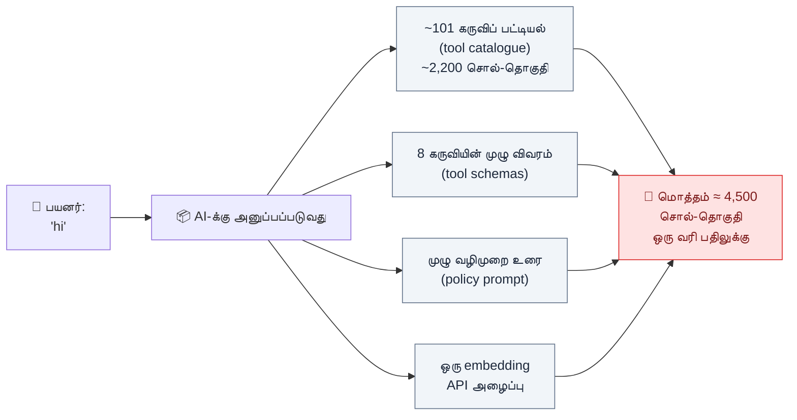

> 🧠 **எளிய உவமை:** "hi" சொல்ல வர்ற ஒருத்தர் கிட்ட, தேவையே இல்லாத
> **ஒரு பெரிய கருவிப் பெட்டியை** (toolbox) தூக்கிட்டு வரச்
> சொல்றாப்ல. அவருக்கு ஒரு "hi" திரும்பச் சொல்றதுக்கு அந்தப் பெட்டி
> தேவையே இல்ல.

**இப்போ எப்படி வேண்டும் (smart way):**

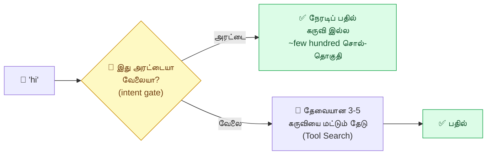

---

## 📋 AI-ன் குறைகள் — பட்டியல்

| # | குறை | இப்போ | 2026 நடைமுறை | அவசரம் |
|---|---|---|---|---|
| 1.1 | கருவிப் பட்டியல் எப்போதும் முழுசா அனுப்பப்படுது | ~2,200 சொல்-தொகுதி / message | தேவையானதை மட்டும் தேடு (Tool Search) — 85% குறைவு | 🟡 P2 |
| 1.2 | கருவித் தேர்வு கேள்வியைப் **படிக்காது** | role-ல் ≤8 கருவி எனில் எல்லாமும் அனுப்பும்; பொருத்தம் அளவீடு (threshold) மிகத் தளர்வு | பொருள் தேடல் + மறு-தரவரிசை (reranker) + கலப்புத் தேடல் (hybrid) | 🟡 P2 |
| 1.3 | வாழ்த்து / அரட்டைக்குத் தனி மலிவான வழி இல்ல | "hi" முழு pipeline வழியா | சிறு classifier முதல்ல முடிவு செய்யும் | 🟡 P2 |
| 1.4 | Vertex-ல் **சேமிப்பு (caching) இல்ல** | Google தானியங்கிச் சேமிப்பை மட்டும் நம்பல் — 0 வெற்றி என்று அளந்தாச்சு | வெளிப்படைச் சேமிப்பு (explicit cache) — 90% செலவுக் குறைவு உறுதி | 🟡 P2 |
| 1.5 | System prompt வரிசை — சேமிப்புக்குப் பாதி மட்டுமே சரி | Policy துண்டுகள் சுற்றுக்குச் சுற்று மாறும் | 2-ஆம் சுற்றிலிருந்து முன்பகுதி அச்சு அசலாக ஒன்றாக இருக்கணும் | 🟡 P2 |
| 1.6 | உரையாடல் வரலாறு (history) ஒவ்வொரு முறையும் முழுசா | ~25,000 சொல்-தொகுதி, ஒரே பெரிய தொகுதியா | சேர்-மட்டும் (append-only), தனித்தனி message | 🟡 P2 |
| 1.7 | சாதாரண chat பதில் **ஓடி வராது (no streaming)** | பதில் முழுசா ஆனப்பறம் ஒரே பாட்டா | பயனர் பார்க்கும் பதிலை எப்போதும் ஓட விடு | 🟡 P2 |
| 1.8 | ஒரு கருவிச் சுற்றுக்கு 2 AI அழைப்பு, context இரட்டிப்பு | decision + synthesize | Caching சேர்த்தா இது வலிக்காது | 🟡 P2 |
| 1.9 | கண்காணிப்புப் பதிவு request பாதையிலேயே DB-க்கு எழுதுது | சுற்றுக்கு 2-4 எழுத்து, காத்திருப்பு | "எழுதிட்டுப் போ" (fire and forget) | 🟠 P1 |
| 1.10 | ஒவ்வொரு Curriculum சுற்றிலும் embedding API அழைப்பு | "hi"-க்கும் | Intent gate-க்குப் பின் தவிர்க்கலாம் | 🟡 P2 |
| 1.11 | Model அமைப்பு நிலையாக (hardcoded) | எல்லாத்துக்கும் "LOW thinking" | கடினத்துக்கேற்ப reasoning ஆழம் | 🟢 P3 |
| 1.12 | கட்டமைத்த வெளியீடு (structured output) பாதி மட்டும் | Gemini/OpenAI-க்கு மட்டும் native | எல்லா adapter-க்கும் schema enforce | 🟢 P3 |
| 1.13 | எண் சரிபார்ப்பு regex-அடிப்படை, ஆங்கிலம் மட்டும் | தமிழ்/Tanglish பிடிக்காது | தனி guardrail அடுக்கு | 🟢 P3 |
| 1.14 | சோதனை அமைப்பு (experiment scaffolding) production பாதையிலேயே | 7 experimental flag hot path-ல் | முறையான feature-flag registry | 🟡 P2 |
| 1.15 | LLM கண்காணிப்பு (observability) — சொந்தமாகக் கட்டியது | ஒரு சுற்றின் முழு மரம் தெரியாது | OpenTelemetry GenAI + Langfuse | 🟠 P1 |
| 1.16 | Agent loop — 3,521 வரி file-ல் கையால் `while(true)` | ஒரே பெரிய function | State machine, node-களா பிரி | 🟢 P3 |
| 1.17 | **சோதனைத் தொகுப்பு (eval harness) இல்லவே இல்ல** | code-லேயே "eval இல்ல" என்று ஒப்புதல் | offline + CI eval, threshold-க்குக் கீழ் merge block | 🟠 P1 |
| 1.18 | Guardrails — regex, ஒற்றை அடுக்கு | jailbreak/PII வடிகட்டி இல்ல | தனி guardrail pass | 🟢 P3 |

---

## 💸 AI செலவு எங்கே கசிகிறது — கசிவு வரைபடம்

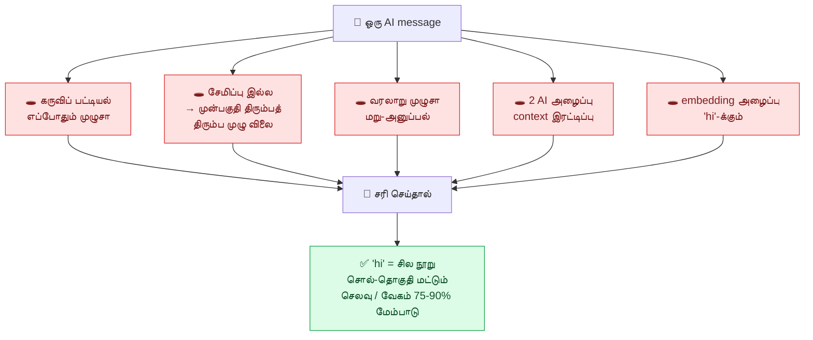

---

# 📄 பகுதி 2 — AI Attachment (இணைப்பு ஆவணக் கையாளுதல்)

## PDF / Word / Excel — model-க்கு வெறும் உரையா மட்டுமே போகுது

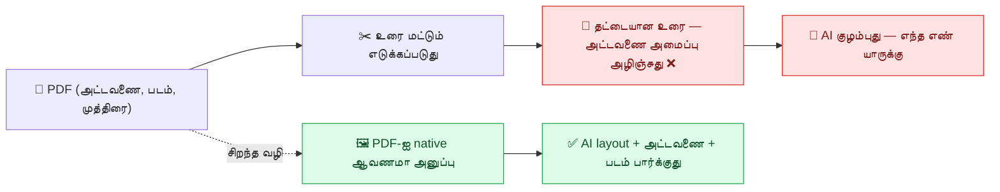

> 📌 checkpoint-ல் இருக்கும் முழு "column attribution" சண்டை —
> இதுதான் மூல காரணம். இதுவே "attachment சரியாக behave செய்யல" என்பதன்
> பொருள்.

| # | குறை | இப்போ | செய்யலாமா | அவசரம் |
|---|---|---|---|---|
| 2.1 | PDF/Word → வெறும் உரை, native ஆவணம் அல்ல | அட்டவணை/layout அழியும் | ஆம் — ADL-065-ஓட ஒத்துப்போகுது (எண்ணிக்கை மட்டும் pdfplumber-ல்) | 🟡 P2 |
| 2.2 | Attachment உரை பயனர் சுற்றில் — சேமிக்க முடியாது, ~2,50,000 சொல்-தொகுதி வரை | துண்டாக்கி எடுக்கும் (RAG) வழி இல்ல | ஆம் — pgvector ஏற்கனவே இருக்கு | 🟡 P2 |
| 2.3 | ஒவ்வொரு புதிய சுற்றிலும் மறு-download + மறு-extract | பிரித்தெடுத்த உரைக்குச் சேமிப்பு இல்ல | ஆம் | 🟢 P3 |
| 2.4 | OCR = `tesseract.js`, செயலிக்குள், 30 பக்க வரம்பு | அட்டவணை/கையெழுத்தில் மோசம் | vision-model OCR (2.1 இதையும் தீர்க்கும்) | 🟢 P3 |
| 2.5 | உரைப் பிரித்தெடுப்பு libraries சிக்கலான PDF-ல் பலவீனம் | `pdf-parse`, `mammoth` | 2.1-க்கு நகர்ந்தா fallback மட்டும் | 🟢 P3 |

---

# 🧩 பகுதி 3 — AI Skills

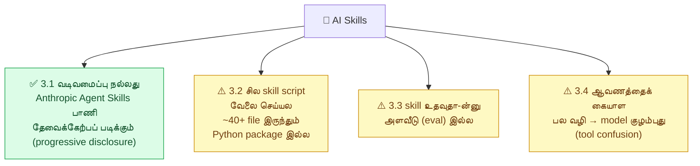

| # | செய்யலாமா | அவசரம் |
|---|---|---|
| 3.1 | வடிவம் **விடக்கூடாது** — தொடரணும் | — |
| 3.2 | ஓடாத script/schema-ஐ நீக்கு அல்லது package சேர் | 🟢 P3 |
| 3.3 | eval harness-ல் (1.17) skill-ஐயும் சேர் | 🟡 P2 |
| 3.4 | ஆவண workflow-ஐ ஒரே தெளிவான பாதையா ஒருங்கிணை | 🔵 P4 |

---

# ⚙️ பகுதி 4 — Backend (பின்தளம்)

## 🅿️ மிக முக்கியம்: DB இணைப்பு "பார்க்கிங் இட" பூட்டு

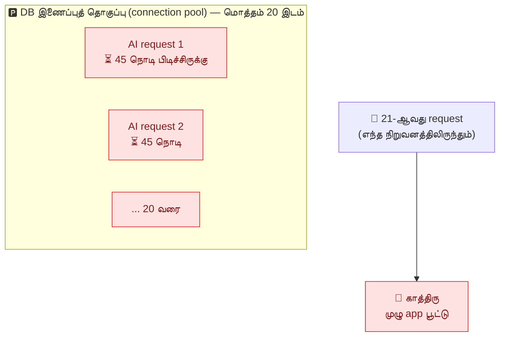

> 🧠 **உவமை:** ஒரு பார்க்கிங்-ல் 20 இடம். ஒவ்வொரு AI கோரிக்கையும்
> ஒரு காரை **45 நொடி** நகர்த்தாமல் நிறுத்தி வைக்குது (AI-யோட
> பேசிக்கிட்டு இருக்கும்போது). 20 கோரிக்கை வந்தா — எல்லா
> நிறுவனங்களுக்கும் பார்க்கிங் காலி.

**சரியான வழி:** DB வேலை இருக்கும்போது மட்டும் இடத்தைப் பிடி, AI-யோட
பேசும்போது இடத்தை விட்டுடு (குறு பரிவர்த்தனை / short transaction).

## Backend குறைகள்

| # | குறை | இப்போ | 2026 நடைமுறை | அவசரம் |
|---|---|---|---|---|
| 4.1 | DB பரிவர்த்தனை (transaction) AI அழைப்பு முழுவதும் திறந்தே | 30-45 நொடி இணைப்புப் பூட்டு | குறு பரிவர்த்தனை; வெளி அழைப்பு transaction-க்கு வெளியே | 🔴 P0 |
| 4.2 | Express 4, plain JavaScript, சரிபார்ப்பு library (validation) இல்ல | route உள்ளீடு கையால் சரிபார்ப்பு | Express 5 + Zod schema + OpenAPI | 🟠 P1 |
| 4.3 | TypeScript இல்லவே இல்ல | 0 `.ts` file | Multi-tenant SaaS-க்கு TS default | 🟢 P3 |
| 4.4 | கண்காணிப்பு = `console.log` | trace இல்ல, metrics இல்ல | OpenTelemetry + pino | 🟠 P1 |
| 4.5 | வரிசை (queue) / cache infra இல்ல | bg job செயலிக்குள்; rate limit நினைவகத்தில் | pg-boss (Postgres-native வரிசை) | 🟡 P2 |
| 4.6 | பெரிய file-கள் (god files) | `aiService.js` 3,521 வரி; `academicService.js` 112k | module-ஆ பிரி (~300-500 வரி) | 🟢 P3 |
| 4.7 | **CI/CD இல்ல** | `.github/workflows` இல்லவே இல்ல | PR-ல் தானா lint+test+build+eval | 🔴 P0 |
| 4.8 | API ஒப்பந்தம் (contract) இல்ல | frontend client கையால், drift ஆகும் | Zod → OpenAPI → client generate | 🟠 P1 |
| 4.9 | சோதனை பிரமிடு (test pyramid) + resilience குறை | Testcontainers இல்ல; circuit breaker இல்ல | உண்மையான DB container; timeout + fallback | 🟢 P3 |
| 4.10 | API version / deprecation policy இல்ல | `/api/v1/` இருக்கு, sunset policy இல்ல | `Sunset` header + timeline | ⚪ P5 |

---

# 🎨 பகுதி 5 — Frontend (முன்தளம்)

## 🔓 மிக முக்கியம்: JWT token browser-ல் திறந்து கிடக்குது

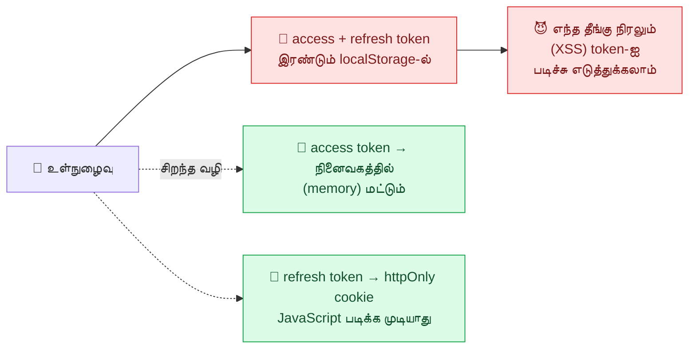

| # | குறை | இப்போ | 2026 நடைமுறை | அவசரம் |
|---|---|---|---|---|
| 5.1 | JWT token localStorage-ல் — XSS திருட்டு அபாயம் | access + refresh இரண்டும் | memory + httpOnly cookie | 🔴 P0 |
| 5.2 | TypeScript இல்ல | 0 `.tsx` | React frontend TS-first | 🟢 P3 |
| 5.3 | Routing = react-router 6 | route type-safety இல்ல | TanStack Router | 🔵 P4 |
| 5.4 | நிகழ்நேர push இல்ல (AI stream தவிர) | notification poll பண்றது | `/events` SSE stream | 🔵 P4 |
| 5.5 | Build — Vite 5, `manualChunks` கையால் | Tailwind 3 | Vite 6/7, Tailwind 4 | 🔵 P4 |
| 5.6 | SPA மட்டும், SSR/RSC இல்ல | முழு client-render | Internal dashboard-க்கு **ஏற்கத்தக்கது** — bundle split மட்டும் | 🔵 P4 |
| 5.7 | **ESLint / Prettier config இல்லவே இல்ல** | lint இல்ல, jsx-a11y இல்ல | ஒவ்வொரு JS project-க்கும் அடிப்படை | 🔴 P0 |
| 5.8 | File அமைப்பு வகைவாரியா (organize by type) | `components/ hooks/ store/` | Feature-Sliced Design (FSD) — domain-வாரியா | 🟢 P3 |
| 5.9 | Client state = Context | `createContext` 10 இடம் | Zustand / Jotai | 🟢 P3 |
| 5.10 | அணுகல்தன்மை (accessibility, a11y) | Radix இருக்கு, jsx-a11y/jest-axe இல்ல | WCAG 2.2 AA + manual screen reader | 🔴 P0 lint + 🔵 P4 முழு |
| 5.11 | வடிவமைப்பு அமைப்பு ஆவணம் (design system) இல்ல | token/Storybook இல்ல | design token + Storybook catalog | 🔵 P4 |
| 5.12 | படிநிலை பிழை எல்லைகள் (nested error boundaries) இல்ல | ஒரு widget crash → முழு app | granular nested boundary | 🔵 P4 |
| 5.13 | Monorepo tooling இல்ல | npm, workspace இல்ல | pnpm workspace + Turborepo | ⚪ P5 |

---

# 🗄️ தரவுத்தளம் (Database)

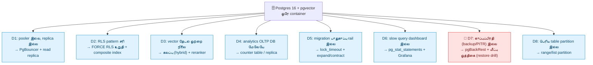

> 🔴 **D7 மிக முக்கியம்:** "நகல் (replication) ≠ காப்புப்பிரதி".
> யாராவது தவறுதலா `DROP TABLE` ஓட்டினா, நகல் DB-லயும் அதே தவறு
> நடக்கும். மீட்பு ஒத்திகையை (restore drill) தினமும் சரிபார்க்கணும்.

| # | இப்போ | 2026 நடைமுறை | அவசரம் |
|---|---|---|---|
| D1 | ஒற்றை instance | PgBouncer transaction-mode + replica | 🟢 P3 |
| D2 | RLS சரி, FORCE உறுதி செய்யல | எல்லா table-லும் `FORCE RLS` | 🟠 P1 |
| D3 | cosine மட்டும் | `tsvector` + pgvector + RRF + rerank | 🟢 P3 |
| D4 | AI சுற்றுக்கு aggregation | incremental counter table | 🟡 P2 |
| D5 | reversible விதி மட்டும் | expand/contract, `lock_timeout` முதல் வரி, `CREATE INDEX CONCURRENTLY` | 🟠 P1 |
| D6 | `pg_stat_statements` இல்ல | + Grafana Alloy | 🟠 P1 |
| D7 | Docker volume மட்டும் | pgBackRest + RPO/RTO + restore drill | 🟠 P1 |
| D8 | partition இல்ல | `ai_llm_call`, `audit_log`, `attendance` | ⚪ P5 |

---

# 🚀 DevOps / Platform / பாதுகாப்பு

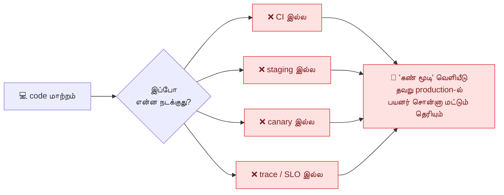

| # | குறை | 2026 நடைமுறை | அவசரம் |
|---|---|---|---|
| O1 | CI pipeline இல்ல | lint+typecheck+unit → integration+SAST → build; Dependabot | 🔴 P0 |
| O2 | trunk-based dev + feature flag இல்ல | தினமும் `main` merge; deploy ≠ release | 🔵 P4 |
| O3 | staging / canary / SLO-rollback இல்ல | canary + user-hash bucketing + auto-rollback | 🔵 P4 |
| O4 | ஒவ்வொரு service auto-observable அல்ல | OpenTelemetry paved path | 🟠 P1 |
| O5 | SBOM / signing / SLSA இல்ல | CycloneDX + cosign + policy-as-code | ⚪ P5 |
| O6 | Secrets manager இல்ல | env → Vault | ⚪ P5 |
| O7 | IaC இல்ல | Terraform / CloudNativePG | ⚪ P5 |
| O8 | SLO / error budget / DORA இல்ல | p95 latency SLO + auto-rollback | 🔵 P4 |

---

# 🏛️ சிறந்த நிறுவனங்களின் எழுதும் முறை (implementation style)

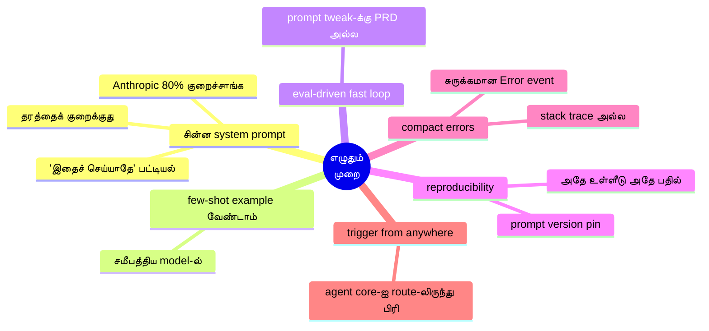

---

# ⚠️ பகுதி 6 — முரண்பாடு கண்டுபிடிப்புகள் (Contradiction findings)

இந்தத் திட்டத்தில் சில பரிந்துரைகள் ARCNAVE-ல் **ஏற்கனவே எடுக்கப்பட்ட
முடிவுகளுக்கு முரண்படுகின்றன**. இவை docs-ஐ நம்பாமல், **நிரலை (code)
நேரடியாகப் படித்துச் சரிபார்க்கப்பட்டவை** (docs-ல் பல விஷயம் "பிறகு
செய்யலாம்" என்று ஒத்திவைக்கப்பட்டவை — அவற்றை நம்பவில்லை).

```mermaid
flowchart TD
    P["📋 என் பரிந்துரை"] --- E["📜 ARCNAVE-ல் ஏற்கனவே இருக்கும் முடிவு"]

    C1["C1 intent classifier"] -->|"முரண்"| A1["aiPolicyAssembly:<br/>'classifier வேண்டாம்'"]
    C2["C2 Vertex caching"] -->|"முரண் (தீர்க்கப்பட்டது)"| A2["ADL-054:<br/>'preemptively கட்டாதே'"]
    C3["C3 Tool Search on"] -->|"முரண்"| A3["config: 'benchmark GO<br/>verdict முதல்ல'"]
    C4["C4 threshold இறுக்கு"] -->|"கட்டுப்பாடு"| A4["describe_tools recovery<br/>பாதுகாக்கணும்"]
    C5["C5 AI குறு transaction"] -->|"முரண் (வேலை)"| A5["'ஒரு request =<br/>ஒரு atomic transaction'"]
    C6["C6 JWT cookie"] -->|"முரண்"| A6["CORS credentials: false"]
    C7["C7 TypeScript"] -->|"முரண்"| A7["ADR-016: plain JavaScript"]
    C8["C8 queue/canary infra"] -->|"முரண்"| A8["'speculatively கட்டாதே'<br/>(code-ல் 5+ இடம்)"]
    C9["C9 native PDF"] -->|"முரண் இல்ல ✅"| A9["ADL-065: 'native reading<br/>நம்பு' — ஒத்துப்போகுது"]
    C10["C10 agent reducer"] -->|"கட்டுப்பாடு"| A10["ADL-050: system segments<br/>byte-identical"]
    C11["C11 prompt சுருக்கு"] -->|"கட்டுப்பாடு"| A10

    classDef block fill:#fee2e2,stroke:#dc2626,color:#7f1d1d
    classDef constr fill:#fef9c3,stroke:#ca8a04,color:#713f12
    classDef ok fill:#dcfce7,stroke:#16a34a,color:#14532d
    class C1,C2,C3,C5,C6,C7,C8 block
    class C4,C10,C11 constr
    class C9 ok
```

### 🔴 C1 — Intent classifier (1.3) vs "classifier வேண்டாம்" கொள்கை

`aiPolicyAssembly.js`-ன் நிரல் குறிப்பு (code comment) வெளிப்படையாகச்
சொல்கிறது: *"message பொருளை (semantics) ஒருபோதும் பார்க்காதே, LLM
classification படி ஒருபோதும் வேண்டாம் — ADR-ல் நிராகரிக்கப்பட்டது:
தவறவிட்ட policy துண்டு ஒரு அமைதியான பின்னடைவு (silent regression)."*

**தீர்வு:** இந்தக் கொள்கை *policy துண்டு தேர்வுக்குச்* சொன்னது —
*கருவி (tool) தேர்வுக்கு* அல்ல. Intent gate-ஐ கருவித் தேர்வுக்கு
மட்டும் கட்டி, policy தேர்வை code-ன் தற்போதைய வழியிலேயே விட்டால்
முரண் தீரும். Approved Spec-ல் இதைத் தெளிவாக எழுதணும்.

### 🟡 C2 — Vertex caching (1.4) vs ADL-054 "preemptively கட்டாதே"

`aiService.js` + `config.js`-ல் ADL-054: *"செலவு/தாமதம் நிஜமான,
நிரூபிக்கப்பட்ட பிரச்சனையாகும் வரை explicit caching கட்டாதே."*
ADL-055 Finding 1 (0 cache hit) ~6 code இடத்தில் "மூடப்பட்டது" என்று
பதிவு.

**தீர்வு:** இந்த session-ல் பயனர் "caching பெரிய பிரச்சனை, 'hi'-க்கு
4,500 சொல்-தொகுதி" என்று சொல்லிவிட்டதால் **மறு-திறப்பு நிபந்தனை
பூர்த்தியாகிறது**. புதிய அளவீட்டை ஒரு ADL entry-ஆகப் பதிவு செய்து,
அதை ADL-054-ன் re-open condition-க்கு இணைத்துத் தொடங்கணும்.

### 🔴 C3 — Tool Search on (1.1) vs "benchmark GO verdict முதல்ல"

`config.js`: *"`tool-search-benchmark.js` GO verdict தந்த பிறகு
மட்டுமே 'true' ஆக்கணும்; app தானா flip செய்யாது."*

**தீர்வு:** வெறுமனே flip செய்யாதே — முதலில் benchmark-ஐ ('demo'
நிறுவனம், உண்மையான billable அழைப்பு) ஓட்டி GO/NO-GO எண்களை ADL
entry-ல். மூன்றாம் தரப்புத் தரவு: retrieval துல்லியம் regex 56%,
BM25 64% மட்டுமே — உண்மையான அபாயம்.

### 🟡 C4 — Threshold இறுக்குதல் (1.2) vs `describe_tools` recovery

முன்பு தவறாக விலக்கப்பட்ட ஒரு கருவி தவறான பதிலை உருவாக்கிய சம்பவம்
நடந்தது. `describe_tools` catalogue உருவானதே "model-க்குத் தன்னிடம்
உள்ள கருவி தெரியாமல் இருக்கக்கூடாது" என்பதற்காக.

**தீர்வு:** retrieval-ஐ இறுக்கும்போது `describe_tools` மீட்பு
வழியை நீக்கக்கூடாது. eval harness (1.17)-ல் இந்தச் சம்பவத்தை ஒரு
test case ஆக வைக்கணும்.

### 🔴 C5 — AI route குறு transaction (4.1) vs "ஒரு request = ஒரு atomic transaction"

`tenantTransaction.js` முழு app-ம் நம்பியிருக்கும் விதி: "request
தொடக்கத்தில் transaction திற, `res.end`-ல் commit." AI சுற்றுகள்
DB writes செய்கின்றன (`logLlmCall`, audit, `mark_attendance_nl`
போன்ற கருவிகள்) — எல்லாம் அந்த ஒரே transaction-ல், LLM அழைப்புகளுக்கு
நடுவே.

**தீர்வு (உண்மையான வேலை, உண்மையான அபாயம்):** குறு transaction-களாகப்
பிரித்தால் "எல்லாம் அல்லது எதுவுமில்லை" (atomicity) உடையும். அணுகுமுறை:
AI சுற்றுக்குள் ஒவ்வொரு DB தொடு-நேரமும் ஒரு தனிக் குறு transaction;
LLM அழைப்பின்போது இணைப்பு pool-க்குத் திரும்பணும். எழுதும் கருவிகள்
(attendance mark) அவற்றின் சொந்த transaction-ல்.

### 🔴 C6 — JWT httpOnly cookie (5.1) vs CORS `credentials: false`

`tenantApp.js` CORS வேண்டுமென்றே `credentials: false` — "cookie-ஐ
cross-origin அனுப்பாதே." Bearer-header auth-தான் design.

**தீர்வு:** refresh token-ஐ cookie-க்கு நகர்த்த `credentials: true`
+ சரியான ஒரே origin (ஏற்கனவே இருக்கு) + `SameSite=Strict` + CSRF
token header வேண்டும். auth middleware-ம் மாறணும். பாதுகாப்பு
மேம்பாட்டுக்காக மாற்றத் தகுந்தது.

### 🔴 C7 — TypeScript (4.3 / 5.2) vs ADR-016 "plain JavaScript"

Backend 0 `.ts`, frontend 0 `.tsx` — இது ADR-016-ன் வேண்டுமென்ற
தேர்வு.

**தீர்வு:** ADR-016-ன் காரணத்தை மறு-எடைபோட்டு, ஒரு புதிய ADR எழுதி
மட்டுமே தொடங்கணும். படிப்படியான migration (`allowJs: true`) —
rewrite அல்ல, ஆனால் இது நிலைப்பாட்டு மாற்றம்.

### 🔴 C8 — Queue / feature-flag / canary infra (4.5, O2, O3) vs "speculatively கட்டாதே"

`rateLimit.js`, `ocrConcurrencyLimit.js`, `permissions.js` — பல
இடத்தில் மீண்டும்: *"usage-volume-gated, speculatively கட்டப்படவில்லை;
இன்று ஒரு deployment-க்கு ஒரே Node process."*

**தீர்வு:** இவற்றை ஏற்பது வேண்டுமென்ற **தத்துவ மாற்றம்**. `pg-boss`
(Postgres-native — புதிய infra இல்ல) மிகக் குறைந்த முரண்பாட்டு
விருப்பம். Multi-instance ஆகும் திட்டம் வந்தால் மட்டுமே feature-flag
platform / canary.

### ✅ C9 — Native PDF ஆவணம் (2.1) — இது முரண்பாடு அல்ல

`aiToolRegistry.js`: ADL-065 (2026-08-30) — உரிமையாளர்
`analyze_document_table`-ஐ **retire** செய்து, "native document
reading-ஐ நம்பு" என்று முடிவெடுத்தார்.

**குறிப்பு:** 2.1 இந்த முடிவோடு **சீரானது**. ஒரே எச்சரிக்கை:
ADL-055/065 native reading "நம்பகமாக எண்ண முடியாது" (2 vs 23,
7 vs 839) என்று அளந்திருக்கிறது — எனவே எண்ணிக்கை/கூட்டல்
deterministic (pdfplumber, ADL-063-ல் shipped) பாதையில் தொடரணும்.
எதுவும் தவறவிடக்கூடாது என்பதற்காகச் சேர்த்தேன்.

### 🟡 C10 — Agent-as-reducer refactor (1.16) vs ADL-050

ADL-050: "ஒரு சுற்றின் முழுவதும் system துண்டுகள் அச்சு அசலாக ஒன்றாக"
— governance உள்ளடக்கத்தை மறு-package செய்தது விதிப் பின்பற்றலை
(rule compliance) 3/3 → 2/7 ஆகக் குறைத்தது.

**தீர்வு:** Reducer rewrite இந்த உத்தரவாதத்தைப் பாதுகாக்கணும்.
refactor-ன் ஏற்பு சோதனையில் (acceptance test) இதை pin செய்யணும்.

### 🟡 C11 — Prompt சுருக்குதல் vs ADL-050

"policy துண்டை நீக்கி அளந்து பார்" — ஆனால் ADL-050 காட்டியது:
மறு-package compliance-ஐ பாதித்தது.

**தீர்வு:** வெறுமனே delete செய்யாதே. ஒவ்வொரு நீக்கத்தையும் விதி
சோதனைகளுக்கு எதிராக eval செய்து மட்டுமே. eval-gated என்பதால்
பாதுகாப்பு.

---

# 🧭 பகுதி 7 — P0 முதல் P5 வரை செயல்திட்டம்

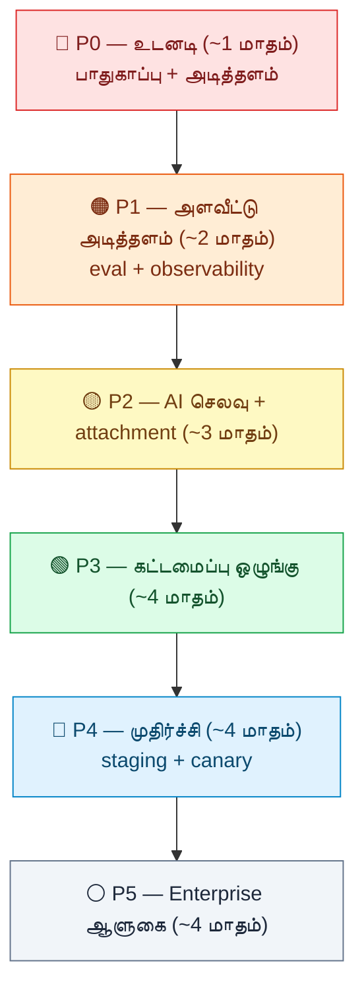

> ⚠️ ஒவ்வொரு கட்டமும் (phase) அதற்கு முந்தையதை நம்பியிருக்கிறது.
> கட்டங்களைத் தவிர்க்காதே.

## 🔴 P0 — உடனடி (பாதுகாப்பு + அடித்தளம், ~1 மாதம்)

இவை இல்லாமல் மற்ற எதுவும் பாதுகாப்பாக நகராது.

- ☐ **CI pipeline** (GitHub Actions) — backend test (Docker), frontend
  test, migration up/down, build. Threshold-க்குக் கீழ் merge block.
- ☐ **ESLint + jsx-a11y + Prettier** — frontend + backend.
- ☐ **சார்பு நிரல் ஸ்கேன் (dependency scanning)** — Dependabot/Renovate.
  பழைய சார்புகள் (multer 1.x, Express 4) பட்டியலிடு.
- ☐ **AI DB-transaction fix** (4.1 / முரண் C5) — `/ai/*` route-ல்
  transaction-ஐ LLM அழைப்பு முழுவதும் திறந்தே வைக்காதே. குறு
  transaction (atomicity கவனத்தோடு).
- ☐ **JWT storage fix** (5.1 / முரண் C6) — refresh token httpOnly
  cookie-க்கு; CORS `credentials: true` + SameSite + CSRF header.

## 🟠 P1 — அளவீட்டு அடித்தளம் (eval + observability, ~2 மாதம்)

இது இல்லாமல் AI-ஐ tune செய்வது **குருட்டுத்தனம்**.

- ☐ **சோதனைத் தொகுப்பு (eval harness)** (1.17) — 50-150 golden case.
  `npm run eval` offline + CI gate. "தவறாக விலக்கப்பட்ட கருவி" சம்பவம்
  (முரண் C4) ஒரு test case ஆக.
- ☐ **LLM கண்காணிப்பு (observability)** (1.15) — OpenTelemetry GenAI
  spans + Langfuse self-host. ஒரு சுற்று = ஒரு trace tree.
- ☐ **Backend tracing** (4.4 / O4) — pino + OpenTelemetry.
- ☐ **DB observability** (D6) — `pg_stat_statements` + Grafana.
- ☐ **Migration பாதுகாப்பு rail** (D5) — `lock_timeout` + advisory
  lock முதல் வரி; `CREATE INDEX CONCURRENTLY`; expand/contract.
- ☐ **காப்புப்பிரதி (PITR)** (D7) — pgBackRest + முதல் மீட்பு ஒத்திகை.
- ☐ **RLS FORCE உறுதி + composite index** (D2).
- ☐ **Zod validation per route + OpenAPI** (4.2 / 4.8) — auth, ai,
  documents, students முதல்ல. Express 5 upgrade.
- ☐ **கண்காணிப்புப் பதிவு async** (1.9) — request பாதையிலிருந்து வெளியே.

## 🟡 P2 — AI செலவு + attachment (~3 மாதம்)

இப்போதுதான் **"hi = 4,500 சொல்-தொகுதி"** சரியாகும்.

- ☐ **Intent gate** (1.3 / முரண் C1) — அரட்டை vs வேலை classifier.
  கருவி gating-க்கு மட்டும்; policy தேர்வு தொடாதே. Approved Spec-ல்
  C1-ஐ எழுது.
- ☐ **Tool Search benchmark → on** (1.1 / முரண் C3) — GO/NO-GO எண்களை
  ADL entry-ல். GO எனில் மட்டும் on.
- ☐ **Vertex explicit context caching** (1.4 / முரண் C2) — regional
  endpoint + explicit cache handle. புதிய அளவீடு ADL entry (ADL-054
  re-open).
- ☐ **வரலாறு = சேமிக்கக்கூடிய முன்பகுதி** (1.6) — append-only.
- ☐ **Native PDF ஆவணம்** (2.1 / முரண் C9) — படிக்க native; எண்ணிக்கை
  pdfplumber-ல்.
- ☐ **Retrieval fix** (1.2 / முரண் C4) — margin/confidence gate,
  eval-ஆல் tune. `describe_tools` மீட்பு பாதுகாக்கப்படணும்.
- ☐ **சாதாரண பதிலுக்கு streaming** (1.7).
- ☐ **சோதனை scaffolding சுத்தம்** (1.14) — 7 flag → config registry.
- ☐ **Skills eval** (3.3).
- ☐ **Embedding அழைப்பு தவிர்ப்பு** (1.10).
- ☐ **pg-boss queue** (4.5 / முரண் C8) — Postgres-native. Archive/
  transcode async.
- ☐ **Quota counter table** (D4).

## 🟢 P3 — கட்டமைப்பு ஒழுங்கு (~4 மாதம்)

- ☐ **Agent-as-reducer refactor** (1.16 / முரண் C10) — `route →
  retrieve → decide → act → verify → synthesize` node. ADL-050
  acceptance test-ல் pin.
- ☐ **God-file split** (4.6).
- ☐ **FSD frontend + Zustand** (5.8 / 5.9) — visual lock மதித்து.
- ☐ **TypeScript migration தொடக்கம்** (4.3 / 5.2 / முரண் C7) — புதிய
  ADR; `allowJs`; புதிய file `.ts`.
- ☐ **PgBouncer transaction-mode** (D1).
- ☐ **Contract tests** (4.9) — auth, ai, documents.
- ☐ **RAG rerank + hybrid search** (1.5 / D3).
- ☐ **Guardrail அடுக்கு** (1.18) — output schema-check universal;
  தமிழ்/Tanglish numeric verification (1.13).
- ☐ **Adaptive reasoning depth** (1.11); structured output native
  எல்லா adapter (1.12).
- ☐ **Attachment extraction cache** (2.3); OCR → vision fallback
  (2.4 / 2.5).
- ☐ **செத்த skill script சுத்தம்** (3.2).

## 🔵 P4 — முதிர்ச்சி (staging + progressive delivery, ~4 மாதம்)

- ☐ **Staging environment + smoke test** (O3).
- ☐ **Canary + feature flags** (O2 / O3 / முரண் C8) — deterministic
  user-hash bucketing; multi-instance ஆனால் மட்டும்.
- ☐ **SLO + error budget + auto-rollback** (O8).
- ☐ **Dogfood loop + retention-gated rollout** — internal cohort,
  feedback synthesis.
- ☐ **Online eval sampling + judge-drift monitoring**.
- ☐ **Notification / job progress-க்கு SSE** (5.4).
- ☐ **Design system doc + Storybook** (5.11); nested error boundaries
  (5.12); performance budget in CI (5.5 / 5.6).
- ☐ **முழு a11y audit — WCAG 2.2 AA** (5.10).
- ☐ **TanStack Router** (5.3); Vite/Tailwind upgrade (5.5).
- ☐ **ஆவண workflow ஒருங்கிணைப்பு** (3.4).

## ⚪ P5 — Enterprise ஆளுகை (~4 மாதம்)

- ☐ **SBOM (CycloneDX) + artifact signing (cosign) + SLSA +
  policy-as-code** (O5).
- ☐ **Secrets manager** (O6) — env → Vault.
- ☐ **IaC** (O7) — Terraform/Pulumi அல்லது CloudNativePG.
- ☐ **DB partitioning** (D8) — `ai_llm_call`, `audit_log`,
  `attendance`.
- ☐ **Read replica** (D1) — heavy analytics.
- ☐ **API versioning / deprecation policy** (4.10).
- ☐ **Prompt/model version registry + canary for prompt/model
  changes**.
- ☐ **Monorepo tooling — pnpm workspace + Turborepo** (5.13).

---

## ⏱️ முதல் 60 நாள் (concrete)

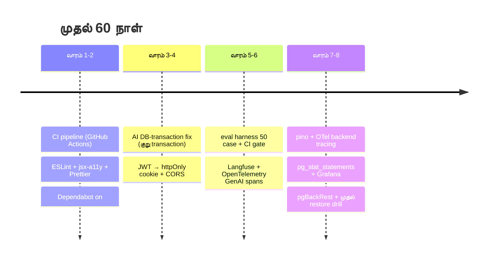

---

# 🎬 முடிவுரை

ARCNAVE-ன் **அடித்தளம் நல்லது** — modular monolith, RLS, சேவை உரிமை
விதிகள், verification backstops, ADR ஒழுங்கு. இதை விடக்கூடாது.

குறைபாடுகள் மூன்று வகை:

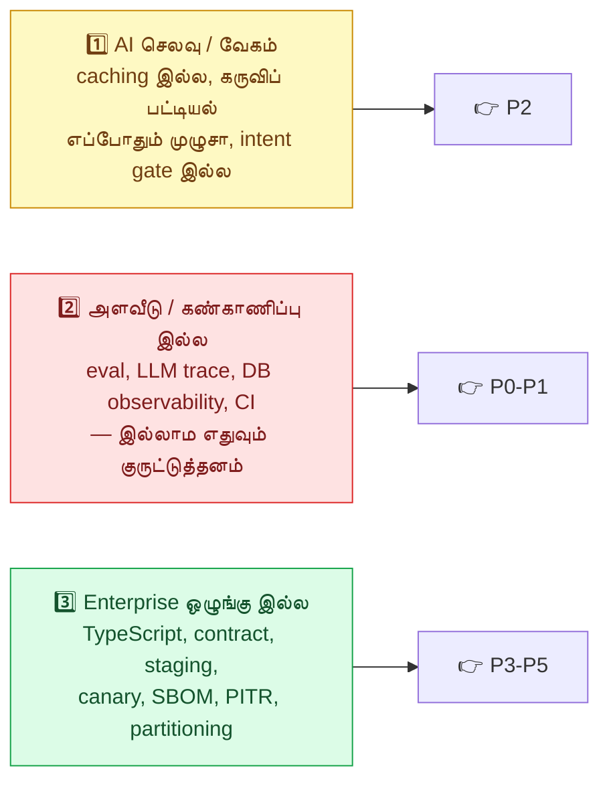

**முதல் 60 நாள் = P0 முழுவதும் + P1-ன் eval harness & observability.**
அதன் பிறகு P2-ஐ eval எண்கள் வழிநடத்தட்டும் — *"கட்டி முடிந்தது"* அல்ல,
*"eval contract-ஐ தாண்டியது."*

பகுதி 6-ன் **11 முரண்பாடுகள்** — இவை தடைகள் அல்ல, ஆனால் ஒவ்வொன்றுக்கும்
ஒரு ADR entry / Approved Spec குறிப்பு எழுதி, காரணத்தோடு தொடங்கணும்.
