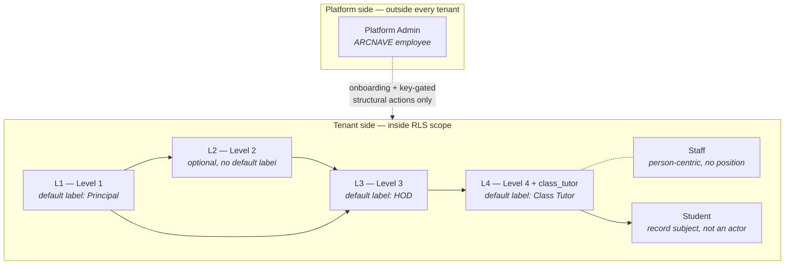

# Actor Model

**Status:** Normative
**Purpose:** Defines every actor the specification may name. No rule may
introduce an actor not defined here.

---

## 1. Actor taxonomy

ARCNAVE recognises exactly two actor populations, structurally separated at the
application boundary:

## 2. Platform Admin

| Property | Definition |
|---|---|
| Employer | ARCNAVE, not the institution |
| Position in the institutional hierarchy | **None.** Not a seat in any tenant's role model. |
| Tenant `users` row | Never exists |
| Authentication | Separate Platform API with its own auth |
| RLS exposure | Never executes inside the RLS-scoped tenant path |
| Cardinality | The one and only platform-side role |

Platform Admin's authority is exhaustively enumerated by
[RS-GOV-001](../10-specification/RS-GOV-governance.md#rs-gov-001) through
[RS-GOV-008](../10-specification/RS-GOV-governance.md#rs-gov-008) and
[RS-TEN-004](../10-specification/RS-TEN-tenancy-security.md#rs-ten-004). Any
action not listed there is outside Platform Admin's authority.

The boundary is drawn by **kind of change, not frequency**
([RS-GOV-002](../10-specification/RS-GOV-governance.md#rs-gov-002)): Platform
Admin owns the college's structural and legal identity; the college owns its
own operational policy.

> **Retired naming.** "Super Admin" and `college_admin` were earlier names for
> actors that no longer exist. Neither term is valid in this specification. See
> [ADL-001](../30-decisions/ledger.md#adl-001).

## 3. The L1–L4 institutional hierarchy

**L1–L4 is the real, underlying authority structure.** Job titles are display
labels rendered over it, configurable per institution
([RS-IDN-012](../10-specification/RS-IDN-identity.md#rs-idn-012)).

| Level | Default display label | Account type | Scope | Optional? |
|---|---|---|---|---|
| L1 | Principal | Position Account | College | No — provisioned automatically at onboarding |
| L2 | *(none — varies by institution)* | Position Account — own `position_access` session, per L1's configuration (corrected 2026-08-16, [ADL-034](../30-decisions/ledger.md#adl-034)) | Per L1's configuration | **Yes** |
| L3 | HOD | Position Account | Owned department(s) | No |
| L4 | Class Tutor | Position Account (`position_type = 'class_tutor'`) | Exactly one class | Per class |

**Default reporting chain:** L4 → L3 → L1.
**With L2 inserted:** L1 → L2 → L3 → L4.

### 3.1 The L2 optionality invariant

L2 is optional and may not exist at a given college. Therefore **no rule,
route, permission check or invitation path may require an L2 to exist in order
for an L1, L3 or L4 action to complete.** This invariant is stated normatively
at [RS-IDN-004](../10-specification/RS-IDN-identity.md#rs-idn-004) and is the
single most frequently violated constraint in the estate — see
[ADL-006](../30-decisions/ledger.md#adl-006).

## 4. Staff

A person employed by the institution who holds no Position. Person-centric:
no Position row, no Position Account. A staff member's `users.role` remains
`staff` regardless of any assignment they hold — **"role" means job title, not
authority**.

Staff derive scope from assignment data (faculty allocation, timetable
linkage), not from the position model.

## 5. Students

Students are **record subjects, not actors**. They hold no login and no
dashboard ([RS-IDN-013](../10-specification/RS-IDN-identity.md#rs-idn-013)).
Parents likewise hold no account
([RS-STU-012](../10-specification/RS-STU-students.md#rs-stu-012)).

## 6. Identity contexts

A single human may authenticate through two structurally distinct contexts.
They are never merged.

| | Personal Identity Context | Institutional Identity Context |
|---|---|---|
| Subject | The person (`users.id`) | One Position Account (`position_accounts.id`) |
| Token `type` | `access` | `position_access` |
| Token `sub` | `userId` | `positionAccountId` (never a user id) |
| Role claim in token | Present | **Absent** — derived per request |
| Resolver | `identityService.resolveCapabilities` | `identityService.resolveCapabilitiesForPosition` |
| Capability semantics | **Union** of every position the person holds | **Exclusively** that one position |
| Effective roles producible | `principal`, `hod`, `staff` | `principal`, `level2`, `hod`, `class_tutor`, `staff` |
| Governing ADR | [ADR-022](../30-decisions/adr-register.md#adr-022) | [ADR-023](../30-decisions/adr-register.md#adr-023) |

Governed normatively by
[RS-IDN-005](../10-specification/RS-IDN-identity.md#rs-idn-005) …
[RS-IDN-009](../10-specification/RS-IDN-identity.md#rs-idn-009).

## 7. Authority is ownership-derived, never title-derived

**No actor acquires write authority over a datum by virtue of holding an
L1–L4 title.** Authority to write is derived from actual ownership of that
specific datum:

| Datum | Write owner |
|---|---|
| Attendance for an hour | The staff member linked to that hour, or their approved substitute |
| Student profile data | The class's L4 |
| Marks for a subject | The faculty member assigned to that subject |
| Fee status (first entry) | The class's L4 |

Approval authority over a *correction* is a separate faculty from ownership of
the *original entry*, and is deliberately held one level up. This is a
structural pattern applied uniformly — see
[RS-DAT-002](../10-specification/RS-DAT-data-integrity.md#rs-dat-002).

## 8. Authority reference

| Actor | May initiate | May approve | Never may |
|---|---|---|---|
| Platform Admin | College creation, onboarding config, key-redeemed structural change, reactivation, archival | Nothing academic or institutional | Enter the tenant RLS path; substitute for L1's approval; refuse a valid key |
| L1 | Academic Year lifecycle, department addition, all operational configuration, structural authorization keys, L2/L3 occupancy | Final approver for timetable; any chain step configured to it | Skip a mandatory approval floor |
| L2 | Per L1's configuration | Per L1's configuration, where inserted into the chain | Act without a resolved position context; hold institutional authority without the Institutional Identity Context |
| L3 | Staff invitation, faculty deactivation, L4 assignment, substitute approval, department-scoped correction approval | Fee-status corrections; student lifecycle transitions (mandatory floor); substitute requests; staff registration (first step) | Act outside their own department |
| L4 | Student creation and profile edit, first-time fee marking, attendance/mark correction approval, Send Alert, examination publication, scholarship eligibility | Attendance corrections, mark corrections (own class) | Mark attendance they do not own; act outside their own class |
| Staff | Attendance for own scheduled hour, first-time mark entry for own subject, substitute request | — | Write to any datum they do not own |
