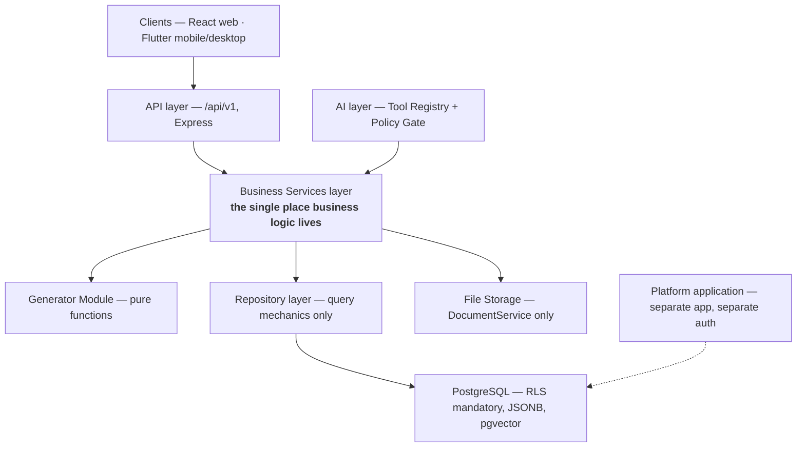

# Domain Model

**Status:** Normative
**Purpose:** Defines the canonical entities, their owning services, and the
structural layering every rule is expressed against.

---

## 1. Architectural style

ARCNAVE is a **modular monolith**: one Express (Node.js) application with
enforced internal boundaries, not separately deployed services
([ADR-003](../30-decisions/adr-register.md#adr-003)).



## 2. Layer invariants

These are structural invariants, not preferences. Each is stated normatively by
the rule shown.

| Invariant | Rule |
|---|---|
| Every consumer — routes, mobile, AI tools — calls the Business Services layer; nothing else reaches a repository or the database | [RS-TEN-006](../10-specification/RS-TEN-tenancy-security.md#rs-ten-006) |
| Repositories never call other repositories | [RS-TEN-007](../10-specification/RS-TEN-tenancy-security.md#rs-ten-007) |
| `DocumentService` is the sole owner of every file byte | [RS-ASM-005](../10-specification/RS-ASM-assessment-documents.md#rs-asm-005) |
| The Generator Module has no database, storage, business-rule or permission access | [RS-ASM-006](../10-specification/RS-ASM-assessment-documents.md#rs-asm-006) |
| `WorkflowService` is the single approval engine for human- and AI-initiated actions alike | [RS-WFL-001](../10-specification/RS-WFL-workflow.md#rs-wfl-001) |
| Every tenant-scoped query is protected by PostgreSQL Row-Level Security | [RS-TEN-001](../10-specification/RS-TEN-tenancy-security.md#rs-ten-001) |
| AI tools call Business Services only | [RS-AIG-002](../10-specification/RS-AIG-ai-governance.md#rs-aig-002) |

## 3. Service ownership register

The owning service is the **single** accountable enforcement point for its
domain. A rule's `Owner` field always names one of these.

| Service | Owns |
|---|---|
| `StudentService` | Student records, enrollment, register/EMIS/admission numbers, lifecycle status |
| `StaffService` | Staff records, job titles, department assignment, staff lifecycle |
| `AcademicService` | Academic year, semester, subjects, curriculum/regulation, faculty allocation, timetable, calendar |
| `AttendanceService` | Hour-wise attendance, attendance windows, lock state, corrections. Reads (never owns) timetable approval state |
| `FinanceService` | Fee status flag, payment records, scholarship eligibility marking |
| `AssessmentService` | Assessment types, raw mark records, mark corrections |
| `DocumentService` | Every file: uploads, generated exports, templates, OCR sources, storage paths, retention |
| `WorkflowService` | Every approval — human-initiated and AI Level 3 alike; delegation; chain versioning |
| `NotificationService` | Notification lifecycle: draft → approved → dispatched; delivery ledger |
| `ReportService` | Composes other services' data into a `ReportModel`. Owns no repository |
| `AnalyticsService` | Aggregated and derived statistics |
| `ConfigurationService` | Per-college settings as JSONB; optimistic-concurrency versioning |
| `IdentityService` | The two capability resolution façades; position/account/occupant reads |
| `PlatformService` | College creation, onboarding, provisioning status, structural authorization keys |

### 3.1 Ledger-shaped exceptions

`audit_log` and `generated_reports` are cross-cutting event ledgers, not a
business domain. They are called directly by any service through their own
standalone repositories, without a mediating service
([ADR-018](../30-decisions/adr-register.md#adr-018)). Both are append-only: the
application role holds no `UPDATE` or `DELETE` grant.

## 4. Canonical entity register

| Entity | Identity key | Permanence | Owning service |
|---|---|---|---|
| College (tenant) | `colleges.college_id` (human-readable code, ≠ internal UUID) | Permanent; archived, never deleted | `PlatformService` |
| Department | Department id | Permanent; merge/rename is key-gated | `PlatformService` / `StaffService` |
| Class | **Slot** keyed by (department, semester number) | Permanent for the life of the course; occupants rotate annually | `AcademicService` |
| Academic Year | Year id | Permanent; exactly one Active per college | `AcademicService` |
| Student | **Permanent Student ID** — for life, across transfers | Permanent; enrollments are additive | `StudentService` |
| Staff | **Permanent Internal Staff ID** — for the whole institutional lifecycle | Permanent; deactivated, never deleted | `StaffService` |
| Position | Position id | Created once, never deleted | `IdentityService` |
| Position Account | Position Account id | Created once per position, never deleted | `IdentityService` |
| Occupant link | Append-only, time-boxed | History accumulates indefinitely | `IdentityService` |
| Timetable version | Version id | Every locked version retained permanently | `AcademicService` |
| Curriculum / regulation version | Regulation id | Historical versions never change | `AcademicService` |
| Attendance record | (class-hour, student, date) | Original value never deleted | `AttendanceService` |
| Mark record | (student, subject, assessment) | Original value never deleted | `AssessmentService` |
| Fee status | (student, fee line) | Original value never deleted | `FinanceService` |
| Workflow request | Request id | Retained with full history | `WorkflowService` |
| Audit entry | Append-only | Never modifiable by any normal user | *(ledger)* |

## 5. Identity-key discipline

| Purpose | Permitted keys | Prohibited |
|---|---|---|
| Student business identity, dedup, import matching | Register Number, EMIS Number, Admission Number | **Aadhaar — absolutely, everywhere** |
| Tenant resolution | Subdomain → JWT claim → explicit college code | — |
| Tenant RLS key | `colleges.college_id` | `colleges.id` (internal UUID) |
| Staff historical reference | Permanent Internal Staff ID | Institution-issued Staff ID / Employee Code (may change on reappointment) |
| Student historical reference | Permanent Student ID | Enrollment id |

The Aadhaar prohibition is a legal compliance requirement, not an
architectural preference, and is stated normatively at
[RS-STU-002](../10-specification/RS-STU-students.md#rs-stu-002).

## 6. Class slot semantics

A class is a **fixed slot**, not a cohort.

```
Slot         : (department, semester number)   e.g. "ECE Sem 3"
Permanence   : for the life of the department/course
Occupancy    : a different batch every academic year
History key  : (slot + academic year) — jointly, never slot alone
Existence    : a section becomes operationally real only once L3 assigns an L4
```

One academic year = two semesters. Each student advances two semesters per
year; a fresh batch enters at the first eligible slot each year. Any history
question — "who was in ECE Sem 3?" — is unanswerable without an academic year.
Governed by [RS-CLS-002](../10-specification/RS-CLS-classroom.md#rs-cls-002).

## 7. Technology baseline

| Concern | Decision | ADR |
|---|---|---|
| Database | PostgreSQL only; JSONB for flexible config; pgvector for embeddings; no second datastore | [ADR-001](../30-decisions/adr-register.md#adr-001) |
| Tenant isolation | Row-Level Security + `SET LOCAL app.current_tenant` per request transaction | [ADR-002](../30-decisions/adr-register.md#adr-002) |
| DB role split | Migration role owns tables; runtime role owns nothing and is never superuser | [ADR-015](../30-decisions/adr-register.md#adr-015) |
| Backend | Express (Node.js, plain JavaScript); `pg` with raw parameterised SQL; `node-pg-migrate` | [ADR-016](../30-decisions/adr-register.md#adr-016) |
| Web client | React + Tailwind | — |
| Mobile / desktop client | Flutter, one codebase | [ADR-007](../30-decisions/adr-register.md#adr-007) |
| Platform isolation | Separate application, separate auth, separate API | [ADR-010](../30-decisions/adr-register.md#adr-010) |
| File storage | Local disk under a tenant-prefixed tree; pluggable backend selection per institution | [ADR-017](../30-decisions/adr-register.md#adr-017), [RS-GOV-013](../10-specification/RS-GOV-governance.md#rs-gov-013) |
| File generation | `exceljs` / `docx` / `pdfkit`; `docxtemplater` + `pizzip` for template merge | [ADR-019](../30-decisions/adr-register.md#adr-019) |
| LLM provider | NVIDIA NIM (OpenAI-compatible endpoint); provider is a configurable, swappable component | [ADR-028](../30-decisions/adr-register.md#adr-028), [ADL-002](../30-decisions/ledger.md#adl-002) |
| Agent pattern | Native function-calling / tool-use. Not LangChain/LangGraph | [ADR-004](../30-decisions/adr-register.md#adr-004) |
