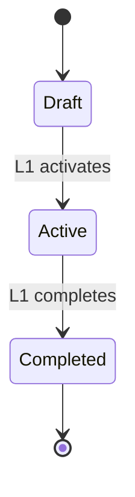
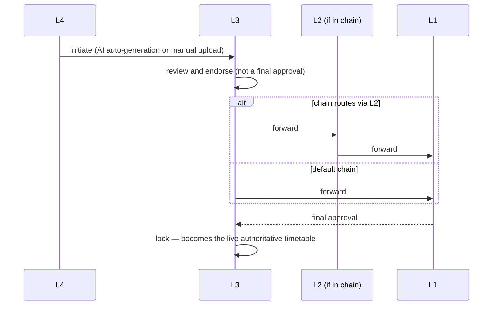

# RS-ACA — Academic Year, Curriculum & Timetable

**Domain:** Academic ownership, the Academic Year lifecycle, curriculum and
regulation versioning, timetable approval, locking and versioning, the
institutional calendar.
**Owning service:** `AcademicService`.

---

## RS-ACA-001

**Academic owns the academic year, semester, subjects, curriculum, faculty
allocation, timetable and calendar. Attendance depends on Academic; Academic
never depends on Attendance.**

The dependency is one-way and structural. It determines module build order and
means no academic concept may be defined in terms of attendance state.

| | |
|---|---|
| **Owner** | `AcademicService` |
| **Authority** | System invariant |
| **Depends on** | — |
| **Governs** | [RS-ACA-002](RS-ACA-academic.md#rs-aca-002), [RS-ACA-004](RS-ACA-academic.md#rs-aca-004), [RS-ATT-001](RS-ATT-attendance.md#rs-att-001) |
| **Lifecycle** | Academic Year, Timetable |
| **Workflow** | — |
| **AI** | — |
| **Modules** | 3 |
| **Data effect** | — |
| **Implementation** | `AcademicService`; `AttendanceService` reads, never owns, timetable approval state |
| **Conformance** | Conformant |
| **Decisions** | — |

---

## RS-ACA-002

**An institution operates under exactly one Active Academic Year at a time,
with the lifecycle `Draft → Active → Completed`. Completed is terminal.**

The previous year MUST be `Completed` before a new one becomes `Active`.

**Only L1 may request *and* execute lifecycle transitions** — create, activate,
complete — directly, with no Platform Admin involvement at any point.

There is no `Archived` Academic Year status. A completed year's individual
*records* may become archived under the general retention rule
([RS-DAT-003](RS-DAT-data-integrity.md#rs-dat-003)) — a record-keeping
mechanism applied on top, not a further lifecycle status the year itself passes
through. This is the same relationship Alumni students have to record archival.

| | |
|---|---|
| **Owner** | `AcademicService` |
| **Authority** | **L1 only** |
| **Depends on** | [RS-DAT-003](RS-DAT-data-integrity.md#rs-dat-003), [RS-DAT-007](RS-DAT-data-integrity.md#rs-dat-007), [RS-GOV-004](RS-GOV-governance.md#rs-gov-004), [RS-ACA-001](RS-ACA-academic.md#rs-aca-001) |
| **Governs** | [RS-ACA-003](RS-ACA-academic.md#rs-aca-003), [RS-ACA-009](RS-ACA-academic.md#rs-aca-009), [RS-ACA-011](RS-ACA-academic.md#rs-aca-011), [RS-STU-008](RS-STU-students.md#rs-stu-008) |
| **Lifecycle** | **Academic Year — canonical definition** |
| **Workflow** | None — L1 direct action, audited |
| **AI** | L1 read. AI defaults to the Active Academic Year unless another is explicitly requested, and MUST NOT change the lifecycle itself |
| **Modules** | 3 |
| **Data effect** | Supersedes with audit |
| **Implementation** | `academic_years.status` ships as `Draft \| Active \| Completed`, enforced by a DB CHECK constraint |
| **Conformance** | Conformant |
| **Decisions** | [ADL-003](../30-decisions/ledger.md#adl-003) |

---

## RS-ACA-003

**Every attendance, timetable, examination, mark, fee and report record belongs
to an Academic Year.**

Combined with the class slot rule ([RS-CLS-002](RS-CLS-classroom.md#rs-cls-002)),
this makes (slot + academic year) the joint key for every historical question.

| | |
|---|---|
| **Owner** | `AcademicService` |
| **Authority** | System invariant |
| **Depends on** | [RS-CLS-002](RS-CLS-classroom.md#rs-cls-002), [RS-ACA-002](RS-ACA-academic.md#rs-aca-002) |
| **Governs** | [RS-DAT-004](RS-DAT-data-integrity.md#rs-dat-004) |
| **Lifecycle** | Academic Year |
| **Workflow** | — |
| **AI** | Binding on every query scope |
| **Modules** | 3, 4, 5, 7 |
| **Data effect** | Preserves |
| **Implementation** | Academic year foreign key on every dated domain table |
| **Conformance** | Conformant |
| **Decisions** | — |

---

## RS-ACA-004

**One unified approval workflow governs both first-time timetable creation and
every later revision. L1 is a mandatory final approver.**

| Property | Rule |
|---|---|
| Initiation | L4, by AI auto-generation or manual upload |
| L3's role | Review and endorsement — explicitly **not** a final approval |
| Routing | Directly to L1, or via L2 first, per the institution's own standing configured chain |
| Final approval | **L1 — mandatory floor, not configurable away** ([RS-WFL-003](RS-WFL-workflow.md#rs-wfl-003)) |
| Locking | L3 locks after L1's approval, making it the live authoritative timetable for that class |
| Immutability | An approved timetable is immutable while locked. A permanent change is a whole new pass through this same workflow, never an edit |

| | |
|---|---|
| **Owner** | Timetable Approval |
| **Supporting Components** | `AcademicService`, `WorkflowService` |
| **Authority** | L4 initiates · L3 endorses and locks · **L1 approves** |
| **Depends on** | [RS-WFL-003](RS-WFL-workflow.md#rs-wfl-003), [RS-CLS-006](RS-CLS-classroom.md#rs-cls-006), [RS-ACA-001](RS-ACA-academic.md#rs-aca-001) |
| **Governs** | [RS-ACA-005](RS-ACA-academic.md#rs-aca-005), [RS-ACA-006](RS-ACA-academic.md#rs-aca-006), [RS-ACA-007](RS-ACA-academic.md#rs-aca-007), [RS-ACA-008](RS-ACA-academic.md#rs-aca-008), [RS-ATT-001](RS-ATT-attendance.md#rs-att-001) |
| **Lifecycle** | **Timetable — canonical definition:** `draft → endorsed → approved → locked` |
| **Workflow** | `timetable_approval`; **mandatory L1 floor** |
| **AI** | L3 workflow-submitting — `academic_submit_timetable_for_approval` |
| **Modules** | 3, 8 |
| **Data effect** | Creates a new version; never supersedes in place |
| **Implementation** | `academicService`; `workflowChainService` |
| **Conformance** | Conformant |
| **Decisions** | — |

---

## RS-ACA-005

**Timetable auto-generation runs one class or department at a time and checks
every faculty member's availability against all already-approved allocations
institution-wide.**

Never institution-wide in a single pass. Availability is checked against
*every* approved timetable allocation across the institution, using each
faculty member's Permanent Internal Staff ID
([RS-STF-004](RS-STF-staff.md#rs-stf-004)), so nobody is double-booked.

**If no conflict-free timetable is possible, AI reports the conflict to L3 for
action rather than guessing.**

| | |
|---|---|
| **Owner** | `AcademicService` |
| **Authority** | L4 initiates |
| **Depends on** | [RS-STF-004](RS-STF-staff.md#rs-stf-004), [RS-ACA-004](RS-ACA-academic.md#rs-aca-004) |
| **Governs** | — |
| **Lifecycle** | Timetable |
| **Workflow** | Feeds [RS-ACA-004](#rs-aca-004) |
| **AI** | L2 generate — produces a draft with no external effect; never publishes |
| **Modules** | 3, 9 |
| **Data effect** | Creates draft |
| **Implementation** | `academicService` generation path |
| **Conformance** | Conformant |
| **Decisions** | — |

---

## RS-ACA-006

**Every past locked timetable version is permanently retained, and attendance
always uses whichever version was locked and effective on the class date.**

Historical attendance is never re-interpreted against a later timetable. This
is the timetable's expression of the general historical-integrity guarantee
([RS-DAT-004](RS-DAT-data-integrity.md#rs-dat-004)).

| | |
|---|---|
| **Owner** | `AcademicService` |
| **Authority** | System invariant |
| **Depends on** | [RS-ACA-004](RS-ACA-academic.md#rs-aca-004) |
| **Governs** | [RS-DAT-004](RS-DAT-data-integrity.md#rs-dat-004), [RS-ACA-007](RS-ACA-academic.md#rs-aca-007), [RS-ATT-001](RS-ATT-attendance.md#rs-att-001) |
| **Lifecycle** | Timetable |
| **Workflow** | — |
| **AI** | Binding on every timetable read |
| **Modules** | 3, 4 |
| **Data effect** | Preserves — versions accumulate |
| **Implementation** | Versioned timetable records with effective dating |
| **Conformance** | Conformant |
| **Decisions** | — |

---

## RS-ACA-007

**While a timetable is pending L1's decision, the previously locked timetable
continues to be followed. There is no rejected state.**

There is no operational gap and an un-approved draft never takes effect, so no
separate rejected status is required. A draft that L1 declines simply never
becomes locked.

| | |
|---|---|
| **Owner** | `AcademicService` |
| **Authority** | System invariant |
| **Depends on** | [RS-ACA-004](RS-ACA-academic.md#rs-aca-004), [RS-ACA-006](RS-ACA-academic.md#rs-aca-006) |
| **Governs** | — |
| **Lifecycle** | Timetable |
| **Workflow** | — |
| **AI** | — |
| **Modules** | 3 |
| **Data effect** | Preserves |
| **Implementation** | Absence of a rejected state is the implementation |
| **Conformance** | Conformant |
| **Decisions** | — |

---

## RS-ACA-008

**Substitute faculty, room changes and emergency adjustments are temporary
operational overrides and never trigger the timetable approval workflow.**

They are session-scoped and do not alter the official timetable. Substitution
is separately governed by [RS-CLS-007](RS-CLS-classroom.md#rs-cls-007).

| | |
|---|---|
| **Owner** | `AcademicService` |
| **Authority** | Per [RS-CLS-007](RS-CLS-classroom.md#rs-cls-007) |
| **Depends on** | [RS-CLS-007](RS-CLS-classroom.md#rs-cls-007), [RS-ACA-004](RS-ACA-academic.md#rs-aca-004) |
| **Governs** | — |
| **Lifecycle** | Timetable |
| **Workflow** | None |
| **AI** | L1 |
| **Modules** | 3 |
| **Data effect** | Creates override record; timetable preserved |
| **Implementation** | Session-scoped override records |
| **Conformance** | Conformant |
| **Decisions** | — |

---

## RS-ACA-009

**Multiple curriculum ("regulation") versions coexist. A student's regulation
is fixed at admission and changes only through an official Curriculum Migration
workflow.**

Each regulation owns its own subject list, credits, contact hours and
examination scheme. **Historical regulation versions never change.**

L3 assigns approved subjects to faculty for a specific Academic Year and
semester.

| | |
|---|---|
| **Owner** | `AcademicService` |
| **Authority** | L1 / L3 per configured chain |
| **Depends on** | [RS-ACA-002](RS-ACA-academic.md#rs-aca-002) |
| **Governs** | [RS-ACA-010](RS-ACA-academic.md#rs-aca-010), [RS-ASM-002](RS-ASM-assessment-documents.md#rs-asm-002) |
| **Lifecycle** | Curriculum version: immutable once published |
| **Workflow** | Curriculum Migration for a student's regulation change |
| **AI** | L1 read |
| **Modules** | 3 |
| **Data effect** | Preserves |
| **Implementation** | `routes/curriculum.js` |
| **Conformance** | Conformant |
| **Decisions** | — |

---

## RS-ACA-010

**Official syllabus documents are retained as the source reference; AI-extracted
curriculum data always requires human verification before publication.**

AI MAY extract subject code, name, semester, credits and hours from an uploaded
syllabus. Extracted data is never published into the ERP unilaterally.

| | |
|---|---|
| **Owner** | Curriculum Documents |
| **Supporting Components** | `AcademicService`, `DocumentService` |
| **Authority** | Human verifier publishes |
| **Depends on** | [RS-ACA-009](RS-ACA-academic.md#rs-aca-009), [RS-ASM-005](RS-ASM-assessment-documents.md#rs-asm-005) |
| **Governs** | [RS-ASM-007](RS-ASM-assessment-documents.md#rs-asm-007), [RS-AIG-012](RS-AIG-ai-governance.md#rs-aig-012) |
| **Lifecycle** | Curriculum version |
| **Workflow** | Human verification gate |
| **AI** | L2 generate — extraction only, never publication |
| **Modules** | 3, 6, 9 |
| **Data effect** | Creates draft |
| **Implementation** | `documentExtractionService` |
| **Conformance** | Conformant |
| **Decisions** | — |

---

## RS-ACA-011

**One shared institutional Academic Calendar exists, with no predefined
event-type restriction.**

It carries semester dates, holidays, exams and other institution-defined
events. It is not a personal task list. AI MAY answer calendar questions but
MUST NOT create or edit an event without authorization.

| | |
|---|---|
| **Owner** | `AcademicService` |
| **Authority** | L1 |
| **Depends on** | [RS-ACA-002](RS-ACA-academic.md#rs-aca-002) |
| **Governs** | — |
| **Lifecycle** | — |
| **Workflow** | None — no workflow step exists for calendar |
| **AI** | L1 read; **L1 direct-write** for `calendar_create_event` / `calendar_update_event`, `principal` only, because no human approval step exists either |
| **Modules** | 3, 9 |
| **Data effect** | Creates / supersedes with audit |
| **Implementation** | `routes/calendar.js` |
| **Conformance** | Conformant |
| **Decisions** | — |
