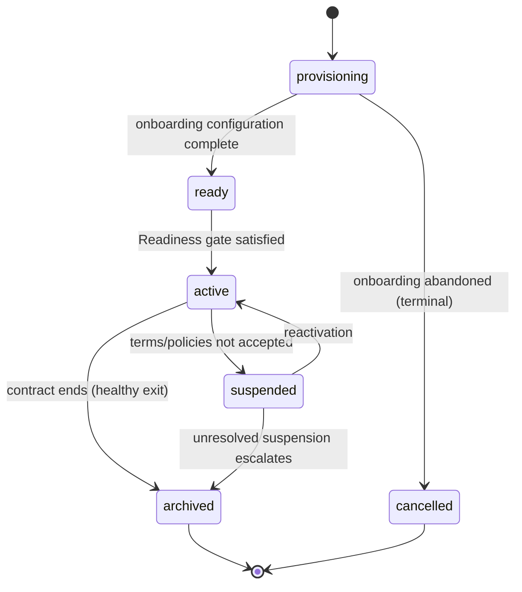

# RS-GOV — Platform Governance & Onboarding

**Domain:** Platform governance, tenant onboarding, structural change control,
organization lifecycle, institution configuration.
**Owning services:** `PlatformService`, `ConfigurationService`.

---

## RS-GOV-001

**Platform Admin is an ARCNAVE employee and holds no seat in any institution's
reporting hierarchy.**

Platform Admin does not teach, makes no academic or institutional decision, and
never approves an academic workflow on any institution's behalf. No
`college_admin` row exists in any tenant's `users` table, and no separate
"Super Admin" actor exists: Platform Admin is the one and only platform-side
role.

| | |
|---|---|
| **Owner** | `PlatformService` |
| **Authority** | ARCNAVE |
| **Depends on** | [RS-TEN-004](RS-TEN-tenancy-security.md#rs-ten-004) |
| **Governs** | [RS-GOV-002](RS-GOV-governance.md#rs-gov-002), [RS-GOV-003](RS-GOV-governance.md#rs-gov-003), [RS-GOV-005](RS-GOV-governance.md#rs-gov-005) |
| **Lifecycle** | Organization |
| **Workflow** | — |
| **AI** | Prohibited — Platform Admin has no path into the tenant AI Workspace |
| **Modules** | 0 |
| **Data effect** | — |
| **Implementation** | Platform API, `platform_admins` table, separate auth |
| **Conformance** | Conformant |
| **Decisions** | [ADL-001](../30-decisions/ledger.md#adl-001) |

---

## RS-GOV-002

**Platform Admin's authority is bounded by the kind of change, not its
frequency: Platform Admin owns the college's structural and legal identity; the
college owns its own operational policy.**

After onboarding, Platform Admin has no ongoing role in a college's day-to-day
operation or policy — not workflow configuration, not Academic Year changes,
not profile maintenance, not staffing. A head of institution does not have to
ask an outside party to change their own college's operational settings.

| | |
|---|---|
| **Owner** | `PlatformService` |
| **Authority** | ARCNAVE / L1 |
| **Depends on** | [RS-GOV-001](RS-GOV-governance.md#rs-gov-001) |
| **Governs** | [RS-GOV-004](RS-GOV-governance.md#rs-gov-004), [RS-GOV-005](RS-GOV-governance.md#rs-gov-005), [RS-GOV-008](RS-GOV-governance.md#rs-gov-008), [RS-GOV-013](RS-GOV-governance.md#rs-gov-013) |
| **Lifecycle** | Organization |
| **Workflow** | — |
| **AI** | — |
| **Modules** | 0 |
| **Data effect** | — |
| **Implementation** | Platform API route surface |
| **Conformance** | Conformant |
| **Decisions** | [ADL-001](../30-decisions/ledger.md#adl-001) |

---

## RS-GOV-003

**A college is onboarded exclusively by Platform Admin, who creates the
college, its departments, and its initial configuration.**

Department creation at onboarding carries name, approved intake and course
duration. Initial configuration includes whether the college has an L2 level
and what L2 covers. Onboarding-time department creation is Platform-Admin-only
because it is the input to the Readiness gate
([RS-GOV-011](#rs-gov-011)).

| | |
|---|---|
| **Owner** | `PlatformService` |
| **Authority** | Platform Admin |
| **Depends on** | [RS-GOV-001](RS-GOV-governance.md#rs-gov-001) |
| **Governs** | [RS-GOV-004](RS-GOV-governance.md#rs-gov-004), [RS-GOV-008](RS-GOV-governance.md#rs-gov-008), [RS-GOV-010](RS-GOV-governance.md#rs-gov-010), [RS-GOV-011](RS-GOV-governance.md#rs-gov-011), [RS-GOV-014](RS-GOV-governance.md#rs-gov-014), [RS-CLS-002](RS-CLS-classroom.md#rs-cls-002), [RS-GOV-015](RS-GOV-governance.md#rs-gov-015), [RS-GOV-016](RS-GOV-governance.md#rs-gov-016), [RS-GOV-017](RS-GOV-governance.md#rs-gov-017) |
| **Lifecycle** | Organization: `provisioning → ready` |
| **Workflow** | None — Platform Admin direct action, audited |
| **AI** | — |
| **Modules** | 0 |
| **Data effect** | Creates |
| **Implementation** | `POST /api/v1/platform/colleges`, `routes/departments.js` (onboarding path) |
| **Conformance** | Conformant (fixed 2026-07-25, Stage 3a) |
| **Decisions** | [ADL-001](../30-decisions/ledger.md#adl-001) |

---

## RS-GOV-004

**After onboarding, every configuration other than the structural exceptions is
freely editable at any time from the college's own L1 login.**

This includes workflow chains, security policy, assessment configuration,
examination configuration, calendar, Academic Year, AI configuration,
import/export, alerts, Organization Name, position titles and storage backend.
No Platform Admin involvement is required and the onboarding wizard is never
re-run. The onboarding wizard and Institution Settings share the same
underlying configuration store; onboarding pre-fills what Institution Settings
later maintains.

| | |
|---|---|
| **Owner** | `ConfigurationService` |
| **Authority** | L1 |
| **Depends on** | [RS-GOV-002](RS-GOV-governance.md#rs-gov-002), [RS-GOV-003](RS-GOV-governance.md#rs-gov-003) |
| **Governs** | [RS-WFL-002](RS-WFL-workflow.md#rs-wfl-002), [RS-GOV-013](RS-GOV-governance.md#rs-gov-013), [RS-ACA-002](RS-ACA-academic.md#rs-aca-002) |
| **Lifecycle** | Organization |
| **Workflow** | None — direct write, audited |
| **AI** | L1 — AI may explain settings and recommend configuration; it MUST NOT change a setting without authorization |
| **Modules** | 0 |
| **Data effect** | Supersedes, with audit |
| **Implementation** | `routes/collegeProfile.js`, `academicYears.js`, `curriculum.js`, `assessments.js`, `examination.js`, `calendar.js`, `workflowChains.js`, `aiConfig.js`; `configurations` categories `workflow_chains`/`ai`/`auth` |
| **Conformance** | Conformant |
| **Decisions** | [ADL-001](../30-decisions/ledger.md#adl-001) |

---

## RS-GOV-005

**Exactly five structural actions remain outside the college's own authority
and require a single-use authorization key.**

The complete set:

1. L2 configuration — whether it exists and what it covers
2. Affiliation changes
3. Adding a new campus
4. Merging or renaming an existing department, including changing its intake or
   duration
5. Accreditation changes

L1 generates the key and hands it to Platform Admin, who may then make only
that one specific change. Platform Admin can never act on its own initiative or
on a general support request; only a valid, unused key unlocks any of these.
No other ongoing Platform Admin action on a live college exists.

| | |
|---|---|
| **Owner** | `PlatformService` |
| **Authority** | L1 authorizes; Platform Admin executes |
| **Depends on** | [RS-TEN-004](RS-TEN-tenancy-security.md#rs-ten-004), [RS-GOV-001](RS-GOV-governance.md#rs-gov-001), [RS-GOV-002](RS-GOV-governance.md#rs-gov-002) |
| **Governs** | [RS-GOV-006](RS-GOV-governance.md#rs-gov-006), [RS-GOV-008](RS-GOV-governance.md#rs-gov-008), [RS-GOV-014](RS-GOV-governance.md#rs-gov-014) |
| **Lifecycle** | Organization |
| **Workflow** | Key-gated; not a `WorkflowService` entity |
| **AI** | Prohibited |
| **Modules** | 0 |
| **Data effect** | Supersedes, versioned and dual-audited |
| **Implementation** | `structural_authorization_keys` table + `platformService.generateStructuralAuthorizationKey`/`cancelStructuralAuthorizationKey`/`loadRedeemableStructuralKey`/`markStructuralKeyRedeemed`, modelled on `principal_invitations`' opaque-token/hash pattern |
| **Conformance** | Conformant (built 2026-07-25, Stage 3a) |
| **Decisions** | [ADL-001](../30-decisions/ledger.md#adl-001) |

---

## RS-GOV-006

**Authorization key mechanics are fixed and non-negotiable.**

| Property | Rule |
|---|---|
| Cardinality | At most one key may exist for a college at a time; generating a new one immediately invalidates any prior unused key |
| Specificity | Each key authorizes exactly one specific change, named at generation time; it is never a reusable general-purpose credential |
| Expiry | 7 days if unused |
| Cancellation | L1 MAY cancel the request and revoke the key at any time before Platform Admin acts; cancellation is logged identically to generation and use |
| Redemption | Atomic, single transaction. Platform Admin MUST NOT decline or refuse to act on a valid key for its own reasons |
| Error handling | Ordinary technical or data-validation failures (e.g. the target department no longer exists) are error states, not discretionary rejections, and MUST NOT consume the key |
| Audit | Both generation and use are recorded in the central audit log, in addition to the general audit obligation |

| | |
|---|---|
| **Owner** | `PlatformService` |
| **Authority** | L1 (generate, cancel) / Platform Admin (redeem) |
| **Depends on** | [RS-DAT-006](RS-DAT-data-integrity.md#rs-dat-006), [RS-GOV-005](RS-GOV-governance.md#rs-gov-005) |
| **Governs** | [RS-GOV-007](RS-GOV-governance.md#rs-gov-007), [RS-GOV-012](RS-GOV-governance.md#rs-gov-012) |
| **Lifecycle** | Authorization key: `generated → (cancelled \| expired \| redeemed)` |
| **Workflow** | Key-gated |
| **AI** | Prohibited |
| **Modules** | 0 |
| **Data effect** | Creates ledger entries at generation and use |
| **Implementation** | `structuralAuthorizationKeyRepository` (cardinality via `cancelAllGeneratedForCollege` before every generate; 7-day expiry; cancel/redeem are guarded `WHERE status='generated'` updates, race-safe) |
| **Conformance** | Conformant (built 2026-07-25, Stage 3a; redemption-atomicity gap found by review and fixed — see ADL-001) |
| **Decisions** | [ADL-001](../30-decisions/ledger.md#adl-001) |

---

## RS-GOV-007

**A vacant L1 seat is the institution's own governance matter; the key
mechanism contains no fallback for it.**

Every L1-only action, including generating a structural authorization key,
simply waits until the institution fills the seat. No special-case bypass
exists, and Platform Admin never substitutes for L1's authority.

| | |
|---|---|
| **Owner** | `PlatformService` |
| **Authority** | L1 only |
| **Depends on** | [RS-IDN-010](RS-IDN-identity.md#rs-idn-010), [RS-GOV-006](RS-GOV-governance.md#rs-gov-006) |
| **Governs** | — |
| **Lifecycle** | Position: vacancy |
| **Workflow** | — |
| **AI** | Prohibited |
| **Modules** | 0 |
| **Data effect** | — |
| **Implementation** | Absence of a fallback path is the implementation |
| **Conformance** | Conformant |
| **Decisions** | [ADL-001](../30-decisions/ledger.md#adl-001) |

---

## RS-GOV-008

**Department authority is split by data-integrity risk, not all-or-nothing.**

| Action | Actor | Gate | Rationale |
|---|---|---|---|
| Create at onboarding | Platform Admin | Onboarding | Feeds the Readiness gate |
| Add post-onboarding | L1 | **None** | Purely additive; no existing data to conflict with |
| Merge or rename existing | Platform Admin | **Key-gated** | Touches data already attached to a department; a merge must resolve every student currently pointing at either source |

L1 is monitor-only specifically on merge and rename, not on departments
generally.

| | |
|---|---|
| **Owner** | `PlatformService` |
| **Authority** | Platform Admin / L1 per the table above |
| **Depends on** | [RS-GOV-002](RS-GOV-governance.md#rs-gov-002), [RS-GOV-003](RS-GOV-governance.md#rs-gov-003), [RS-GOV-005](RS-GOV-governance.md#rs-gov-005) |
| **Governs** | [RS-GOV-009](RS-GOV-governance.md#rs-gov-009), [RS-GOV-011](RS-GOV-governance.md#rs-gov-011), [RS-CLS-002](RS-CLS-classroom.md#rs-cls-002) |
| **Lifecycle** | Organization |
| **Workflow** | Merge/rename: key-gated. Add: direct write |
| **AI** | Prohibited |
| **Modules** | 0 |
| **Data effect** | Creates / supersedes |
| **Implementation** | `routes/departments.js` — post-onboarding creation `principal`-gated, unchanged; `POST /platform/colleges/:college_id/departments` (Platform Admin, onboarding-only) and `platformService.executeDepartmentMergeOrRename` (key-gated merge/rename, never deletes — marks `merged_into_department_id`) |
| **Conformance** | Conformant (built 2026-07-25, Stage 3a) |
| **Decisions** | [ADL-001](../30-decisions/ledger.md#adl-001) |

---

## RS-GOV-009

**Structural changes to `colleges` and `departments` are versioned using the
platform's existing optimistic-concurrency mechanism.**

A version column is bumped on write and paired with an `audit_log` row. This
reuses `ConfigurationService`'s established pattern applied to structural
fields; it is not a new mechanism.

| | |
|---|---|
| **Owner** | `ConfigurationService` |
| **Authority** | Platform Admin / L1 |
| **Depends on** | [RS-DAT-006](RS-DAT-data-integrity.md#rs-dat-006), [RS-GOV-008](RS-GOV-governance.md#rs-gov-008) |
| **Governs** | — |
| **Lifecycle** | Organization |
| **Workflow** | — |
| **AI** | — |
| **Modules** | 0 |
| **Data effect** | Supersedes with version history |
| **Implementation** | `version` column on `colleges` / `departments`, bumped on every structural write (`transitionProvisioningStatus`, `renameDepartment`, `mergeDepartments`) |
| **Conformance** | Conformant (built 2026-07-25, Stage 3a) |
| **Decisions** | [ADL-001](../30-decisions/ledger.md#adl-001) |

---

## RS-GOV-010

**A college's `provisioning_status` is a distinct lifecycle, independent of
`subscription_status`.**

| State | Meaning |
|---|---|
| `provisioning` | Onboarding in progress |
| `ready` | Platform Admin's onboarding configuration work is complete — college and departments created, initial config set. A checkpoint, not an operating state |
| `active` | The college is running day-to-day |
| `suspended` | Side-branch off `active` only. Trigger: the institution not accepting ARCNAVE's terms/policies |
| `archived` | Terminal. Reachable from `active` (contract ending — the only way a healthy college leaves ARCNAVE) or `suspended` (escalation) |

**Prohibited transitions.** `provisioning` MUST NOT transition directly to
`archived`; onboarding cancelled midway leaves the college permanently in
`provisioning` with a distinct terminal marker and never reaches `ready`.
`suspended` is reachable only from `active`. Reactivation is a transition back
to `active`, not a state of its own.

| | |
|---|---|
| **Owner** | `PlatformService` |
| **Authority** | Platform Admin |
| **Depends on** | [RS-GOV-003](RS-GOV-governance.md#rs-gov-003), [RS-GOV-011](RS-GOV-governance.md#rs-gov-011) |
| **Governs** | [RS-GOV-012](RS-GOV-governance.md#rs-gov-012), [RS-GOV-015](RS-GOV-governance.md#rs-gov-015) |
| **Lifecycle** | **Organization — canonical definition** |
| **Workflow** | None — Platform Admin direct actions, all audited |
| **AI** | Prohibited |
| **Modules** | 0 |
| **Data effect** | Supersedes with audit |
| **Implementation** | `colleges.provisioning_status` (CHECK-constrained) + `platformRepository.transitionProvisioningStatus` (DB-level `WHERE...=ANY(fromStatuses)` guard, race-safe) |
| **Conformance** | Conformant (built 2026-07-25, Stage 3a) |
| **Decisions** | [ADL-003](../30-decisions/ledger.md#adl-003) |

---

## RS-GOV-011

**A college moves from `ready` to `active` only once every department Platform
Admin created at onboarding has at least one enrolled student.**

This is a **one-time gate**, evaluated only during the transition out of
`ready`. Once `active` is first reached it is never re-evaluated, even if
departments are added later through the key-gated structural process.

The gate is always satisfiable by design: ARCNAVE does not onboard a college
that has only first-year students, because first-year students are never
department-linked ([RS-CLS-001](RS-CLS-classroom.md#rs-cls-001)). An
institution becomes an onboarding candidate only once it already has a batch
that has reached, or is entering, its second year.

| | |
|---|---|
| **Owner** | `PlatformService` |
| **Authority** | System-evaluated |
| **Depends on** | [RS-GOV-003](RS-GOV-governance.md#rs-gov-003), [RS-GOV-008](RS-GOV-governance.md#rs-gov-008), [RS-CLS-001](RS-CLS-classroom.md#rs-cls-001) |
| **Governs** | [RS-GOV-010](RS-GOV-governance.md#rs-gov-010) |
| **Lifecycle** | Organization: `ready → active` |
| **Workflow** | None — automatic evaluation |
| **AI** | — |
| **Modules** | 0 |
| **Data effect** | — |
| **Implementation** | `departmentRepository.findOnboardingDepartmentsMissingStudents`, called only from `activateCollege`'s `ready→active` path |
| **Conformance** | Conformant (built 2026-07-25, Stage 3a) |
| **Decisions** | [ADL-003](../30-decisions/ledger.md#adl-003) |

---

## RS-GOV-012

**Reactivation and archival are status actions, not structural changes, and are
therefore never key-gated.**

Reactivation happens automatically once the institution accepts the terms that
triggered a suspension; for any other suspension reason Platform Admin
reactivates directly. Either way the college returns to `active`. Archival is a
direct Platform Admin action. Both are logged in the central audit log like any
other Platform Admin action.

The key mechanism assumes a functioning L1 to issue a key; a suspended college's
L1 may be precisely why it is suspended, so gating reactivation the same way
could lock a college out of its own unlock.

| | |
|---|---|
| **Owner** | `PlatformService` |
| **Authority** | Platform Admin |
| **Depends on** | [RS-GOV-006](RS-GOV-governance.md#rs-gov-006), [RS-GOV-010](RS-GOV-governance.md#rs-gov-010) |
| **Governs** | — |
| **Lifecycle** | Organization: `suspended → active`, `* → archived` |
| **Workflow** | None — direct Platform Admin action |
| **AI** | Prohibited |
| **Modules** | 0 |
| **Data effect** | Supersedes with audit |
| **Implementation** | `POST /platform/colleges/:college_id/suspend`\`/reactivate`\`/archive` — direct Platform Admin endpoints. Terms-based automatic reactivation not built — no terms-acceptance flow exists anywhere in this codebase yet, a real, separate gap; every reactivation today is the "for any other reason" direct path this rule already names as the fallback |
| **Conformance** | Conformant (built 2026-07-25, Stage 3a) |
| **Decisions** | [ADL-003](../30-decisions/ledger.md#adl-003) |

---

## RS-GOV-013

**Institution Settings is the single per-tenant configuration area, and
Organization Name, position titles and storage backend belong to it
unrestricted.**

Organization Name and position titles are identity and labelling changes, not
the data-integrity risk the key mechanism exists for. Storage backend follows
the same logic: ARCNAVE hosts a college's files by default, but a college MAY
instead point at its own storage (for example an institution-owned FTP or
server) so its files stay inside its own infrastructure. Because that is the
college's own infrastructure choice, configuring it is unrestricted and
L1-side. `DocumentService` remains the sole storage mediator regardless of
which backend is active ([RS-ASM-005](RS-ASM-assessment-documents.md#rs-asm-005)).

Institution Settings covers: institution profile, academic settings,
user/role management, workflows, security, assessment, examination, calendar,
AI, import/export and alerts. Every configuration change is audited.

**Declared gaps.** Three sub-areas are named, open follow-ups rather than
delivered capability:

| Gap | Current state |
|---|---|
| Role management | Role→permission mappings are a static code table, not tenant-configurable via any API |
| Alerts | Only an ad hoc Send Alert action exists; no configurable alert policy or threshold area |
| Import/export | Deliberately per-module opt-in ([RS-DAT-008](RS-DAT-data-integrity.md#rs-dat-008)); proven on one real call site, not a missing generic screen |

| | |
|---|---|
| **Owner** | `ConfigurationService` |
| **Authority** | L1 |
| **Depends on** | [RS-GOV-002](RS-GOV-governance.md#rs-gov-002), [RS-GOV-004](RS-GOV-governance.md#rs-gov-004) |
| **Governs** | [RS-IDN-012](RS-IDN-identity.md#rs-idn-012), [RS-ASM-005](RS-ASM-assessment-documents.md#rs-asm-005) |
| **Lifecycle** | — |
| **Workflow** | None — direct write, audited |
| **AI** | L1 — explain and recommend only |
| **Modules** | 0, 6 |
| **Data effect** | Supersedes with audit |
| **Implementation** | **Stage 8a (2026-07-25):** Organization Name/level1-and-3 position titles moved to the tenant side (`collegeProfileRepository.js`/`routes/collegeProfile.js`, principal-only, real column-level GRANT in `1759200000000_college-profile-tenant-editable-identity-fields.js`) — no longer editable from the platform-admin frontend (`platformRepository.EDITABLE_COLUMNS` narrowed to license only). Storage backend is a real per-tenant `storage` configuration category (`configurationService`, principal-only, validated against `storageProviderRegistry.js`'s known provider names), dispatched through a new provider-adapter layer (`storageProviderRegistry.js` + `storage/providers/localDiskProvider.js`) — `local_disk` is the only implemented provider today; a future provider (SFTP, cloud) is a registry entry, not a `documentService.js`/`fileStorage.js` change. `middleware/permissions.js` (role management, static) and the alert-policy area remain the two declared, deliberately-deferred gaps this rule already named. |
| **Conformance** | Conformant (role management / alerts / import-export gaps remain declared, not divergences) |
| **Decisions** | [ADL-004](../30-decisions/ledger.md#adl-004) |

---

## RS-GOV-014

**Whether a college has an L2 level is decided at onboarding by Platform
Admin; once it exists, L1 configures its scope and its position in the chain.**

| Aspect | Authority |
|---|---|
| Whether L2 exists at all | Platform Admin, at onboarding; changeable afterwards only via the key process |
| What L2's duties and module scope cover | L1 |
| Whether L2 is inserted into the reporting chain above L3 | L1 — if inserted the chain is L1 → L2 → L3 → L4; otherwise L1 → L3 → L4 |
| Whether L2 has its own login | **Yes, where L2 exists** — a real Position Account with its own `position_access` session, per [RS-IDN-003](RS-IDN-identity.md#rs-idn-003)/[RS-IDN-007](RS-IDN-identity.md#rs-idn-007) and `positionAccountAuthService.js`'s `assertLevelAllowsPositionLogin` (levels 1–3 eligible). Corrected 2026-08-16 — see [ADL-034](../30-decisions/ledger.md#adl-034); the prior "Never" wording never matched the shipped login gate |

| | |
|---|---|
| **Owner** | `PlatformService` |
| **Authority** | Platform Admin (existence) / L1 (scope, chain position, occupancy) |
| **Depends on** | [RS-GOV-003](RS-GOV-governance.md#rs-gov-003), [RS-GOV-005](RS-GOV-governance.md#rs-gov-005) |
| **Governs** | [RS-IDN-003](RS-IDN-identity.md#rs-idn-003), [RS-IDN-004](RS-IDN-identity.md#rs-idn-004), [RS-WFL-002](RS-WFL-workflow.md#rs-wfl-002) |
| **Lifecycle** | Organization |
| **Workflow** | Existence change: key-gated. Scope/chain: L1 direct write |
| **AI** | Prohibited |
| **Modules** | 0 |
| **Data effect** | Supersedes with audit |
| **Implementation** | `positions.level = 2`; `effectiveRole: 'level2'` produced only by the Institutional resolver; no scope mapping in the resolution model |
| **Conformance** | **Ratified 2026-07-26** — per-college flexibility (no fixed global default; Platform Admin decides existence, L1 decides scope and chain position per college) confirmed by the product owner as the final governing behavior, not a gap. Conformant |
| **Decisions** | [ADL-001](../30-decisions/ledger.md#adl-001) |

---

## RS-GOV-015

**A college's license (Trial/Full) defaults from a platform-wide setting at
creation, and a Trial license carries a fixed 30-day expiry window from the
college's `created_at`.**

The Platform Settings screen's "Default License for New Colleges" toggle
(`platform_settings.default_license`) seeds the Onboarding Wizard's own
License step — a real default, not a hardcoded value — but the admin may
still override it per college during onboarding. Once a license is Trial,
`trial_ends_at = created_at + 30 days`; moving to Full clears it; moving back
to Trial from Full re-derives it as `now() + 30 days`. The window is a fixed
platform policy, not per-college configurable.

This does not change `subscription_status`'s own semantics or values
(`trial`/`full`, per [RS-GOV-010](#rs-gov-010)) — it only adds an expiry
timestamp alongside the existing state, and a platform-wide default for what
value new colleges start with.

| | |
|---|---|
| **Owner** | `PlatformService` |
| **Authority** | Platform Admin sets the platform-wide default; Platform Admin sets/changes the per-college value at creation or via the license PATCH |
| **Depends on** | [RS-GOV-003](RS-GOV-governance.md#rs-gov-003), [RS-GOV-010](RS-GOV-governance.md#rs-gov-010) |
| **Governs** | — |
| **Lifecycle** | Organization: license `trial ⇄ full`, `trial_ends_at` recomputed on every license transition |
| **Workflow** | None — Platform Admin direct action, audited |
| **AI** | Prohibited |
| **Modules** | 0 |
| **Data effect** | Supersedes with audit |
| **Implementation** | `platform_settings.default_license` (migration `1760700000000`); `colleges.trial_ends_at` (migration `1760800000000`), computed in `platformRepository.createCollege`/`updateCollege` from the same placeholder as `subscription_status`; Dashboard's "Trial Colleges" stat card surfaces a real "N expire this week" sub-metric off it (`platformCollegeRepository.countTrialCollegesExpiringSoon`) |
| **Conformance** | Conformant (built 2026-08-01) |
| **Decisions** | [ADL-025](../30-decisions/ledger.md#adl-025) |

---

## RS-GOV-016

**Principal Invitation is its own lifecycle, owned by Platform Admin, separate
from college creation: `created → (resent | revoked) → (revived) → accepted`.
Resend and revoke are independent actions; resending is the ONLY path back
from `revoked`.**

An invitation is created either inline with college creation (`principalEmail`
on `POST /colleges`) or afterwards via Organizations' 3-step Invite-L1 flow
(email → OTP verify → invite). Whichever path created it, the SAME row is
reused for every later resend — never a second invitation per original invite
action.

| Action | Effect |
|---|---|
| Resend | Rotates token/expiry; MAY redirect to a different email in the same call (typo-correction — the invitation's stored email changes, the same row); **also revives a revoked invitation** — clears `revoked_at`, the row becomes `pending` again |
| Revoke | Terminal by itself — a revoked invitation cannot be resent-and-still-revoked, and cannot be accepted while revoked |
| Accept | Terminal — an accepted invitation can never be resent or revoked again |

Resend is blocked ONLY by `accepted_at IS NOT NULL`. It is explicitly NOT
blocked by `revoked_at IS NOT NULL` — a revoked invitation is a recoverable
state, not a dead end requiring a fresh Invite-L1 flow from Organizations.

| | |
|---|---|
| **Owner** | `PlatformService` |
| **Authority** | Platform Admin |
| **Depends on** | [RS-GOV-003](RS-GOV-governance.md#rs-gov-003) |
| **Governs** | [RS-GOV-017](RS-GOV-governance.md#rs-gov-017) |
| **Lifecycle** | **Principal invitation — canonical definition:** `created → (resent ⇄ revoked) → accepted` (revoked and resent may alternate any number of times before acceptance) |
| **Workflow** | None — Platform Admin direct action, audited |
| **AI** | Prohibited |
| **Modules** | 0, 2 |
| **Data effect** | Supersedes (resend/revive); terminal on accept |
| **Implementation** | `principalInvitationRepository.resendInvitation` (`WHERE accepted_at IS NULL`, no longer excludes `revoked_at`; sets `revoked_at = NULL` and `email = coalesce($4, email)` in the same statement); `platformService.loadResendableInvitation` (accepted-only guard, separate from `loadPendingInvitation` which still gates revoke to pending-only); Invitations screen's revoked-row action flashes "link invalid" for 3 seconds after a revoke, then shows a real "SEND INVITATION" button wired to the same resend action |
| **Conformance** | Conformant (built 2026-08-01) |
| **Decisions** | [ADL-026](../30-decisions/ledger.md#adl-026) |

---

## RS-GOV-017

**The Onboarding Wizard's L1 Head personal-profile fields (name, designation,
phone, address) are captured by Platform Admin and carried into the real
Principal account automatically at accept time — the invitee never re-types
what the admin already entered.**

This is a deliberate reversal of the Staff invitation pattern
([RS-STF-001](RS-STF-staff.md#rs-stf-001)/[RS-STF-002](RS-STF-staff.md#rs-stf-002)),
where the invited person always fills their own profile on accept. The
distinction: a Staff invite is sent by L3 for someone L3 has never met acting
on their own behalf; the Onboarding Wizard's L1 Head fields are filled by
Platform Admin *during a live onboarding conversation with the institution*,
so the data already reflects what the institution told Platform Admin — asking
the incoming Principal to re-type it would only reintroduce transcription risk
Platform Admin already resolved once.

The wizard's email field specifically requires a real OTP verification before
these fields can be submitted (see Implementation) — the exact address that
receives the resulting invitation token.

**Not the same field as [RS-IDN-012](RS-IDN-identity.md#rs-idn-012)'s
per-college display label.** The wizard's single "Designation" input
(`l1CalledAs`) seeds BOTH `colleges.level1_position_title` (RS-IDN-012's
per-college label — "Principal" is only the default, L1 may relabel this to
"Director"/"Dean" any time post-onboarding via Institution Settings) AND, as
of this rule, the Principal's own personal `users.designation` (RS-STF-011's
administrative half — L1-editable only, changed independently). They start
equal at onboarding and are expected to diverge over time if the college ever
relabels its L1 seat: relabelling does NOT retroactively update the sitting
Principal's own `users.designation`, and editing the Principal's personal
designation does not rename the seat. This is a deliberate consequence of two
genuinely different concepts (a seat's institutional title vs. one person's
own profile field) sharing one input at the single moment they happen to
agree, not a sync mechanism to be "fixed" later.

| | |
|---|---|
| **Owner** | `PlatformService` |
| **Authority** | Platform Admin captures at onboarding; auto-applied to the Principal's `users` row at accept, never re-entered by the invitee |
| **Depends on** | [RS-GOV-003](RS-GOV-governance.md#rs-gov-003), [RS-GOV-016](#rs-gov-016), [RS-IDN-012](RS-IDN-identity.md#rs-idn-012), [RS-STF-011](RS-STF-staff.md#rs-stf-011) |
| **Governs** | — |
| **Lifecycle** | Carried on `principal_invitations` (set at invite time) → copied onto `users` (set once, at accept) |
| **Workflow** | None — direct, audited |
| **AI** | Prohibited |
| **Modules** | 0, 2 |
| **Data effect** | Creates (on both `principal_invitations` and, at accept, `users`) |
| **Implementation** | `principal_invitations.full_name`/`designation`/`phone`/`address` and matching nullable columns on `users` (migration `1761000000000`); `platformService.invitePrincipal`/`createCollege` accept and store them; `authService.acceptInvitation` copies them onto the new `users` row; surfaced read-only via `GET /auth/me` and the tenant Profile page. The wizard's L1 Head Email field's OTP is real (`wizard_email_verifications` table, migration `1760900000000`; `platformService.sendWizardEmailVerificationCode`/`verifyWizardEmailCode`; `POST /onboarding/verify-email/send-code`\|`verify-code`) — no college exists yet at this step, so it cannot reuse `principal_invite_verifications` (which requires an existing `college_id`). Every OTHER wizard OTP field (institution mobile/email, L1 mobile/alt-mobile/alt-email) remains a UI-only simulation — none of them are ever used to send anything real, so there is no equivalent risk to close there |
| **Conformance** | Conformant (built 2026-08-01) |
| **Decisions** | [ADL-027](../30-decisions/ledger.md#adl-027) |
