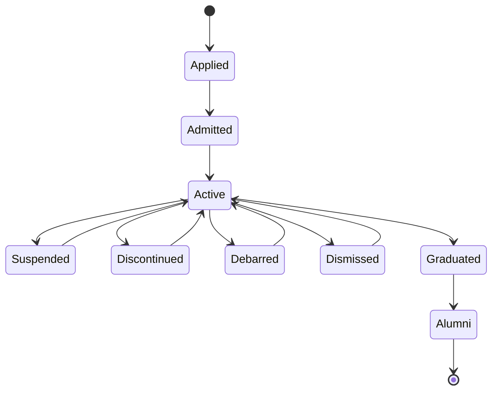

# RS-STU — Student Identity, Lifecycle & Records

**Domain:** Student identity and compliance, transfer, lifecycle, progression,
graduation, documents, parent scope.
**Owning service:** `StudentService`.

---

## RS-STU-001

**A student register number is unique within a tenant.**

| | |
|---|---|
| **Owner** | `StudentService` |
| **Authority** | L4 creates, own class only |
| **Depends on** | [RS-TEN-001](RS-TEN-tenancy-security.md#rs-ten-001), [RS-CLS-004](RS-CLS-classroom.md#rs-cls-004) |
| **Governs** | [RS-STU-004](RS-STU-students.md#rs-stu-004), [RS-STU-005](RS-STU-students.md#rs-stu-005), [RS-STU-006](RS-STU-students.md#rs-stu-006) |
| **Lifecycle** | Student |
| **Workflow** | None — direct write |
| **AI** | L1 read |
| **Modules** | 1 |
| **Data effect** | Creates |
| **Implementation** | Tenant-scoped uniqueness constraint |
| **Conformance** | Conformant |
| **Decisions** | — |

---

## RS-STU-002

**Aadhaar is never part of identity, dedup, import, search, AI reasoning or
reporting, anywhere in the system.**

Where a college requires it for a government process, it is stored as an
**optional, encrypted, access-restricted field only** — never a normal identity
attribute, and permanently excluded from export and reporting everywhere.

This is a **legal compliance requirement (Aadhaar Act), not an architectural
preference.** It binds every layer without exception, including AI tools and
the RAG document pipeline.

| | |
|---|---|
| **Business Owner** | Student Identity Compliance |
| **Supporting Components** | `StudentService`, `DocumentService` |
| **Authority** | Statutory |
| **Depends on** | — |
| **Governs** | [RS-DAT-008](RS-DAT-data-integrity.md#rs-dat-008), [RS-CLS-005](RS-CLS-classroom.md#rs-cls-005), [RS-CLS-010](RS-CLS-classroom.md#rs-cls-010), [RS-STU-003](RS-STU-students.md#rs-stu-003), [RS-STU-004](RS-STU-students.md#rs-stu-004), [RS-AIG-011](RS-AIG-ai-governance.md#rs-aig-011) |
| **Lifecycle** | Student |
| **Workflow** | — |
| **AI** | **Prohibited** — absolutely, in reasoning, search and reporting alike |
| **Modules** | 1, 6, 7, 9 |
| **Data effect** | — |
| **Implementation** | `documentService` exported Aadhaar doc-type constant as the single source of the excluded value |
| **Conformance** | Conformant |
| **Decisions** | — |

---

## RS-STU-003

**The Aadhaar exclusion is a deliberate, recorded deviation from the original
source requirements and MUST NOT be "corrected" back.**

The original requirements documents list Aadhaar as a *required* student field
and instruct that profile fields not be removed. That instruction is
intentionally overridden for compliance reasons. Re-adding Aadhaar as a
required field to match the source specification is prohibited.

If a future business need requires collecting it, it is revisited as an
optional, Restricted field only, with legal sign-off — never by matching the
source specification as written.

| | |
|---|---|
| **Owner** | `StudentService` |
| **Authority** | Statutory; requires legal sign-off to revisit |
| **Depends on** | [RS-STU-002](RS-STU-students.md#rs-stu-002) |
| **Governs** | — |
| **Lifecycle** | — |
| **Workflow** | — |
| **AI** | Prohibited |
| **Modules** | 1 |
| **Data effect** | — |
| **Implementation** | Field absent from the required set |
| **Conformance** | Conformant |
| **Decisions** | — |

---

## RS-STU-004

**Business identity for dedup and import is Register Number, EMIS Number or
Admission Number — never Aadhaar.**

The import pipeline is: CSV/Excel → validation → staging tables → preview →
conflict detection on these business keys → user decision (skip / update /
create / review) → commit. It is idempotent, supports dry-run before commit,
and produces an audit record on every run.

| | |
|---|---|
| **Owner** | `StudentService` |
| **Authority** | Importing user |
| **Depends on** | [RS-DAT-008](RS-DAT-data-integrity.md#rs-dat-008), [RS-STU-001](RS-STU-students.md#rs-stu-001), [RS-STU-002](RS-STU-students.md#rs-stu-002) |
| **Governs** | — |
| **Lifecycle** | Student |
| **Workflow** | None — validated import with explicit user decision |
| **AI** | L1/L2 — AI MAY assist with column mapping and validation but MUST NOT auto-commit an import |
| **Modules** | 1 |
| **Data effect** | Creates / supersedes with audit |
| **Implementation** | Import pipeline with staging tables |
| **Conformance** | Conformant |
| **Decisions** | — |

---

## RS-STU-005

**A student keeps a single Permanent Student ID for life. A transfer never
creates a new student.**

| Transfer type | Effect |
|---|---|
| Internal department/course transfer | Updates the student's academic context, preserving enrolment continuity |
| Inter-college transfer | Creates a **new enrolment** linked to the **same** Permanent Student ID |

All historical academic, attendance, financial, administrative and document
records stay attached to the context in which they were created. Transfers
follow the institution's configured approval workflow and are permanently
audited.

AI identifies students by Permanent Student ID, distinguishes active from
historical enrolments, and **never merges or rewrites historical records across
a transfer.**

| | |
|---|---|
| **Owner** | `StudentService` |
| **Authority** | Per the institution's configured chain |
| **Depends on** | [RS-WFL-002](RS-WFL-workflow.md#rs-wfl-002), [RS-STU-001](RS-STU-students.md#rs-stu-001) |
| **Governs** | [RS-DAT-004](RS-DAT-data-integrity.md#rs-dat-004) |
| **Lifecycle** | Student, Enrolment |
| **Workflow** | `student_transfer`; configurable chain |
| **AI** | L3 workflow-submitting — `students_submit_transfer` |
| **Modules** | 1, 8, 9 |
| **Data effect** | **Preserves** — additive enrolment, never a rewrite |
| **Implementation** | `studentService` transfer path |
| **Conformance** | Conformant |
| **Decisions** | — |

---

## RS-STU-006

**The student lifecycle is `Applied → Admitted → Active → (Suspended /
Discontinued / Debarred / Dismissed) → Graduated → Alumni`. Alumni is
terminal.**

**There is no `Archived` student status.** A student's individual *records* MAY
become archived under the general retention rule
([RS-DAT-003](RS-DAT-data-integrity.md#rs-dat-003)) — read-only and restorable
— but that is a record-keeping mechanism applied on top, not a further
lifecycle status the student passes through.

**Lifecycle status is independent of attendance status.** Attendance drives
absence monitoring and alerts; lifecycle drives eligibility for institutional
processes. Neither derives from the other.

| | |
|---|---|
| **Owner** | `StudentService` |
| **Authority** | Per [RS-STU-007](#rs-stu-007) |
| **Depends on** | [RS-DAT-003](RS-DAT-data-integrity.md#rs-dat-003), [RS-STU-001](RS-STU-students.md#rs-stu-001), [RS-ATT-008](RS-ATT-attendance.md#rs-att-008) |
| **Governs** | [RS-STU-007](RS-STU-students.md#rs-stu-007), [RS-STU-008](RS-STU-students.md#rs-stu-008), [RS-STU-009](RS-STU-students.md#rs-stu-009), [RS-STU-010](RS-STU-students.md#rs-stu-010) |
| **Lifecycle** | **Student — canonical definition** |
| **Workflow** | Per transition; see [RS-STU-007](#rs-stu-007) |
| **AI** | AI MUST NOT classify a student as Suspended, Discontinued, Debarred or Dismissed without an approved institutional record behind it |
| **Modules** | 1 |
| **Data effect** | Supersedes with full audit |
| **Implementation** | `studentService` status path |
| **Conformance** | Conformant |
| **Decisions** | [ADL-003](../30-decisions/ledger.md#adl-003) |

---

## RS-STU-007

**Suspended, Discontinued, Debarred and Dismissed are high-severity
transitions. All four require the institution's configured approval workflow,
with L3 as a mandatory minimum floor.**

*Instance of structural pattern P2 — see [RS-WFL-003](RS-WFL-workflow.md#rs-wfl-003).*

| Property | Rule |
|---|---|
| Proposal | The class's L4 MAY propose a status change, with a **mandatory reason** |
| Unilateral action | **Prohibited for all four** — never a Tutor-only action |
| Approval floor | **L3.** An institution's chain MAY extend approval further up (e.g. L3 → L1) but MUST NEVER configure these as Tutor-only |
| Notification | A pending high-severity request awaiting approval raises an automatic system notification to L3 ([RS-NTF-005](RS-NTF-notifications.md#rs-ntf-005)) |
| Audit | Previous status, new status, effective date, updated by, reason — permanently retained |

This reflects that student disciplinary and lifecycle changes are ordinarily
visible and reviewable at HOD level in how institutions actually operate.

| | |
|---|---|
| **Business Owner** | Student Lifecycle |
| **Supporting Components** | `StudentService`, `WorkflowService` |
| **Authority** | L4 proposes · **L3 minimum approver** · chain may extend |
| **Depends on** | [RS-WFL-003](RS-WFL-workflow.md#rs-wfl-003), [RS-STU-006](RS-STU-students.md#rs-stu-006) |
| **Governs** | [RS-STU-010](RS-STU-students.md#rs-stu-010), [RS-NTF-005](RS-NTF-notifications.md#rs-ntf-005) |
| **Lifecycle** | Student |
| **Workflow** | `student_lifecycle_change`; **mandatory L3 floor** |
| **AI** | L3 workflow-submitting — `students_submit_lifecycle_change` |
| **Modules** | 1, 8, 9 |
| **Data effect** | Supersedes with full audit |
| **Implementation** | **Fixed 2026-07-26** — `Suspended` requires approval (`APPROVAL_REQUIRED_STATES`), `requestLifecycleStatusChange` resolves its chain via `workflowChainService.resolveApproverChain` (rejects any configured `student_lifecycle_change` chain that never reaches L3, `WorkflowChainFloorViolationError`), and now emails the chain's current approver directly on submission (this rule's own "Notification" row) — see [RS-NTF-005](RS-NTF-notifications.md#rs-ntf-005) |
| **Conformance** | Conformant |
| **Decisions** | [ADL-012](../30-decisions/ledger.md#adl-012) |

---

## RS-STU-008

**Promotion to the next semester happens automatically when that specific
semester is officially closed — not when the Academic Year is Completed.**

One Academic Year contains **two** semester closures, each an independent
promotion event: closing Semester 3 promotes to Semester 4; closing Semester 4
promotes to Semester 5.

**Academic Year Completion is a separate, later, administrative-only step.** It
does not itself promote anyone; by the time it occurs, both of that year's
semester closures and their promotions have already happened.

| | |
|---|---|
| **Business Owner** | Semester Progression |
| **Supporting Components** | `AcademicService`, `StudentService` |
| **Authority** | System-executed on semester closure |
| **Depends on** | [RS-CLS-002](RS-CLS-classroom.md#rs-cls-002), [RS-ACA-002](RS-ACA-academic.md#rs-aca-002), [RS-STU-006](RS-STU-students.md#rs-stu-006) |
| **Governs** | [RS-STU-009](RS-STU-students.md#rs-stu-009), [RS-STU-010](RS-STU-students.md#rs-stu-010) |
| **Lifecycle** | Student, Academic Year |
| **Workflow** | None — automatic on semester closure |
| **AI** | L1 — AI evaluates progression eligibility from lifecycle status and generates an exception report for students not promoted, with reason |
| **Modules** | 1, 3 |
| **Data effect** | Supersedes with audit |
| **Implementation** | Semester closure event |
| **Conformance** | Conformant |
| **Decisions** | — |

---

## RS-STU-009

**Graduation is assigned once final-semester results are published and no
arrears or disciplinary hold remain; Alumni status is automatic the moment
graduation is approved.**

L1 approval applies where the institution requires it. **AI never decides
graduation itself.**

| | |
|---|---|
| **Owner** | `StudentService` |
| **Authority** | Institution; L1 approval where required |
| **Depends on** | [RS-STU-006](RS-STU-students.md#rs-stu-006), [RS-STU-008](RS-STU-students.md#rs-stu-008) |
| **Governs** | — |
| **Lifecycle** | Student: `Graduated → Alumni` |
| **Workflow** | Configurable; L1 where the institution requires it |
| **AI** | L1 read only — decision prohibited |
| **Modules** | 1 |
| **Data effect** | Supersedes with audit |
| **Implementation** | `studentService` graduation path |
| **Conformance** | Conformant |
| **Decisions** | — |

---

## RS-STU-010

**Discontinued, Debarred and Dismissed block automatic semester progression
until changed through the configured approval workflow. Suspended is promoted
or blocked per institution policy.**

Arrears alone do not block progression unless university regulations say
otherwise.

Note that progression blocking and the approval requirement of
[RS-STU-007](#rs-stu-007) are **separate axes**: `Suspended` requires approval
to enter, but whether it blocks progression is an institution policy choice.

| | |
|---|---|
| **Owner** | `StudentService` |
| **Authority** | Institution policy for `Suspended`; system-enforced for the other three |
| **Depends on** | [RS-STU-006](RS-STU-students.md#rs-stu-006), [RS-STU-007](RS-STU-students.md#rs-stu-007), [RS-STU-008](RS-STU-students.md#rs-stu-008) |
| **Governs** | — |
| **Lifecycle** | Student |
| **Workflow** | Configured chain to leave a blocking status |
| **AI** | L1 read — exception reporting only |
| **Modules** | 1, 3 |
| **Data effect** | — |
| **Implementation** | Progression eligibility check |
| **Conformance** | Conformant |
| **Decisions** | — |

---

## RS-STU-011

**Student-facing documents are held in a flat, searchable per-student
repository with no folder hierarchy, and only the current version of each
document is retained.**

Replacing a document updates the current copy, carrying upload and replacement
metadata plus an audit entry. This reuses `DocumentService` as the sole storage
owner ([RS-ASM-005](RS-ASM-assessment-documents.md#rs-asm-005)) and is not a
second storage path.

The current-version-only rule is deliberately narrower than the general
retention guarantee: it applies to student-facing documents only, never to
staff or HR documents, and never to the underlying audit trail.

| | |
|---|---|
| **Owner** | `DocumentService` |
| **Authority** | Per document-type permissions |
| **Depends on** | [RS-DAT-003](RS-DAT-data-integrity.md#rs-dat-003), [RS-ASM-005](RS-ASM-assessment-documents.md#rs-asm-005) |
| **Governs** | — |
| **Lifecycle** | Document |
| **Workflow** | None |
| **AI** | L1 read via document search, subject to classification |
| **Modules** | 1, 6 |
| **Data effect** | Supersedes the file; preserves the audit trail |
| **Implementation** | `documentService`; tenant-prefixed storage paths |
| **Conformance** | Conformant |
| **Decisions** | — |

---

## RS-STU-012

**ARCNAVE provides no parent accounts, logins or dashboards.**

Attendance, marks, documents and notices are accessed only by authorized
institutional users, and by the student where a student portal is enabled.

**Two-way parent communication** — meetings, discussions — happens outside the
ERP through institutional procedure. This is distinct from the **one-way system
alerts** that Send Alert ([RS-NTF-006](RS-NTF-notifications.md#rs-ntf-006)) and
OTP ([RS-NTF-007](RS-NTF-notifications.md#rs-ntf-007)) already deliver directly
to parents.

**AI never treats a parent as a system user** and never exposes student
information outside role-based access control.

| | |
|---|---|
| **Owner** | `StudentService` |
| **Authority** | System invariant |
| **Depends on** | [RS-IDN-013](RS-IDN-identity.md#rs-idn-013) |
| **Governs** | [RS-NTF-006](RS-NTF-notifications.md#rs-ntf-006), [RS-NTF-007](RS-NTF-notifications.md#rs-ntf-007) |
| **Lifecycle** | — |
| **Workflow** | — |
| **AI** | Prohibited from treating a parent as a user |
| **Modules** | 1 |
| **Data effect** | — |
| **Implementation** | No parent authentication path exists |
| **Conformance** | Conformant |
| **Decisions** | — |

---

## RS-STU-013

**A student may carry a manual flag, raised with an optional remark by whoever
already has read/visibility authority over that student's profile — never an
automated signal, never a title-based grant.**

**Remark made optional 2026-08-04** ([ADL-030](../30-decisions/ledger.md#adl-030)):
previously required — a flag with no stated reason is now allowed, since a
teacher flagging in-the-moment (e.g. immediately after an incident, from
Class Log) may not always want to write a reason on the spot. The flag itself
(who, when, which student) remains the audited fact regardless of whether a
remark is attached.

Added 2026-07-26 from the frontend discovery pass (UAT, Class Tutor
dashboard) — a "watchlist" concept, deliberately narrowed on product decision
from an automated aggregation of existing signals (attendance flags,
lifecycle status) to a manual marker a human raises with a stated reason.
*Instance of structural pattern P3 (ownership-based authority)* — flagging
uses the same boundary as VIEWING the student
([RS-CLS-009](RS-CLS-classroom.md#rs-cls-009):
`visibilityService.assertCanViewStudent` — for staff/class_tutor, the
class's own tutor-of-record **or a subject faculty member allocated to
that class**; HOD's own department; Principal college-wide), not the
narrower tutor-only boundary editing the student's profile uses.
Widened 2026-08-04 (product decision): a subject teacher who isn't the
class tutor may flag/clear a student they teach, exactly as they may
already view that student — see [ADL-029](../30-decisions/ledger.md#adl-029).

A flag is an append-only history, not an overwritable boolean: raising and
clearing are each their own permanent, timestamped, attributed fact, so a
student's full flag history over time is always reconstructable. "Currently
flagged" is derived (the newest flag with no clearing timestamp), never a
separate field that could drift from the history.

| | |
|---|---|
| **Business Owner** | Student Flag |
| **Supporting Components** | — |
| **Authority** | Same as `assertCanViewStudent` — class's own tutor OR subject faculty, HOD's own department, Principal college-wide |
| **Depends on** | [RS-CLS-009](RS-CLS-classroom.md#rs-cls-009) |
| **Governs** | — |
| **Lifecycle** | Flag: raised → (cleared, optional, by the same authority) |
| **Workflow** | None — direct write, no approval |
| **AI** | L1 direct-write, same ownership boundary as `students_update_profile` — `students_flag`, `students_flag_clear` |
| **Modules** | 1 |
| **Data effect** | Creates (raise); supersedes in place (clear sets `cleared_at`/`cleared_by` on the same row) |
| **Implementation** | `studentService.flagStudent`/`clearStudentFlag`/`getActiveFlag`/`listFlagHistory`, `student_flags` table |
| **Conformance** | Conformant |
| **Decisions** | — |
