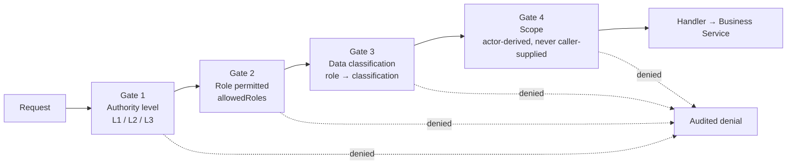

# AI Capability Matrix

**Status:** Derived view. Non-normative — regenerated from the `AI` field of
the [Specification layer](../10-specification/index.md) and governed by
[RS-AIG](../10-specification/RS-AIG-ai-governance.md).

**Purpose:** The complete, closed statement of what the AI may do, under what
authority, against what data, and what it may never do.

---

## 1. The three-gate model

Every AI invocation passes three **independent** gates. Passing one implies
nothing about the others.

A tool with broad read access is **not** entitled to Restricted data because it
is read-only ([RS-AIG-006](../10-specification/RS-AIG-ai-governance.md#rs-aig-006)).
Every denial writes an audit entry naming the reason.

## 2. Authority levels

| Level | Name | External effect | Approval | Governing rule |
|---|---|---|---|---|
| **L1** | Inform | None | None | [RS-AIG-001](../10-specification/RS-AIG-ai-governance.md#rs-aig-001) |
| **L2** | Generate | None — produces a file or draft | None | [RS-AIG-001](../10-specification/RS-AIG-ai-governance.md#rs-aig-001) |
| **L3** | Act | **Yes** | **Always, no exceptions** | [RS-AIG-004](../10-specification/RS-AIG-ai-governance.md#rs-aig-004) |

An L3 tool's handler MUST wrap a service method that only ever *submits* for
approval, never one that performs the send or mutation. This is a checked
runtime invariant, not only a registration convention.

## 3. Data classification

| Data | Classification |
|---|---|
| Timetable, student name | Internal |
| Parent phone, marks | Confidential |
| Fee details, staff salary | **Restricted** |

The role-to-classification matrix was **ratified 2026-07-26**
([ADL-005](../30-decisions/ledger.md#adl-005)) as final policy.

## 4. Tool register

**Regenerated 2026-08-26 from the real `aiToolRegistry.js`** (verified by
direct source reading — `grep -c 'registerTool({'` plus a per-call-site
`name`/`level`/`dataClassification`/`allowedRoles` extraction, not
inferred from naming or from this document's own prior content). **106
tools registered** — up from the 66 this section stated as of
2026-08-21 ([F10](../90-appendix/consumer-adaptation-flags.md#f10-closed-2026-08-26-ai-capability-matrixmd-regenerated-from-source),
now closed). By registered `level`: **92 L1, 7 L2, 7 L3.**

§§4.1–4.9 below are the 2026-08-21 baseline (66 tools), unchanged except
where noted. §§4.10–4.16 are the 40 tools added since — 21 from the
"implement the consumer Claude.ai tool/skill architecture" pass
(2026-08-26; full mapping and rationale in
[`consumer-tool-inventory-classification.md`](../90-appendix/consumer-tool-inventory-classification.md))
plus 19 more already live but never folded into this document before
that pass started. All 40 are registered `L1`/`Internal`/all four roles
unless stated otherwise — none carry a dedicated `RS-AIG` rule of their
own; the general umbrella rules
([RS-AIG-006](../10-specification/RS-AIG-ai-governance.md#rs-aig-006),
[RS-AIG-007](../10-specification/RS-AIG-ai-governance.md#rs-aig-007))
govern them the same way they govern every other L1 tool, and that
absence of a dedicated rule is itself accurate, not an oversight this
regeneration should paper over.

Every tool declares a code-level `level` (`L1`/`L2`/`L3`) directly at
registration. **This is the same L1/L2/L3 axis
[RS-AIG-001](../10-specification/RS-AIG-ai-governance.md#rs-aig-001)
defines**, but code and domain-rule text do not always agree on which
label a given capability gets — see the flagged discrepancy in §8. This
section states the tool's **real registered `level`**, not the level a
governing rule's prose implies it should have; where the two disagree,
that disagreement is the conformance finding, not something this section
resolves by picking one.

### 4.1 Read-only (registered L1)

| Tool | Classification | Roles | Notes |
|---|---|---|---|
| `get_college_profile` | Internal | principal, hod | |
| `search_documents` | Per document classification | Per classification | RAG; classification decided per document type at ingestion |
| `resolve_document_destination` | Internal | principal, hod, staff, class_tutor | Looks up whether a named category/department/year matches real data before any upload; never uploads or moves anything itself. Governed by [RS-ASM-005](../10-specification/RS-ASM-assessment-documents.md#rs-asm-005) |
| `list_institutional_documents` | Internal | principal, hod, staff, class_tutor | AI-facing equivalent of browsing Institutional Documents with filters. Governed by [RS-ASM-005](../10-specification/RS-ASM-assessment-documents.md#rs-asm-005) |
| `get_document_version_history` | Internal | principal, hod, staff, class_tutor | Every version of one logical document, newest first. Governed by [RS-ASM-005](../10-specification/RS-ASM-assessment-documents.md#rs-asm-005) |
| `get_document_lineage` | Internal | principal, hod, staff, class_tutor | Cross-year ancestor/successor lookup. Governed by [RS-ASM-005](../10-specification/RS-ASM-assessment-documents.md#rs-asm-005) |
| `attendance_summary` | Internal | principal, hod, staff, class_tutor | |
| `students_low_attendance` | Internal | principal, hod, staff, class_tutor | Same source data as the summary, threshold-filtered |
| `attendance_outstanding_absence_flags` | Internal | principal, hod, staff, class_tutor | The flag itself is system-raised and only L3-closable — no AI entry point to close one. Governed by [RS-ATT-008](../10-specification/RS-ATT-attendance.md#rs-att-008) |
| `list_calendar_events` | Internal | principal, hod, staff, class_tutor | Never creates or edits an event. Governed by [RS-ACA-011](../10-specification/RS-ACA-academic.md#rs-aca-011) |
| `students_roster` | Internal | principal, hod, staff, class_tutor | Wraps an already scope-aware service |
| `assessment_marks_summary` | Internal | principal, hod, staff, class_tutor | **Deliberate divergence** from the Confidential default: the same tutor already has full read/write access to these marks on the dashboard ([RS-ASM-004](../10-specification/RS-ASM-assessment-documents.md#rs-asm-004)) |
| `academic_class_timetable` | Internal | principal, hod, staff, class_tutor | |
| `staff_roster` | Internal | principal, hod | Not staff or class_tutor — no dashboard reason for a tutor to browse the staff directory |
| `staff_self_profile_get` | Internal | principal, hod, staff, class_tutor | Same-actor only |
| `finance_status_summary` | **Restricted** | principal | Paid/Not Paid only; there is no amount to summarise. College-wide |
| `workflow_pending_summary` | Internal | principal, hod, class_tutor | Requests awaiting the actor's **own** approval — not a department- or college-wide audit. `class_tutor` included because L4 approves attendance and mark corrections |
| `substitute_duties_list` | Internal | principal, hod, staff, class_tutor | |

### 4.1a Reports (registered L1 — see §8 for the classification-vs-level note)

| Tool | Classification | Roles | Notes |
|---|---|---|---|
| `reports_student_export` | Internal | principal, hod, staff | |
| `reports_generate_attendance` | Internal | principal | |
| `reports_generate_finance` | **Restricted** | principal | |
| `reports_generate_assessment_marks` | Internal | principal | |

### 4.1b Personal workspace reads (registered L1, same-actor scoped)

| Tool | Classification | Roles | Notes |
|---|---|---|---|
| `class_log_list` | Internal | principal, hod, staff, class_tutor | |
| `personal_notes_list` | Internal | principal, hod, staff, class_tutor | |
| `activity_timeline_read` | Internal | principal, hod, staff, class_tutor | Own activity only |
| `user_preferences_list` | Internal | principal, hod, staff, class_tutor | See [§4.8](#48-scoped-preference-memory-userpreferencesset) — the paired write tool is key-restricted, this read is not |

### 4.2 Direct write (registered L1, under the same-actor carve-out)

Every entry here satisfies all three conditions of
[RS-AIG-007](../10-specification/RS-AIG-ai-governance.md#rs-aig-007).

| Tool | Classification | Roles | Mirrors a human path that is already direct | Constraint |
|---|---|---|---|---|
| `mark_attendance_nl` | Internal | The hour's assigned/substitute faculty | Yes — the marking route | Re-runs the identical eligibility assertion; own class, own real-time message only. `maxAffectedRows.rejectAt = 300`. Inherits every rejection condition of the human path unchanged ([RS-ATT-006](../10-specification/RS-ATT-attendance.md#rs-att-006)) |
| `assessment_record_mark` | Internal | principal, hod, staff, class_tutor | Yes — gated by the assigned-faculty assertion | **First-time entry only.** MUST check for an existing value and route to the correction path instead |
| `finance_record_payment` | **Restricted** | class_tutor | Yes — L4's own class, receipt-backed | **First-time marking only.** Same existing-value check. Named `classificationOverrideRoles` exception ([RS-FIN-006](../10-specification/RS-FIN-finance.md#rs-fin-006)) |
| `students_update_profile` | Internal | principal, hod, class_tutor | Yes — gated by the modify assertion | **Excludes lifecycle status** |
| `students_flag` / `students_flag_clear` | Internal | principal, hod, staff, class_tutor | Yes | |
| `staff_update_profile` | Internal | principal | Yes — principal-only on the dashboard too | |
| `staff_self_profile_update` | Internal | principal, hod, staff, class_tutor | Yes — same-actor only | |
| `calendar_create_event` / `calendar_update_event` | Internal | principal | Yes — no workflow step exists for calendar either | |
| `academic_generate_timetable` / `academic_revise_timetable` | Internal | principal, hod, class_tutor | Yes — same institution-wide availability check a human generation triggers | Produces a draft only, feeds [RS-ACA-004](../10-specification/RS-ACA-academic.md#rs-aca-004)'s own approval workflow for locking; `maxAffectedRows` confirmAt=40/rejectAt=200. **Registered `L1`; [RS-ACA-005](../10-specification/RS-ACA-academic.md#rs-aca-005)'s own prose says "AI: L2 generate" — see §8** |
| `class_assign_tutor` | Internal | hod | Yes | |
| `substitute_request_initiate` | Internal | principal, hod, staff, class_tutor | Yes — initiate is already direct; only *approve* requires L3 ([RS-CLS-007](../10-specification/RS-CLS-classroom.md#rs-cls-007)) | |
| `substitute_duty_acknowledge` | Internal | principal, hod, staff, class_tutor | Yes — same-actor only | |
| `departments_create` / `departments_update` | Internal | principal | Yes | `departments_create` has `maxAffectedRows` confirmAt=30/rejectAt=100 |
| `academic_year_create` | Internal | principal | Yes | |

### 4.3 Personal workspace writes (registered L1, same-actor scoped)

| Tool | Classification | Roles | Notes |
|---|---|---|---|
| `class_log_create` | Internal | principal, hod, staff, class_tutor | |
| `personal_notes_create` | Internal | principal, hod, staff, class_tutor | |
| `update_project_instructions` | Internal | principal, hod, staff, class_tutor | |
| `manage_project_document` | Internal | principal, hod, staff, class_tutor | Attach/detach a reference — never a new upload path; reuses the existing Documents pipeline |
| `update_artifact_content` | Internal | principal, hod, staff, class_tutor | Wraps `artifactService.updateArtifact` |
| `export_artifact` | Internal | principal, hod, staff, class_tutor | Wraps `artifactService.publishArtifact` — produces a real downloadable document |
| `generate_document` | Internal | principal, hod, staff, class_tutor | Wraps `documentService.uploadPersonalDocument` — the ordinary-chat equivalent of `export_artifact`, added round 16 to close the "AI drafts content with nowhere to save it" gap |

### 4.4 Generate (registered L2)

| Tool | Output | humanOnly | Constraint |
|---|---|---|---|
| `draft_notification` | A notification draft | — | Produces no external effect; the send is a separate L3 action |
| `upload_institutional_document` | An uploaded document | **true** | Never called by the AI on its own initiative; reachable only via the user's own explicit confirm action, after `resolve_document_destination` has already shown them the target. Same "AI drafts, human confirms" shape as Send Alert ([RS-NTF-006](../10-specification/RS-NTF-notifications.md#rs-ntf-006)). Governed by [RS-ASM-005](../10-specification/RS-ASM-assessment-documents.md#rs-asm-005) |
| `class_send_alert` | Draft message text | **true** | The same tutor MUST review and confirm the final text before it sends |
| `departments_delete` | Removes a department | **true** | Destructive; human-confirm-only by design, not merely by convention |
| `academic_year_activate` | Activates an academic year | **true** | Institution-wide effect; human-confirm-only |
| `academic_year_complete` | Completes an academic year | **true** | Institution-wide effect; human-confirm-only |

Also L2-shaped by capability, not all individually registered tools:
curriculum extraction (human verification required before publication —
[RS-AIG-012](../10-specification/RS-AIG-ai-governance.md#rs-aig-012)),
examination timetable extraction and diff (the Tutor verifies and
publishes), document classification (deterministic alias normalization;
discarded predictions force confidence to zero).

### 4.5 Workflow-submitting (registered L3)

Never mutates directly; submits the identical request a human submission uses —
same entity type, same approver chain.

| Tool | Entity type | Roles | Approval floor | Status |
|---|---|---|---|---|
| `staff_submit_registration` | `staff_registration` | principal, hod | Configured chain | Built |
| `students_submit_lifecycle_change` | `student_lifecycle_change` | principal, hod, staff, class_tutor | **L3 mandatory** | Built; floor not enforced |
| `students_submit_transfer` | `student_transfer` | principal, hod, staff, class_tutor | Configured chain | Built |
| `academic_submit_timetable_for_approval` | `timetable_approval` | principal, hod | **L1 mandatory** | Built |
| `request_notification_send` | `notification` | principal, hod | Configured chain | Built |
| `assessment_submit_mark_correction` | Mark correction | principal, hod, staff, class_tutor | **L4 (class tutor approves)** | Built ([ADL-014](../30-decisions/ledger.md#adl-014)) |
| `finance_submit_fee_correction` | Fee correction | principal, hod | **L3 (hod approves)** | Built ([ADL-013](../30-decisions/ledger.md#adl-013)) |

**Every tool in this table requires the pre-submission confirmation turn**
([RS-AIG-005](../10-specification/RS-AIG-ai-governance.md#rs-aig-005)) — a
general rule, not a per-tool behaviour ([ADL-018](../30-decisions/ledger.md#adl-018)).
Structurally, no L3 tool can bypass this table at all: `assertL3ResultNotBypassed`
requires the handler's return value carry a real `workflow_request_id` and
a non-terminal status, checked post-hoc on every invocation.

### 4.6 Bounded multi-step plan (`run_workflow_plan`)

Not a registered tool — a per-call meta-capability built fresh on every
`askAgent` turn from that turn's own already role/relevance-filtered tool
list, offered alongside it. Governed by
[RS-AIG-018](../10-specification/RS-AIG-ai-governance.md#rs-aig-018): up
to 6 steps, each re-entering the Policy Gate exactly as a standalone call
would, one confirmation for the whole plan, no recursive plan creation
(structurally impossible — the plan tool is never itself an offerable
step). This is what closes the "one tool per question" limitation
[RS-AIG-009](../10-specification/RS-AIG-ai-governance.md#rs-aig-009)
previously declared — see that rule's own superseded-limitation note.

### 4.7 Trusted Web Retrieval (`fetch_trusted_web_page`)

| Tool | Level | Classification | Roles | Notes |
|---|---|---|---|---|
| `fetch_trusted_web_page` | L1 | Internal | principal, hod, staff, class_tutor | Single known `https://` URL only, never an open-ended search — no search provider is configured anywhere in this codebase |

Governed by [RS-AIG-020](../10-specification/RS-AIG-ai-governance.md#rs-aig-020):
SSRF-hardened (https-only, no embedded credentials, no IP literals, no
redirects followed), per-college opt-in domain allowlist (a small,
non-removable platform default of regulatory domains plus per-college
additions, exact-or-subdomain match only), bounded fetch time/response
size/extracted text. Result flows through the identical untrusted-data
pipeline every other tool's output already uses — no special case.

### 4.8 Scoped preference memory (`user_preferences_set`)

Governed by [RS-AIG-021](../10-specification/RS-AIG-ai-governance.md#rs-aig-021).
The paired read (`user_preferences_list`, §4.1b) is unrestricted; the
write is not: `user_preferences_set` may only write one of `report_format`,
`default_chart`, `language` — enforced by an explicit check inside the
tool's own handler (`AI_ALLOWED_PREFERENCE_KEYS`), not only declared as a
JSON-schema `enum` hint a model could be talked past. Same-actor,
same-college scoped. Never a freeform or inferred fact about anyone.

### 4.9 Cross-cutting session mechanisms (not individually registered tools)

| Mechanism | Governed by | Summary |
|---|---|---|
| Short-session conversation memory | [RS-AIG-017](../10-specification/RS-AIG-ai-governance.md#rs-aig-017) | Last 10 messages of the *current* conversation only, ownership+tenant checked, injected as a labelled background hint never re-elevated to instruction status |
| Numeric-claim verification | [RS-AIG-019](../10-specification/RS-AIG-ai-governance.md#rs-aig-019) | Deterministic, re-parses already-fetched data (never a fresh query, never a second model call), advisory-only (`PASS`/`CONFLICT`/`INSUFFICIENT_EVIDENCE`) |
| Model routing (`fast_model`) | [RS-AIG-022](../10-specification/RS-AIG-ai-governance.md#rs-aig-022) | Only ever downgrades the synthesis/description call for an already-authorized, already-fetched low-risk result; the tool-selection/decision call is never eligible |
| General/Curriculum scope mode | [RS-AIG-023](../10-specification/RS-AIG-ai-governance.md#rs-aig-023) | General mode structurally builds no tool list at all (not a softer prompt); Curriculum mode is the unchanged pre-existing tool-scoped path; default is Curriculum everywhere |

### 4.10 Document analysis (registered L1)

| Tool | Classification | Roles | Notes |
|---|---|---|---|
| `analyze_document_table` | Internal | principal, hod, staff, class_tutor | Deterministic in-backend table extraction (ADL-055→058); y-bucketing recovers identity columns but does not yet reliably attribute numeric columns — see [F3](../90-appendix/consumer-adaptation-flags.md#f3-pdfplumber-may-make-adl-058-unnecessary-and-that-has-not-been-measured), still open |

### 4.11 AI memory (registered L1, same-actor scoped, consent-gated)

| Tool | Classification | Roles | Notes |
|---|---|---|---|
| `ai_memory_consent_status` | Internal | principal, hod, staff, class_tutor | Read-only; whether the actor has opted in |
| `ai_memory_remember` | Internal | principal, hod, staff, class_tutor | Free-text memory item; requires consent |
| `ai_memory_forget` | Internal | principal, hod, staff, class_tutor | Deletes one free-text memory item |
| `ai_memory_remember_fact` | Internal | principal, hod, staff, class_tutor | Structured `fact` slot; bounded by `MAX_GENERAL_FACTS` |
| `ai_memory_forget_fact` | Internal | principal, hod, staff, class_tutor | Deletes one structured fact |
| `ai_memory_revise` | Internal | principal, hod, staff, class_tutor | Edits an existing fact in place (`aiMemoryService.reviseFact`) — added 2026-08-26; does not re-check `MAX_GENERAL_FACTS` since it is an edit, not an addition |
| `ai_memory_list` | Internal | principal, hod, staff, class_tutor | Lists everything remembered for the actor |

All seven operate on the actor's own memory only, never another user's,
and never bypass the consent check `ai_memory_consent_status` reports.

### 4.12 Session & conversation tools (registered L1, same-actor scoped)

| Tool | Classification | Roles | Notes |
|---|---|---|---|
| `ask_user_choice` | Internal | principal, hod, staff, class_tutor | Structured multiple-choice prompt back to the user, distinct from [§4.9](#49-cross-cutting-session-mechanisms-not-individually-registered-tools)'s short-session memory hint |
| `conversation_search` | Internal | principal, hod, staff, class_tutor | Finds past conversations by content |
| `conversation_recent` | Internal | principal, hod, staff, class_tutor | Most recent conversations, no search term |
| `conversation_read` | Internal | principal, hod, staff, class_tutor | Reads one past conversation. Deliberately returns only `role`/`content`/`createdAt`, dropping each message's `rawData`/`presentation`, to avoid re-injecting an entire earlier document extraction — the same cost regression ADL-055's attachment-hint slice removed (125,048 → 2,771 tokens). Actual token cost of this guard is unmeasured — see [F9](../90-appendix/consumer-adaptation-flags.md#f9-closed-2026-08-26-conversationreads-guard-measured-against-a-real-vertex-counttokens-call), still open |
| `conversation_archive` | Internal | principal, hod, staff, class_tutor | Archives a past conversation; same-owner check as the read |

### 4.13 Inline presentation widgets (registered L1)

Structural constraint throughout this table, per
[RS-AIG-013](../10-specification/RS-AIG-ai-governance.md#rs-aig-013)
("AI is advisory on every institutional judgement and decisive on
none"): **no schema below has a score, rank, or "recommended" field.**
Where a tool implies a comparison, the caller must supply an objective
`basis` instead of a verdict.

| Tool | Classification | Roles | Notes |
|---|---|---|---|
| `present_options` | Internal | principal, hod, staff, class_tutor | Plain option list, no ranking |
| `present_quiz` | Internal | principal, hod, staff, class_tutor | |
| `present_translation` | Internal | principal, hod, staff, class_tutor | |
| `present_steps` | Internal | principal, hod, staff, class_tutor | Ordered instructions |
| `present_featured` | Internal | principal, hod, staff, class_tutor | `basis` is a **required** field — states the objective match criterion; no score/rank exists in the schema |
| `present_comparison` | Internal | principal, hod, staff, class_tutor | Every item supplies exactly one value per declared attribute; no verdict field |
| `present_carousel` | Internal | principal, hod, staff, class_tutor | Item order carries no ranking claim |
| `present_links` | Internal | principal, hod, staff, class_tutor | http/https only; rejects `javascript:`/`data:`; always sets `untrusted: true` on the rendered payload |
| `present_places` | Internal | principal, hod, staff, class_tutor | Caller-supplied places only — no Google Places integration, so no attribution obligation |
| `present_map` | Internal | principal, hod, staff, class_tutor | Same as `present_places`; requires lat/long (the list variant tolerates their absence) |
| `present_recipe` | Internal | principal, hod, staff, class_tutor | Ingredient quantities must be numeric (rejects e.g. "a handful") so a frontend can rescale servings |
| `present_diagram` | Internal | principal, hod, staff, class_tutor | SVG allowlist sanitizer (`aiDiagramService.js`) — presentation attributes only, no `href`/`on*`/`style`/`url(...)`. A rejection is caught in the tool's own handler and returned as `{rejected, reason}` rather than thrown (fix for [F14](../90-appendix/consumer-adaptation-flags.md#f14-closed-tool-specific-fix-2026-08-26-a-presentdiagram-rejection-crashed-the-whole-turn-instead-of-being-reported-back-to-the-model), closed; the general class of 69+ other uncaught validation-error types across the rest of the registry remains open per ADL-056) |
| `describe_diagram_constraints` | Internal | principal, hod, staff, class_tutor | Returns the actual enforced allowlist as data, so a model can check before drawing instead of after being rejected |

### 4.14 Output-format & skills policy (registered L1)

| Tool | Classification | Roles | Notes |
|---|---|---|---|
| `decide_output_format` | Internal | principal, hod, staff, class_tutor | A callable tool, deliberately not prompt text — [ADL-050](../30-decisions/ledger.md#adl-050) measured that packaging this kind of governance-bearing instruction into the system prompt instead measurably weakened compliance elsewhere. Cost: the model must choose to call it, and at `maxToolCallsPerTurn = 1` it competes with actually answering — [F7](../90-appendix/consumer-adaptation-flags.md#f7-the-output-format-policy-is-a-tool-not-prompt-text-and-that-is-a-real-limitation), accepted, not resolved |
| `decide_image_route` | Internal | principal, hod, staff, class_tutor | Same tool-not-prompt shape as above, for image generation vs. search |
| `list_skills` | Internal | principal, hod, staff, class_tutor | Names of platform-owned skill guides only (`backend/src/skills/*/SKILL.md`) — no per-tenant skills, no database row |
| `describe_skill` | Internal | principal, hod, staff, class_tutor | Full SKILL.md body for one named skill; throws a clean not-found error for an unknown name |

### 4.15 Capability catalog, code execution, search & external data (registered L1/L2)

| Tool | Level | Classification | Roles | Notes |
|---|---|---|---|---|
| `capability_search` | L1 | Internal | principal, hod, staff, class_tutor | What ARCNAVE can do, by role and query term |
| `capability_explain` | L1 | Internal | principal, hod, staff, class_tutor | Explains *why* a capability is or isn't available to this actor right now — distinct reasons (`not_a_capability`/`human_only`/`role_not_permitted`/`not_enabled_for_college`/`available`), never a bare no |
| `execute_code` | L1 | Internal | principal, hod, staff, class_tutor | Runs in the credential-less sandbox service (ADL-059), no ARCNAVE DB/API access. Optional `saveAs`/`expectFormulasIn` params route a generated `.xlsx` through a LibreOffice recalculation gate before it can become an Artifact — see [F3a](../90-appendix/consumer-adaptation-flags.md#f3a-closed-2026-08-26-the-sandbox-now-returns-a-file-verified-before-it-leaves), closed. The deployed Cloud Run image still lacks the packages this needs live — [F2](../90-appendix/consumer-adaptation-flags.md#f2-the-sandbox-image-gained-three-python-packages-and-has-not-been-redeployed), open |
| `web_search` | L1 | Internal | principal, hod, staff, class_tutor | Provider-agnostic (Brave/Tavily) as of this pass; no provider is actually configured yet — [F1](../90-appendix/consumer-adaptation-flags.md#f1-websearch-has-no-working-provider-and-now-neither-do-two-new-tools), open |
| `web_search_fast` | L1 | Internal | principal, hod, staff, class_tutor | Same provider gap as `web_search` |
| `image_search` | L1 | Internal | principal, hod, staff, class_tutor | Throws `WebSearchNotConfiguredError` by design on Tavily (no image index); needs Brave if image search matters |
| `weather_fetch` | L1 | Internal | principal, hod, staff, class_tutor | Caller-supplied location only |
| `generate_image` | L2 | Internal | principal, hod, staff, class_tutor | Produces a file, no external effect — routed via `decide_image_route` |

### 4.16 Artifact lifecycle additions (registered L1)

| Tool | Classification | Roles | Notes |
|---|---|---|---|
| `export_artifact_as` | Internal | principal, hod, staff, class_tutor | Format-converting export; distinct from `export_artifact`'s (§4.3) direct publish |
| `list_own_artifacts` | Internal | principal, hod, staff, class_tutor | Same-actor artifacts only |

## 5. Prohibited capabilities

Permanently excluded. Not deferred, not backlogged.

| Capability | Rule | Reason |
|---|---|---|
| Hard delete of attendance, fee or mark records | [RS-AIG-015](../10-specification/RS-AIG-ai-governance.md#rs-aig-015) | Retention requirements a hard delete would violate irreversibly. Excluded **even at L3 with approval** |
| Any Aadhaar processing — reasoning, search, reporting, matching | [RS-STU-002](../10-specification/RS-STU-students.md#rs-stu-002) | Statutory compliance |
| Deciding scholarship eligibility | [RS-FIN-005](../10-specification/RS-FIN-finance.md#rs-fin-005) | Advisory only; the Tutor's decision is final |
| Deciding graduation | [RS-STU-009](../10-specification/RS-STU-students.md#rs-stu-009) | Institutional judgement |
| Classifying a student's lifecycle status without an approved record | [RS-STU-006](../10-specification/RS-STU-students.md#rs-stu-006) | Requires an institutional record behind it |
| Inferring an approved-leave state overriding recorded attendance | [RS-ATT-007](../10-specification/RS-ATT-attendance.md#rs-att-007) | No leave module exists |
| Publishing extracted data unilaterally | [RS-AIG-012](../10-specification/RS-AIG-ai-governance.md#rs-aig-012) | Human verification required |
| Auto-committing an import | [RS-DAT-008](../10-specification/RS-DAT-data-integrity.md#rs-dat-008) | Explicit user decision required |
| Altering an audit entry | [RS-DAT-006](../10-specification/RS-DAT-data-integrity.md#rs-dat-006) | Append-only, grant-enforced |
| Modifying an archived record | [RS-DAT-003](../10-specification/RS-DAT-data-integrity.md#rs-dat-003) | Read-only unless restoration is authorized |
| Modifying or deleting a backup; initiating an unauthorized restore | [RS-DAT-005](../10-specification/RS-DAT-data-integrity.md#rs-dat-005) | Monitor and alert only |
| Bypassing, disabling or weakening authentication or MFA | [RS-AIG-016](../10-specification/RS-AIG-ai-governance.md#rs-aig-016) | Operates only post-authentication |
| Changing a configuration setting without authorization | [RS-GOV-004](../10-specification/RS-GOV-governance.md#rs-gov-004) | Explain and recommend only |
| Predictive or ML forecasting of student outcomes | [RS-AIG-014](../10-specification/RS-AIG-ai-governance.md#rs-aig-014) | No model exists; the system explains this rather than fabricating a forecast |
| Skipping a mandatory approval floor | [RS-WFL-003](../10-specification/RS-WFL-workflow.md#rs-wfl-003) | Platform-enforced |
| Writing to storage, a repository or raw SQL | [RS-AIG-002](../10-specification/RS-AIG-ai-governance.md#rs-aig-002), [RS-ASM-005](../10-specification/RS-ASM-assessment-documents.md#rs-asm-005) | Business Services only |
| Any Platform Admin action | [RS-TEN-004](../10-specification/RS-TEN-tenancy-security.md#rs-ten-004) | No path into the tenant AI Workspace exists for the platform actor |

## 6. Deliberately withheld capabilities

Not prohibited in principle — withheld pending a stated prerequisite.

| Capability | Prerequisite | Reference |
|---|---|---|
| Staff deactivation tool | The human action's per-row scope gap must be fixed first; a tool would inherit and amplify it | [ADL-008](../30-decisions/ledger.md#adl-008) |
| Document upload/review for tutor and HOD | The current permission is principal-only and explicitly provisional pending a real rule decision | [ADL-008](../30-decisions/ledger.md#adl-008) |
| Any grant to the `level2` effective role | L2 scope is open product policy the AI domain does not own; a speculative grant would pre-empt it | [RS-GOV-014](../10-specification/RS-GOV-governance.md#rs-gov-014) |

**Resolved since the table above was last current:** *Multi-tool
orchestration for compound questions* — built as the bounded plan
mechanism, [RS-AIG-018](../10-specification/RS-AIG-ai-governance.md#rs-aig-018)
(§4.6). *Per-tenant LLM provider configuration* — real and wired for all
4 providers (`gemini`/`claude`/`openai`/`self_hosted`), each via a
per-college `college_ai_config` row or the global default block; `gemini`
is the zero-config default (`nim` removed, [ADL-051](../30-decisions/ledger.md#adl-051)).
See [RS-AIG-008](../10-specification/RS-AIG-ai-governance.md#rs-aig-008)
and the Conformance summary below.

## 7. The entry-versus-correction boundary in AI terms

The single most consequential distinction in this matrix.

| Datum | AI may write directly | AI must submit for approval |
|---|---|---|
| Attendance | Original real-time marking during the window, by the eligible faculty | Any edit or correction of a recorded entry |
| Marks | First-time entry, on the assigned faculty's own behalf | Any write to a value that already exists |
| Fee status | First-time Paid/Not Paid marking, by the class's L4 | Any change to a status already marked |

A direct-write tool MUST check for an existing value and route to the
correction path when one is found. Writing directly over an existing value is
the failure mode this boundary exists to prevent.

## 8. Conformance summary

| Area | Status |
|---|---|
| Authority levels, tool architecture, injection protection | Conformant |
| Identity-context consumption at the Policy Gate | Conformant |
| Downstream scope fidelity in Business Services | **Corrected 2026-07-25 — Conformant.** Verified against real code: already fixed (Phase 4), not an open defect. See [RS-AIG-011](../10-specification/RS-AIG-ai-governance.md#rs-aig-011), [ADL-020](../30-decisions/ledger.md#adl-020) |
| Pre-submission confirmation turn | **Built 2026-07-25 (Stage 7) — Conformant** ([ADL-018](../30-decisions/ledger.md#adl-018)) |
| Existing-value check on direct-write tools | **Resolved, Stage 4/5, 2026-07-26** — `finance_record_payment`/`assessment_record_mark` refuse a second direct mark (`FeePaymentAlreadyMarkedError` and equivalent) and route the AI to `finance_submit_fee_correction`/`assessment_submit_mark_correction` instead, both now built |
| Fee-structure tools | **Resolved, Stage 4** — both fee-structure AI tools removed outright, along with the table/route/workflow entity type they served ([ADL-013](../30-decisions/ledger.md#adl-013)) |
| `finance_record_payment` role | **Resolved, Stage 4** — moved to `class_tutor` (`classificationOverrideRoles`), no longer principal-only |
| Tool register coverage | **Resolved 2026-08-21, re-verified and extended 2026-08-26.** Section 4 regenerated directly from `aiToolRegistry.js` (106 registered tools, verified by source reading, not inferred — up from 66). The AI capability roadmap's rounds 13–18 subsystems (conversation memory, the bounded multi-step workflow engine, evidence/provenance verification, Trusted Web Retrieval, scoped preference memory, `generate_document`/`export_artifact`/`update_artifact_content`, model routing, General/Curriculum mode) are governed by [RS-AIG-017 through 023](../10-specification/RS-AIG-ai-governance.md#rs-aig-017) and reflected in §4.3–4.9, each amended through the full procedure (Decision Ledger entries [ADL-035 through ADL-040](../30-decisions/ledger.md#adl-035), `RS-AIG` edits, this regeneration, a passing `validate.py`). The 40 tools added in §§4.10–4.16 (memory, session/conversation, presentation widgets, output-format/skills policy, capability catalog, code execution, search, artifact-lifecycle additions) have **no dedicated `RS-AIG` rule** — they are governed by the general umbrella rules only, documented instead in [`consumer-tool-inventory-classification.md`](../90-appendix/consumer-tool-inventory-classification.md) and [`consumer-adaptation-flags.md`](../90-appendix/consumer-adaptation-flags.md); that is a real gap in specification-layer coverage, not resolved by this regeneration, only made visible by it. Real SSE streaming and token/cost telemetry are transport/operational details, not authority-boundary changes — deliberately not given their own `RS-AIG` rules, noted here only. |
| Registered `level` vs. governing rule's stated AI level — real, evidenced discrepancy, flagged not resolved | `academic_generate_timetable`/`academic_revise_timetable` are registered `level: 'L1'` in `aiToolRegistry.js` (verified by direct source read), but their governing rule, [RS-ACA-005](../10-specification/RS-ACA-academic.md#rs-aca-005), states `**AI** \| L2 generate — produces a draft with no external effect; never publishes`. The 4 `reports_*` tools show the same pattern less explicitly (registered L1, conceptually "produces a file" per [RS-AIG-001](../10-specification/RS-AIG-ai-governance.md#rs-aig-001)'s own L2 definition). Not resolved by this pass — per `00-foundation/scope-and-conventions.md` §1's own precedence rule, code is never the arbiter of a rule; either the code's registered level or the rule's stated level is the actual defect, and deciding which requires checking against `RS-AIG-007`'s same-actor-carve-out conditions (a generation step that's already direct for a human today may legitimately be L1, not L2) — a real product/architecture judgment call, not a mechanical fix. |
| Provider register | **Resolved 2026-08-21.** 5 live adapters confirmed by source: `nim`, `gemini`, `claude`, `openai`, `self_hosted` (`aiProviders/index.js`). Selection is genuinely per-college (`college_ai_config` row) for `claude`/`openai`/`self_hosted`/`gemini`; `nim` has no per-college path and serves as the zero-row fallback (`DEFAULT_AI_PROVIDER` env var, default `'nim'`, unchanged). `ADR-028`'s "NVIDIA NIM, the only artefact permitted to name the production provider" wording amended — see the ADR register. |
| Role-to-classification matrix | **Undecided** ([ADL-005](../30-decisions/ledger.md#adl-005)) |
