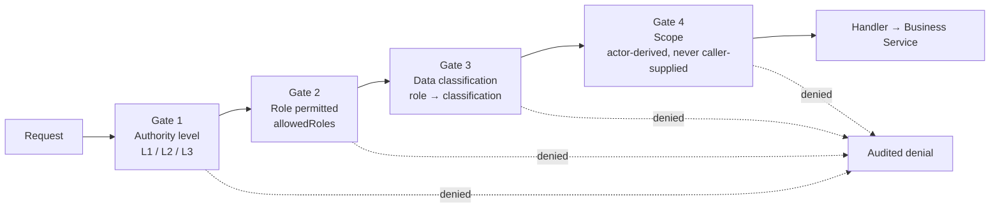

# AI Capability Matrix

**Status:** Derived view. Non-normative — regenerated from the `AI` field of
the [Specification layer](../10-specification/index.md) and governed by
[RS-AIG](../10-specification/RS-AIG-ai-governance.md).

**Purpose:** The complete, closed statement of what the AI may do, under what
authority, against what data, and what it may never do.

---

## 1. The three-gate model

Every AI invocation passes three **independent** gates. Passing one implies
nothing about the others.

A tool with broad read access is **not** entitled to Restricted data because it
is read-only ([RS-AIG-006](../10-specification/RS-AIG-ai-governance.md#rs-aig-006)).
Every denial writes an audit entry naming the reason.

## 2. Authority levels

| Level | Name | External effect | Approval | Governing rule |
|---|---|---|---|---|
| **L1** | Inform | None | None | [RS-AIG-001](../10-specification/RS-AIG-ai-governance.md#rs-aig-001) |
| **L2** | Generate | None — produces a file or draft | None | [RS-AIG-001](../10-specification/RS-AIG-ai-governance.md#rs-aig-001) |
| **L3** | Act | **Yes** | **Always, no exceptions** | [RS-AIG-004](../10-specification/RS-AIG-ai-governance.md#rs-aig-004) |

An L3 tool's handler MUST wrap a service method that only ever *submits* for
approval, never one that performs the send or mutation. This is a checked
runtime invariant, not only a registration convention.

## 3. Data classification

| Data | Classification |
|---|---|
| Timetable, student name | Internal |
| Parent phone, marks | Confidential |
| Fee details, staff salary | **Restricted** |

The role-to-classification matrix was **ratified 2026-07-26**
([ADL-005](../30-decisions/ledger.md#adl-005)) as final policy.

## 4. Tool register

### 4.1 Read (L1)

| Tool | Classification | Roles | Notes |
|---|---|---|---|
| `students_roster` | Internal | principal, hod, staff, class_tutor | Wraps an already scope-aware service |
| `attendance_summary` | Internal | principal, hod, staff, class_tutor | |
| `students_low_attendance` | Internal | principal, hod, staff, class_tutor | Same data as the summary, threshold-filtered |
| `assessment_marks_summary` | Internal | principal, hod, staff, class_tutor | **Deliberate divergence** from the Confidential default: the same tutor already has full read/write access to these marks on the dashboard ([RS-ASM-004](../10-specification/RS-ASM-assessment-documents.md#rs-asm-004)) |
| `academic_class_timetable` | Internal | principal, hod, staff, class_tutor | |
| `staff_roster` | Internal | principal, hod | Not staff or class_tutor — no dashboard reason for a tutor to browse the staff directory |
| `finance_status_summary` | **Restricted** | principal | Paid/Not Paid only; there is no amount to summarise. College-wide |
| `workflow_pending_summary` | Internal | principal, hod, class_tutor | Requests awaiting the actor's **own** approval — not a department- or college-wide audit. `class_tutor` included because L4 approves attendance and mark corrections |
| `search_documents` | Per document classification | Per classification | RAG; classification decided per document type at ingestion |
| `get_college_profile` | Internal | principal, hod | |
| `list_institutional_documents` | Internal | principal, hod, staff, class_tutor | **Added 2026-07-25 — previously ungoverned.** The AI-facing equivalent of browsing Institutional Documents with filters; read-only. Governed by [RS-ASM-005](../10-specification/RS-ASM-assessment-documents.md#rs-asm-005) (`DocumentService` sole ownership) |
| `get_document_version_history` | Internal | principal, hod, staff, class_tutor | **Added 2026-07-25 — previously ungoverned.** Lists every version of one logical document, newest first; read-only. Governed by [RS-ASM-005](../10-specification/RS-ASM-assessment-documents.md#rs-asm-005) |
| `get_document_lineage` | Internal | principal, hod, staff, class_tutor | **Added 2026-07-25 — previously ungoverned.** Cross-year ancestor/successor lookup for a document; read-only. Governed by [RS-ASM-005](../10-specification/RS-ASM-assessment-documents.md#rs-asm-005) |
| `resolve_document_destination` | Internal | principal, hod, staff, class_tutor | **Added 2026-07-25 — previously ungoverned.** Looks up whether a named category/department/year matches real data before any upload; read-only, never uploads or moves anything itself. Governed by [RS-ASM-005](../10-specification/RS-ASM-assessment-documents.md#rs-asm-005) |
| `list_calendar_events` | Internal | principal, hod, staff, class_tutor | **Added 2026-07-25 — previously ungoverned.** Read-only; never creates or edits an event. Governed by [RS-ACA-011](../10-specification/RS-ACA-academic.md#rs-aca-011) |
| `attendance_outstanding_absence_flags` | Internal | principal, hod, staff, class_tutor | **Added, Stage 6 (2026-07-25) — missing from this table until now.** Read-only; the flag itself is system-raised and only L3-closable (no AI entry point to close one). Governed by [RS-ATT-008](../10-specification/RS-ATT-attendance.md#rs-att-008) |

### 4.2 Direct write (L1 under the same-actor carve-out)

Every entry here satisfies all three conditions of
[RS-AIG-007](../10-specification/RS-AIG-ai-governance.md#rs-aig-007).

| Tool | Classification | Roles | Mirrors a human path that is already direct | Constraint |
|---|---|---|---|---|
| `mark_attendance_nl` | Internal | The hour's assigned/substitute faculty | Yes — the marking route | Re-runs the identical eligibility assertion; own class, own real-time message only. Inherits every rejection condition of the human path unchanged ([RS-ATT-006](../10-specification/RS-ATT-attendance.md#rs-att-006)) |
| `assessment_record_mark` | Internal | principal, hod, staff, class_tutor | Yes — gated by the assigned-faculty assertion | **First-time entry only.** MUST check for an existing value and route to the correction path instead |
| `finance_record_payment` | **Restricted** | class_tutor | Yes — L4's own class, receipt-backed | **First-time marking only.** Same existing-value check |
| `students_update_profile` | Internal | principal, hod, staff, class_tutor | Yes — gated by the modify assertion | **Excludes lifecycle status** |
| `staff_update_profile` | Internal | principal | Yes — principal-only on the dashboard too | |
| `calendar_create_event` / `calendar_update_event` | Internal | principal | Yes — no workflow step exists for calendar either | |

### 4.3 Generate (L2)

| Capability | Output | Constraint |
|---|---|---|
| `draft_notification` | A notification draft | Produces no external effect; the send is a separate L3 action |
| `upload_institutional_document` | An uploaded document | **Added 2026-07-25 — previously ungoverned.** `humanOnly: true` — never called by the AI on its own initiative; reachable only via the user's own explicit confirm action in the chat UI, after `resolve_document_destination` has already shown them the target. Same "AI drafts, human confirms" shape as Send Alert ([RS-NTF-006](../10-specification/RS-NTF-notifications.md#rs-ntf-006)). Governed by [RS-ASM-005](../10-specification/RS-ASM-assessment-documents.md#rs-asm-005) |
| Report generation | A report model rendered to bytes | Through the report service and generator chain; never writes storage directly |
| Timetable auto-generation | A draft timetable | Institution-wide availability check; reports conflicts to L3 rather than guessing |
| Curriculum extraction | Extracted subject data | **Human verification required before publication** |
| Examination timetable extraction and diff | A proposed revision | The Tutor verifies and publishes |
| Document classification | A detected type and confidence | Deterministic alias normalization; discarded predictions force confidence to zero |
| Send Alert wording | Draft message text | **The same tutor MUST review and confirm the final text** |

### 4.4 Workflow-submitting (L3)

Never mutates directly; submits the identical request a human submission uses —
same entity type, same approver chain.

| Tool | Entity type | Roles | Approval floor | Status |
|---|---|---|---|---|
| `staff_submit_registration` | `staff_registration` | principal, hod | Configured chain | Built |
| `students_submit_lifecycle_change` | `student_lifecycle_change` | principal, hod, staff, class_tutor | **L3 mandatory** | Built; floor not enforced |
| `students_submit_transfer` | `student_transfer` | principal, hod, staff, class_tutor | Configured chain | Built |
| `academic_submit_timetable_for_approval` | `timetable_approval` | principal, hod | **L1 mandatory** | Built |
| `request_notification_send` | `notification` | principal, hod | Configured chain | Built |
| `assessment_submit_mark_correction` | Mark correction | principal, hod, staff, class_tutor | **L4 (class tutor approves)** | **Built (Stage 5, 2026-07-25)** ([ADL-014](../30-decisions/ledger.md#adl-014)) |
| `finance_submit_fee_correction` | Fee correction | principal, hod | **L3 (hod approves)** | **Built (Stage 4, 2026-07-25)** ([ADL-013](../30-decisions/ledger.md#adl-013)) |

**Every tool in this table requires the pre-submission confirmation turn**
([RS-AIG-005](../10-specification/RS-AIG-ai-governance.md#rs-aig-005)) — a
general rule, not a per-tool behaviour, **built 2026-07-25 (Stage 7)**
([ADL-018](../30-decisions/ledger.md#adl-018)).

## 5. Prohibited capabilities

Permanently excluded. Not deferred, not backlogged.

| Capability | Rule | Reason |
|---|---|---|
| Hard delete of attendance, fee or mark records | [RS-AIG-015](../10-specification/RS-AIG-ai-governance.md#rs-aig-015) | Retention requirements a hard delete would violate irreversibly. Excluded **even at L3 with approval** |
| Any Aadhaar processing — reasoning, search, reporting, matching | [RS-STU-002](../10-specification/RS-STU-students.md#rs-stu-002) | Statutory compliance |
| Deciding scholarship eligibility | [RS-FIN-005](../10-specification/RS-FIN-finance.md#rs-fin-005) | Advisory only; the Tutor's decision is final |
| Deciding graduation | [RS-STU-009](../10-specification/RS-STU-students.md#rs-stu-009) | Institutional judgement |
| Classifying a student's lifecycle status without an approved record | [RS-STU-006](../10-specification/RS-STU-students.md#rs-stu-006) | Requires an institutional record behind it |
| Inferring an approved-leave state overriding recorded attendance | [RS-ATT-007](../10-specification/RS-ATT-attendance.md#rs-att-007) | No leave module exists |
| Publishing extracted data unilaterally | [RS-AIG-012](../10-specification/RS-AIG-ai-governance.md#rs-aig-012) | Human verification required |
| Auto-committing an import | [RS-DAT-008](../10-specification/RS-DAT-data-integrity.md#rs-dat-008) | Explicit user decision required |
| Altering an audit entry | [RS-DAT-006](../10-specification/RS-DAT-data-integrity.md#rs-dat-006) | Append-only, grant-enforced |
| Modifying an archived record | [RS-DAT-003](../10-specification/RS-DAT-data-integrity.md#rs-dat-003) | Read-only unless restoration is authorized |
| Modifying or deleting a backup; initiating an unauthorized restore | [RS-DAT-005](../10-specification/RS-DAT-data-integrity.md#rs-dat-005) | Monitor and alert only |
| Bypassing, disabling or weakening authentication or MFA | [RS-AIG-016](../10-specification/RS-AIG-ai-governance.md#rs-aig-016) | Operates only post-authentication |
| Changing a configuration setting without authorization | [RS-GOV-004](../10-specification/RS-GOV-governance.md#rs-gov-004) | Explain and recommend only |
| Predictive or ML forecasting of student outcomes | [RS-AIG-014](../10-specification/RS-AIG-ai-governance.md#rs-aig-014) | No model exists; the system explains this rather than fabricating a forecast |
| Skipping a mandatory approval floor | [RS-WFL-003](../10-specification/RS-WFL-workflow.md#rs-wfl-003) | Platform-enforced |
| Writing to storage, a repository or raw SQL | [RS-AIG-002](../10-specification/RS-AIG-ai-governance.md#rs-aig-002), [RS-ASM-005](../10-specification/RS-ASM-assessment-documents.md#rs-asm-005) | Business Services only |
| Any Platform Admin action | [RS-TEN-004](../10-specification/RS-TEN-tenancy-security.md#rs-ten-004) | No path into the tenant AI Workspace exists for the platform actor |

## 6. Deliberately withheld capabilities

Not prohibited in principle — withheld pending a stated prerequisite.

| Capability | Prerequisite | Reference |
|---|---|---|
| Staff deactivation tool | The human action's per-row scope gap must be fixed first; a tool would inherit and amplify it | [ADL-008](../30-decisions/ledger.md#adl-008) |
| Document upload/review for tutor and HOD | The current permission is principal-only and explicitly provisional pending a real rule decision | [ADL-008](../30-decisions/ledger.md#adl-008) |
| Multi-tool orchestration for compound questions | Changes the LLM interaction loop itself; needs its own scoped decision | [RS-AIG-009](../10-specification/RS-AIG-ai-governance.md#rs-aig-009) |
| Any grant to the `level2` effective role | L2 scope is open product policy the AI domain does not own; a speculative grant would pre-empt it | [RS-GOV-014](../10-specification/RS-GOV-governance.md#rs-gov-014) |
| Per-tenant LLM provider configuration | Global configuration is sufficient today | [RS-AIG-008](../10-specification/RS-AIG-ai-governance.md#rs-aig-008) |

## 7. The entry-versus-correction boundary in AI terms

The single most consequential distinction in this matrix.

| Datum | AI may write directly | AI must submit for approval |
|---|---|---|
| Attendance | Original real-time marking during the window, by the eligible faculty | Any edit or correction of a recorded entry |
| Marks | First-time entry, on the assigned faculty's own behalf | Any write to a value that already exists |
| Fee status | First-time Paid/Not Paid marking, by the class's L4 | Any change to a status already marked |

A direct-write tool MUST check for an existing value and route to the
correction path when one is found. Writing directly over an existing value is
the failure mode this boundary exists to prevent.

## 8. Conformance summary

| Area | Status |
|---|---|
| Authority levels, tool architecture, injection protection | Conformant |
| Identity-context consumption at the Policy Gate | Conformant |
| Downstream scope fidelity in Business Services | **Corrected 2026-07-25 — Conformant.** Verified against real code: already fixed (Phase 4), not an open defect. See [RS-AIG-011](../10-specification/RS-AIG-ai-governance.md#rs-aig-011), [ADL-020](../30-decisions/ledger.md#adl-020) |
| Pre-submission confirmation turn | **Built 2026-07-25 (Stage 7) — Conformant** ([ADL-018](../30-decisions/ledger.md#adl-018)) |
| Existing-value check on direct-write tools | **Resolved, Stage 4/5, 2026-07-26** — `finance_record_payment`/`assessment_record_mark` refuse a second direct mark (`FeePaymentAlreadyMarkedError` and equivalent) and route the AI to `finance_submit_fee_correction`/`assessment_submit_mark_correction` instead, both now built |
| Fee-structure tools | **Resolved, Stage 4** — both fee-structure AI tools removed outright, along with the table/route/workflow entity type they served ([ADL-013](../30-decisions/ledger.md#adl-013)) |
| `finance_record_payment` role | **Resolved, Stage 4** — moved to `class_tutor` (`classificationOverrideRoles`), no longer principal-only |
| Tool register coverage | **Stale — 32 real tools now exist in `aiToolRegistry.js`, not 30.** `attendance_outstanding_absence_flags` (Stage 6) was missing from this table until this pass; the two fee-structure tools this row used to count were removed in Stage 4. Section 4 above is now current as of 2026-07-26 |
| Role-to-classification matrix | **Undecided** ([ADL-005](../30-decisions/ledger.md#adl-005)) |
