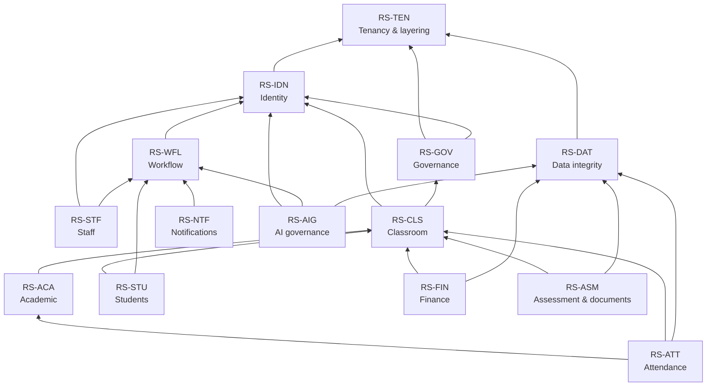
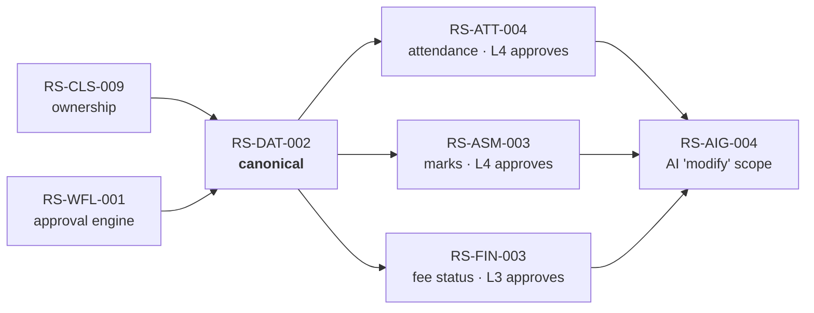
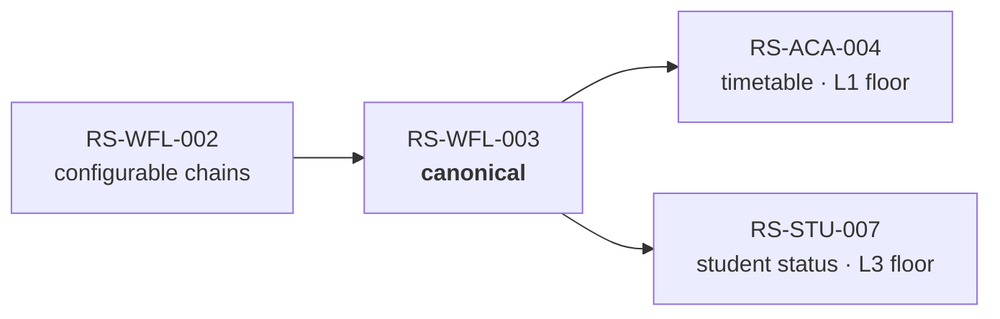

# Rule Dependency Graph

**Status:** Derived view. Non-normative — regenerated from the `Depends on` and
`Governs` fields of the [Specification layer](../10-specification/index.md).

**Purpose:** To answer *"if I change this rule or this code, what else moves?"*
before the change is made rather than after a regression reveals it.

---

## 1. Domain-level dependency structure

Domains form a strict layering. An arrow means *depends on*.



**Reading the layering.** `RS-TEN` is the foundation: nothing depends on
anything below it. `RS-AIG` is a pure consumer: it constrains AI's expression
of rules owned elsewhere and introduces no domain rule of its own. A dependency
edge running *downward* against this diagram is a specification defect.

## 2. Foundational rules by fan-out

The rules most other rules depend on. A change to any of these is
high-blast-radius by construction.

| Rule | Direct dependents | Why it is foundational |
|---|---|---|
| [RS-CLS-009](../10-specification/RS-CLS-classroom.md#rs-cls-009) — ownership, not title | 6 | Determines who may write every mutable datum in the system |
| [RS-DAT-002](../10-specification/RS-DAT-data-integrity.md#rs-dat-002) — correction, not immutability | 6 | Governs all three correction paths and the historical-record guarantee |
| [RS-TEN-001](../10-specification/RS-TEN-tenancy-security.md#rs-ten-001) — RLS | All tenant-scoped rules | The isolation backstop everything assumes |
| [RS-IDN-001](../10-specification/RS-IDN-identity.md#rs-idn-001) — Position/Account/Occupant | 5 | The identity substrate |
| [RS-WFL-001](../10-specification/RS-WFL-workflow.md#rs-wfl-001) — one approval engine | 5 | Every approval, human and AI |
| [RS-STU-002](../10-specification/RS-STU-students.md#rs-stu-002) — Aadhaar exclusion | 6 | Statutory; binds every layer |
| [RS-AIG-001](../10-specification/RS-AIG-ai-governance.md#rs-aig-001) — AI authority levels | 5 | Every AI capability's ceiling |
| [RS-DAT-001](../10-specification/RS-DAT-data-integrity.md#rs-dat-001) — no permanent deletion | 5 | The retention substrate |

## 3. Structural pattern clusters

Four patterns account for most cross-domain coupling. Changing a pattern's
canonical rule changes every instance.

### P1 — Entry versus correction



### P2 — Mandatory approval floor



### P3 — Ownership, not title

Canonical: [RS-CLS-009](../10-specification/RS-CLS-classroom.md#rs-cls-009).
Instances: [RS-ATT-002](../10-specification/RS-ATT-attendance.md#rs-att-002),
[RS-ASM-002](../10-specification/RS-ASM-assessment-documents.md#rs-asm-002),
[RS-FIN-002](../10-specification/RS-FIN-finance.md#rs-fin-002),
[RS-CLS-004](../10-specification/RS-CLS-classroom.md#rs-cls-004).

### P4 — Same-actor direct-action carve-out

Canonical: [RS-AIG-007](../10-specification/RS-AIG-ai-governance.md#rs-aig-007).
Instances: [RS-ATT-005](../10-specification/RS-ATT-attendance.md#rs-att-005),
[RS-NTF-006](../10-specification/RS-NTF-notifications.md#rs-ntf-006),
plus every direct-write AI tool in the
[AI Capability Matrix](ai-capability-matrix.md).

## 4. Critical dependency chains

Five chains where a change at the head propagates the furthest.

### C1 — Timetable to attendance

```
RS-CLS-002 (class slot)
  → RS-CLS-006 (timetable is the structural core; one hour, one staff member)
    → RS-ACA-004 (approval workflow, L1 floor)
      → RS-ACA-006 (version retention, effective dating)
        → RS-ATT-001 (marking requires an approved timetable)
          → RS-ATT-002 (per-hour ownership)
            → RS-ATT-005 (AI assistant inherits the eligibility check)
```

**Implication.** Any change to timetable structure reaches the AI attendance
assistant. Changing per-hour ownership without changing the AI tool's
validation leaves the AI path enforcing a looser rule than the human path.

### C2 — Identity to authorization to AI scope

```
RS-IDN-001 (Position/Account/Occupant)
  → RS-IDN-006 (single frozen resolution façade)
    → RS-IDN-007 (authorization uses live effective role)
      → RS-AIG-010 (AI is identity-context-centric)
        → RS-AIG-011 (downstream services consume the resolved context)
```

**Implication.** This was the chain [ADL-020](../30-decisions/ledger.md#adl-020)
broke at its final link — **resolved 2026-07-25 (Phase 4)**, verified already
fixed rather than a live defect. The whole chain is Conformant now.

### C3 — Ownership to correction to AI authority

```
RS-CLS-009 (ownership, not title)
  → RS-DAT-002 (correction, not immutability)
    → RS-ATT-004 / RS-ASM-003 / RS-FIN-003 (the three correction paths)
      → RS-AIG-004 (what "modify" means for the AI gate)
        → RS-AIG-005 (pre-submission confirmation)
```

**Implication.** The three correction paths are structurally identical and
should be built to one template. Building them independently is how they
diverge.

### C4 — Governance to organization lifecycle

```
RS-GOV-001 (Platform Admin scope)
  → RS-GOV-005 (five structural exceptions)
    → RS-GOV-006 (key mechanics)
      → RS-GOV-008 (department risk split)
        → RS-GOV-011 (readiness gate)
          → RS-GOV-010 (provisioning lifecycle)
```

**Implication.** The readiness gate depends on which departments exist at
onboarding, which depends on the department risk split. Building the lifecycle
before the department split produces a gate evaluating the wrong set.

### C5 — Workflow to notification

```
RS-WFL-001 (one approval engine)
  → RS-NTF-003 (external sends need approval, via that engine)
    → RS-NTF-001 (the ledger)
      → RS-NTF-005 (system-notification carve-out)
        → RS-ATT-008 / RS-CLS-007 / RS-STU-007 (action-carrying alerts)
```

## 5. Change-impact procedure

Before any change, resolve these in order:

1. **Locate the rule.** Find the `RS-*` record owning the statement.
2. **Read `Governs` transitively.** Every rule reachable through `Governs` is
   potentially affected.
3. **Check pattern membership.** If the rule is a P1–P4 canonical rule, every
   instance changes with it. If it is an *instance*, verify the change does not
   contradict the canonical rule — if it does, the canonical rule must change
   first.
4. **Check the chains.** If the rule appears in C1–C5, read the whole chain.
5. **Check conformance.** Consult the
   [Implementation Impact Matrix](implementation-impact-matrix.md) for
   divergences in the affected set. A change layered on an existing divergence
   compounds rather than resolves it.
6. **Check the gates.** Confirm no open decision in
   [Decisions](../30-decisions/index.md) blocks the change.
   ~~[ADL-021](../30-decisions/ledger.md#adl-021) blocks all identity-layer
   work~~ — resolved 2026-07-25, no longer a gate; see below.

## 6. Sequencing constraints

Hard ordering constraints derived from the graph. Violating one produces rework,
not merely inefficiency.

| # | Constraint | Reason |
|---|---|---|
| 1 | ~~Resolve [ADL-021](../30-decisions/ledger.md#adl-021) before any identity-layer change~~ | **Done, 2026-07-25** — verified against code, HOD is already `level: 3` everywhere; there was no real numbering mismatch to resolve |
| 2 | ~~Verify [ADL-020](../30-decisions/ledger.md#adl-020) against code before other scheduled work~~ | **Done, 2026-07-25** — verified fixed (Phase 4); not a live defect |
| 3 | ~~Establish a trustworthy test baseline before any implementation~~ | **Done, Stage 0** — without one, a regression hides inside pre-existing failures |
| 4 | ~~Identity and platform foundation before anything referencing roles or levels~~ | **Done, Stage 3 (3a-3d)** — C2, C4 |
| 5 | ~~The fee-payment foreign-key migration before or with the fee-structure drop~~ | **Done, Stage 4, constraint satisfied** — the column is a `NOT NULL` FK into the dropped table, and the migration ran the drop and the FK/constraint change together ([ADL-013](../30-decisions/ledger.md#adl-013)) |
| 6 | ~~All three correction paths before the shared AI confirmation turn~~ | **Done** — Stages 4-6 (fee/mark/attendance corrections) landed before Stage 7's shared confirmation turn, in order ([ADL-018](../30-decisions/ledger.md#adl-018)) |
| 7 | ~~Attendance authority rework and AI tool ownership checks together~~ | **Done, Stage 5** — landed together via the shared `assertCanMark`, otherwise the AI path would enforce a looser rule than the human path (C1) |
| 8 | ~~Department risk split before the organization lifecycle~~ | **Done, Stage 3a** — both landed in the same stage, in order; the readiness gate depends on the split (C4) |
| 9 | Re-run the two-tenant isolation test after every group touching identity or tenant data | Ongoing release gate, not a one-time constraint — [RS-TEN-001](../10-specification/RS-TEN-tenancy-security.md#rs-ten-001) |
