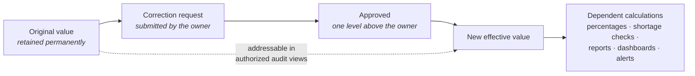

# Historical Data Integrity Specification

**Status:** Derived view. Non-normative — regenerated from the `Data effect`
field of the [Specification layer](../10-specification/index.md) and governed by
[RS-DAT](../10-specification/RS-DAT-data-integrity.md).

**Purpose:** The complete statement of what ARCNAVE guarantees about the past:
what is preserved, what may be superseded, how history is keyed, and what
questions the system can answer about its own record.

---

## 1. The four guarantees

Every historical guarantee in ARCNAVE reduces to one of four.

| # | Guarantee | Statement | Canonical rule |
|---|---|---|---|
| **G1** | **Non-deletion** | No institutional record is permanently deleted through normal operations | [RS-DAT-001](../10-specification/RS-DAT-data-integrity.md#rs-dat-001) |
| **G2** | **Original preservation** | An original recorded value is never destroyed by a correction; the correction becomes the new *effective* value alongside it | [RS-DAT-002](../10-specification/RS-DAT-data-integrity.md#rs-dat-002) |
| **G3** | **Contextual fidelity** | A historical record is interpreted against the structure in force when it was created, never against current structure | [RS-DAT-004](../10-specification/RS-DAT-data-integrity.md#rs-dat-004) |
| **G4** | **Attributional integrity** | Who acted, and in what capacity, are recorded as separate facts and are never collapsed or reattributed | [RS-IDN-011](../10-specification/RS-IDN-identity.md#rs-idn-011) |

## 2. Data-effect classification

Every rule that touches data carries one of three effects.

| Effect | Meaning | Reversible? |
|---|---|---|
| **Creates** | Adds a record; nothing prior is affected | n/a |
| **Supersedes** | Replaces a current value, with the change audited | Through the audit trail |
| **Preserves** | The prior state remains addressable as a first-class fact | By construction |

### 2.1 Preserving rules — the historical substrate

| Rule | What is preserved |
|---|---|
| [RS-DAT-001](../10-specification/RS-DAT-data-integrity.md#rs-dat-001) | Every institutional record — student, staff, academic, attendance, examination, document, financial, audit |
| [RS-DAT-002](../10-specification/RS-DAT-data-integrity.md#rs-dat-002) | Every original value behind every correction |
| [RS-DAT-003](../10-specification/RS-DAT-data-integrity.md#rs-dat-003) | Archived records — read-only, searchable, restorable |
| [RS-DAT-006](../10-specification/RS-DAT-data-integrity.md#rs-dat-006) | The full audit ledger, append-only, grant-enforced |
| [RS-IDN-002](../10-specification/RS-IDN-identity.md#rs-idn-002) | Every position and account; lifecycle by link presence, never by deletion |
| [RS-IDN-010](../10-specification/RS-IDN-identity.md#rs-idn-010) | Full occupant history, accumulating indefinitely |
| [RS-ACA-006](../10-specification/RS-ACA-academic.md#rs-aca-006) | Every locked timetable version, with effective dating |
| [RS-ACA-009](../10-specification/RS-ACA-academic.md#rs-aca-009) | Every historical curriculum version, immutable |
| [RS-STU-005](../10-specification/RS-STU-students.md#rs-stu-005) | Every enrolment's records, attached to their own context across transfers |
| [RS-STF-008](../10-specification/RS-STF-staff.md#rs-stf-008) | Attribution of a departed staff member's historical actions |
| [RS-WFL-008](../10-specification/RS-WFL-workflow.md#rs-wfl-008) | The workflow version in force at each request's submission |
| [RS-NTF-002](../10-specification/RS-NTF-notifications.md#rs-ntf-002) | Every delivery attempt, including retries |

### 2.2 The one narrowed guarantee

| Rule | Narrowing | Scope of the narrowing |
|---|---|---|
| [RS-STU-011](../10-specification/RS-STU-students.md#rs-stu-011) | Only the **current version** of a student-facing document is retained | Student-facing documents only — never staff or HR documents, and never the underlying audit trail of upload and replacement |

This is the only place in the specification where a prior state is not
addressable, and it is deliberate.

### 2.3 The one field deliberately never accumulated

Aadhaar is excluded from identity, dedup, import, search, reasoning and
reporting, and — where a college is legally obliged to hold it at all — is
stored only as an optional, encrypted, access-restricted field
([RS-STU-002](../10-specification/RS-STU-students.md#rs-stu-002)). The
exclusion is a **recorded, deliberate deviation from the original source
requirements**, which listed the field as mandatory
([RS-STU-003](../10-specification/RS-STU-students.md#rs-stu-003)). It is
recorded here so that the absence of Aadhaar from any historical record is
never read as data loss.

## 3. Correction semantics

| Property | Rule |
|---|---|
| The original is never deleted | G2 |
| The approved correction becomes the **effective** value | G2 |
| Every dependent calculation recomputes from the effective value | [RS-DAT-002](../10-specification/RS-DAT-data-integrity.md#rs-dat-002) |
| The audit trail records original value, corrected value, approver and timestamp | [RS-DAT-002](../10-specification/RS-DAT-data-integrity.md#rs-dat-002) |
| AI reports the latest effective value while preserving the original for authorized audit views | [RS-DAT-002](../10-specification/RS-DAT-data-integrity.md#rs-dat-002) |
| The audit trail — not a mandatory second reviewer — is the safety net | [RS-ATT-004](../10-specification/RS-ATT-attendance.md#rs-att-004) |

## 4. Historical keying

The composite keys required to ask a historical question correctly. Using a
partial key silently returns the wrong answer rather than an error — this is
the most consequential table in this document.

| Question | Required key | Why a partial key fails | Rule |
|---|---|---|---|
| "Who was in ECE Sem 3?" | **(class slot, academic year)** | The slot is permanent and holds a **different batch every year**. Slot alone returns an undefined mixture | [RS-CLS-002](../10-specification/RS-CLS-classroom.md#rs-cls-002) |
| "Was this student present on this date?" | **(student, class-hour, date, effective timetable version)** | A later timetable revision would reinterpret which hour and which staff member applied | [RS-ACA-006](../10-specification/RS-ACA-academic.md#rs-aca-006) |
| "What is this student's record?" | **(Permanent Student ID, enrolment context)** | Inter-college transfer creates a new enrolment against the same permanent identity; merging them fabricates a history | [RS-STU-005](../10-specification/RS-STU-students.md#rs-stu-005) |
| "What subjects and credits applied to this student?" | **(student, regulation version fixed at admission)** | Regulations coexist; the current version is not this student's version | [RS-ACA-009](../10-specification/RS-ACA-academic.md#rs-aca-009) |
| "Who approved this?" | **(Actor, Acting Position Account, Position)** | Collapsing to one field makes either the person's history or the seat's history unqueryable | [RS-IDN-011](../10-specification/RS-IDN-identity.md#rs-idn-011) |
| "What did this staff member do?" | **Permanent Internal Staff ID** | The institution-issued code may change on reappointment | [RS-STF-004](../10-specification/RS-STF-staff.md#rs-stf-004) |
| "Which chain approved this request?" | **The workflow version pinned at submission** | A later configuration change would misrepresent the route actually taken | [RS-WFL-008](../10-specification/RS-WFL-workflow.md#rs-wfl-008) |
| Any dated record | **+ Academic Year** | Every dated domain record belongs to an academic year | [RS-ACA-003](../10-specification/RS-ACA-academic.md#rs-aca-003) |

## 5. Attributional integrity

A Position Account survives reassignment unchanged, which is what makes
compound attribution representable:

> **Approved by:** Position — *Principal* · Acting Person — *Dr. Arun Kumar*

| Query | Returns |
|---|---|
| By **Position** | The seat's full approval history across every occupant it has ever had |
| By **Actor** | Exactly what one specific person did, across every seat they occupied |

A design mapping positions directly to people makes this distinction
structurally impossible, not merely unbuilt: there is nothing for a credential,
session or revocation to attach to that is not the person's own record.

**Conformance.** The model defines four audit fields; all four are populated
today — Acting Position Account and Position default from ambient request
context on every write, not threaded explicitly per call site. Whether that
ambient default is correct at every one of the ~100 call sites (e.g. one
running outside request-scoped middleware) is the one remaining, narrower
item — a verification sweep, not missing capability
([RS-IDN-011](../10-specification/RS-IDN-identity.md#rs-idn-011)).

## 6. Archival versus lifecycle

The most frequently confused distinction in the estate, and the source of three
separate naming defects resolved at [ADL-003](../30-decisions/ledger.md#adl-003).

| | Lifecycle status | Archival |
|---|---|---|
| What it describes | The entity's own institutional state | A record-keeping treatment applied to records |
| Axis | The entity's progression | Orthogonal, layered on top |
| Reversible | Per the lifecycle's own transitions | Yes — restoration, explicitly authorized and audited |
| Appears in the student lifecycle? | `Alumni` is terminal | **No `Archived` status** |
| Appears in the Academic Year lifecycle? | `Completed` is terminal | **No `Archived` status** |
| Searchable | Yes | Yes, for authorized users |
| Mutable | Per rule | **Read-only** unless restoration is authorized |

**Rule.** A completed Academic Year's or an Alumni student's individual
*records* may become archived. The year and the student do not thereby enter a
further lifecycle state.

## 7. Append-only enforcement

Preservation is enforced at the database grant level, not by application
convention.

| Ledger | Enforcement |
|---|---|
| `audit_log` | Select and insert grants only — no update, no delete. *A ledger the application can rewrite is not a ledger* |
| `generated_reports` | Same |
| Occupant history | Append-only by construction; closing a link opens a new row |
| Department and module ownership | Append-only; closing one ownership link and opening another preserves the full history |
| Refresh tokens | Append-only with a revocation timestamp |

The runtime database role owns no table and is never superuser
([RS-TEN-003](../10-specification/RS-TEN-tenancy-security.md#rs-ten-003)), so
these grants cannot be circumvented by the application.

## 8. Migration safety

A data migration is the one operation capable of violating G1–G4. The controls
at [RS-DAT-007](../10-specification/RS-DAT-data-integrity.md#rs-dat-007) exist
solely to make that impossible by construction:

| Control | What it prevents |
|---|---|
| Reversibility | An irreversible schema change |
| Idempotency | Duplicate rows on re-run |
| **Batch tagging** | Rollback deleting legitimate data created after the migration |
| Per-tenant batching | A half-migrated tenant, and one tenant's failure blocking others |
| Resumability | A killed run losing its place |
| Dry run | Discovering the blast radius during the real run |

**One real data migration is currently outstanding:** the Academic Year status
rename ([ADL-003](../30-decisions/ledger.md#adl-003)). The fee-payment foreign
key drop ([ADL-013](../30-decisions/ledger.md#adl-013)) is a schema change
against existing rows and is subject to the same controls.

## 9. Backup and recoverability

Preservation guarantees are void without recoverability.

| Obligation | Rule |
|---|---|
| Parameters — frequency, retention, location, restore authorization, RPO/RTO — set per institution at onboarding, as an operational commitment | [RS-DAT-005](../10-specification/RS-DAT-data-integrity.md#rs-dat-005) |
| Database and document-storage backups run on the same schedule to the same off-host location | [RS-DAT-005](../10-specification/RS-DAT-data-integrity.md#rs-dat-005) |
| Integrity verified periodically; **restore tests actually conducted, not assumed** | [RS-DAT-005](../10-specification/RS-DAT-data-integrity.md#rs-dat-005) |
| Every backup and restore action audited | [RS-DAT-005](../10-specification/RS-DAT-data-integrity.md#rs-dat-005) |

**Coupling constraint.** A document backup with no matching database backup, or
the reverse, is **not a restorable system**: storage-path rows and the bytes on
disk must agree. Backing up one without the other produces a false sense of
recoverability.

**Conformance.** Database backup exists. Document-volume archival and the
restore drill are **not built**.

## 10. Declared limitations affecting historical fidelity

| Limitation | Effect on history | Rule |
|---|---|---|
| "Final year" has no structured field | Any historical query filtering on it is a soft text match | [RS-ATT-009](../10-specification/RS-ATT-attendance.md#rs-att-009) |
| Document classification is per type, decided at ingestion | A mixed-sensitivity document is historically classified at the coarsest level of its type | [RS-ASM-010](../10-specification/RS-ASM-assessment-documents.md#rs-asm-010) |

The full register is at
[RS-DAT-009](../10-specification/RS-DAT-data-integrity.md#rs-dat-009).
