# What actually happens when an attachment is given to ARCNAVE's AI

Traced from source on 2026-08-28, not from design intent. Every box below
names the real file and the real symbol that does it. Where a status
string appears in quotes, that is the literal value a tool returns.

Authoritative sources for the *rules* behind these steps stay where they
are — `RS-AIG-ai-governance.md` for AI authority, `CLAUDE.md` rules 1/2/9,
and ADL-055→058 in [`ledger.md`](../30-decisions/ledger.md) for the
document-analysis behaviour. This file only records the execution order.

---

## The whole path

```mermaid
flowchart TD
    U["User attaches a file in chat"] --> UP["POST /documents/chat-attachments<br/>DocumentService stores it<br/>doc_type = CHAT_ATTACHMENT<br/>uploaded_by_user_id = this user"]
    UP --> ASK["POST /ai/ask<br/>question + attachmentIds[]"]

    ASK --> N{"More than 10 ids?<br/>MAX_CHAT_ATTACHMENTS"}
    N -- yes --> THROW1["Throw AiServiceValidationError<br/>turn ends"]
    N -- no --> RES["resolveChatAttachments()<br/>aiService.js:517<br/>re-validate EVERY id, never trust the caller"]

    RES --> OWN{"RLS same college<br/>AND doc_type = CHAT_ATTACHMENT<br/>AND uploaded_by = this user?"}
    OWN -- no --> THROW2["Throw - fail loudly.<br/>Never silently drop an id.<br/>Cross-tenant id simply does not resolve"]
    OWN -- yes --> MIME{"Server-sniffed mime_type<br/>never the declared one"}

    MIME -- "image/*" --> IMG["images[] - base64 to a<br/>vision-capable adapter"]
    MIME -- "not in the allowlist" --> THROW3["Throw - unsupported attachment type"]
    MIME -- "pdf docx xlsx pptx odt ods text" --> EXT["documentTextExtractionService<br/>.extractPlainText()"]

    EXT --> OK{"text extracted?"}
    OK -- "no - corrupt, scanned,<br/>password-protected" --> DEG["Audit ai_attachment_extraction_failed<br/>DEGRADE, do not throw:<br/>documents[] carries a failureReason.<br/>The turn continues"]
    OK -- yes --> AUD["Audit ai_attachment_analyzed<br/>documents[] carries the text"]

    IMG --> BUD
    DEG --> BUD
    AUD --> BUD["Shared PER-TURN char budget<br/>divided across every readable file<br/>MIN_PER_FILE_CHARS floor"]

    BUD --> HINT["buildAttachmentHint() :641<br/>text + the VERBATIM attachmentId,<br/>wrapped in aiPromptSafetyLayer<br/>boundary markers - untrusted DATA,<br/>never instructions (CLAUDE.md rule 9)"]

    HINT --> PIN["pinDocumentAnalysisTool() :272<br/>analyze_document_table is APPENDED<br/>whenever documents exist - sourced from<br/>roleTools, so a role without it stays without it"]

    PIN --> SEL["Decision call - purpose 'tool_select'<br/>every permitted tool NAME is visible<br/>in the tool-catalogue segment"]

    SEL --> BR{"What does the model do?"}
    BR -- "a lookup:<br/>describe_tools, list_skills,<br/>describe_skill, decide_output_format" --> LOOK["BUDGET_EXEMPT_LOOKUP_TOOLS :973<br/>runs a round-trip, spends NO tool budget<br/>MAX_LOOKUP_CALLS = 3"]
    LOOK --> SEL
    BR -- "answer with no tool" --> ANS
    BR -- "call a tool" --> GATE["Policy Gate re-check at invocation<br/>role, level, dataClassification -<br/>regardless of what the catalogue offered"]

    GATE --> WHICH{"Which tool?"}
    WHICH -- analyze_document_table --> DET
    WHICH -- execute_code --> SBX
    WHICH -- "any other tool" --> COV

    DET["documentTableExtractionService.detect()<br/>strategy: delimited / sequential_id / none"] --> COVCHK{"Coverage check:<br/>did it find records for<br/>the whole document?"}
    COVCHK -- no --> UNREL["status: 'unreliable_extraction'<br/>states the shortfall - an HONEST failure,<br/>not a silent partial answer (ADL-055)"]
    COVCHK -- yes --> AGG["documentAggregateService<br/>count / sum / breakdown / compare"]
    AGG --> AGGST{"result"}
    AGGST -- "bad regex" --> S1["status: 'invalid_pattern'<br/>names the parameter (ADL-056)"]
    AGGST -- "nothing matched" --> S2["status: 'no_matching_records'"]
    AGGST -- "rows matched but unnamed" --> S3["status: 'identity_required' (ADL-057)"]
    AGGST -- ok --> S4["records + figures + evidence"]

    SBX["loadOwnedAttachmentForExecution() :3461<br/>SAME ownership chain as above"] --> SBX2["sandbox-service on Cloud Run<br/>NO ARCNAVE db, NO api session,<br/>NO network route back (ADL-059)<br/>only the one passed attachment"]
    SBX2 --> SAVE{"saveAs given?"}
    SAVE -- no --> COV
    SAVE -- yes --> RECALC["recalc.py quality gate:<br/>real LibreOffice recalculation.<br/>Checks 3 distinct failures - error values,<br/>a declared formula cell holding a CONSTANT,<br/>a formula never evaluated"]
    RECALC --> VER{"verdict"}
    VER -- "failed / unverified" --> FAILF["Reported to the model with the reason.<br/>The bytes NEVER reach model or user"]
    VER -- passed --> ATT["artifactService.attachGeneratedFile()<br/>enforces the gate a SECOND time at the<br/>ownership boundary (CLAUDE.md rule 1)"]

    UNREL --> COV
    S1 --> COV
    S2 --> COV
    S3 --> COV
    S4 --> COV
    FAILF --> COV
    ATT --> COV

    COV{"detectDocumentCoverageGap() :243<br/>2+ documents attached, but the tools ran<br/>against fewer attachmentIds?"}
    COV -- yes --> REF["buildCoverageRefusal() - composed in CODE,<br/>not asked of the model, so it cannot be<br/>talked out of it. Names what WAS analysed.<br/>verification: INSUFFICIENT_EVIDENCE.<br/>The answer call is SKIPPED entirely"]
    COV -- no --> ANS["Answer call - purpose 'tool_answer'<br/>gets the tool RESULT + evidence.<br/>NOT the raw attachment text (ADL-055:<br/>125,048 -> 2,771 tokens)"]

    ANS --> VC["verifyNumericClaims(answer, evidence)<br/>PASS / INSUFFICIENT_EVIDENCE"]
    REF --> OUT
    VC --> OUT["Response: answer + evidence + verification"]
```

---

## The four things this diagram is really saying

1. **Ownership is checked twice, from the same chain, in two different
   services.** `resolveChatAttachments` (`aiService.js:517`) and
   `loadOwnedAttachmentForExecution` (`aiToolRegistry.js:3461`) each
   independently require RLS-same-college **and** `doc_type ===
   CHAT_ATTACHMENT` **and** `uploaded_by_user_id === this user`. Neither
   trusts the other, and neither trusts the caller's declared mime type.

2. **An unreadable file degrades; an unauthorized file throws.** These are
   deliberately different. A corrupt scan should not kill a turn that had
   three other attachments — it comes back with a `failureReason` and the
   turn continues. An id the user does not own is never silently dropped.

3. **Two gates are deterministic code, not prompt text**, because this
   project measured prompt guidance failing twice in one session for the
   same job: the coverage refusal (`detectDocumentCoverageGap` →
   `buildCoverageRefusal`) and the workbook recalculation gate
   (`recalc.py`). Neither can be argued out of by the model.

4. **The raw attachment text rides in the decision call only.** The answer
   call gets computed figures and evidence. That is why a wrong free-text
   answer became a verified deterministic one, and why `tool_answer` fell
   from 125,048 to 2,771 tokens (ADL-055).

## What is NOT in this path, deliberately

- **`date_led_rows`** — the third extraction strategy. Specified
  ([ADL-058-adjacent spec](../60-product-reasoning/ai-chat-ledger-statement-category-month-approved-spec.md)),
  **not built**. `detect()` returns only `delimited`, `sequential_id`, or
  `none` today.
- **Geometric PDF reconstruction** — ADL-058, specified, not built, and
  F3 says measure `pdfplumber.extract_tables()` against it first.
- **Cross-document `join`** — this is exactly what the coverage refusal
  refuses instead of guessing.
- **Editing the uploaded file in place** — the sandbox is credential-less
  by design; it receives a copy of one attachment and can write a NEW
  file, never back to the original.
